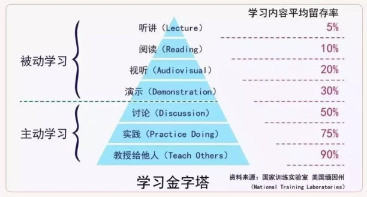

# study

**好好学习，天天向上！**

学习的境界有 3 种，知道、理解和内化。

像看书、看文章、听课、看视频等方式，都是在被动灌输知识，只能让我们达到「知道」和「理解」的境界，知识留存度最多 30%。

而要达到「内化」境界，则要通过思辨、践行、总结和归纳，真正输出自己的知识地图。否则，就只是在机械地重复某件事（记忆知识），而难以内化为自己的知识。

「总结」的过程是将知识和自身知识建立连接的过程，而「输出」的过程是「以教代学」的过程，最大程度将知识内化为自身的知识。

