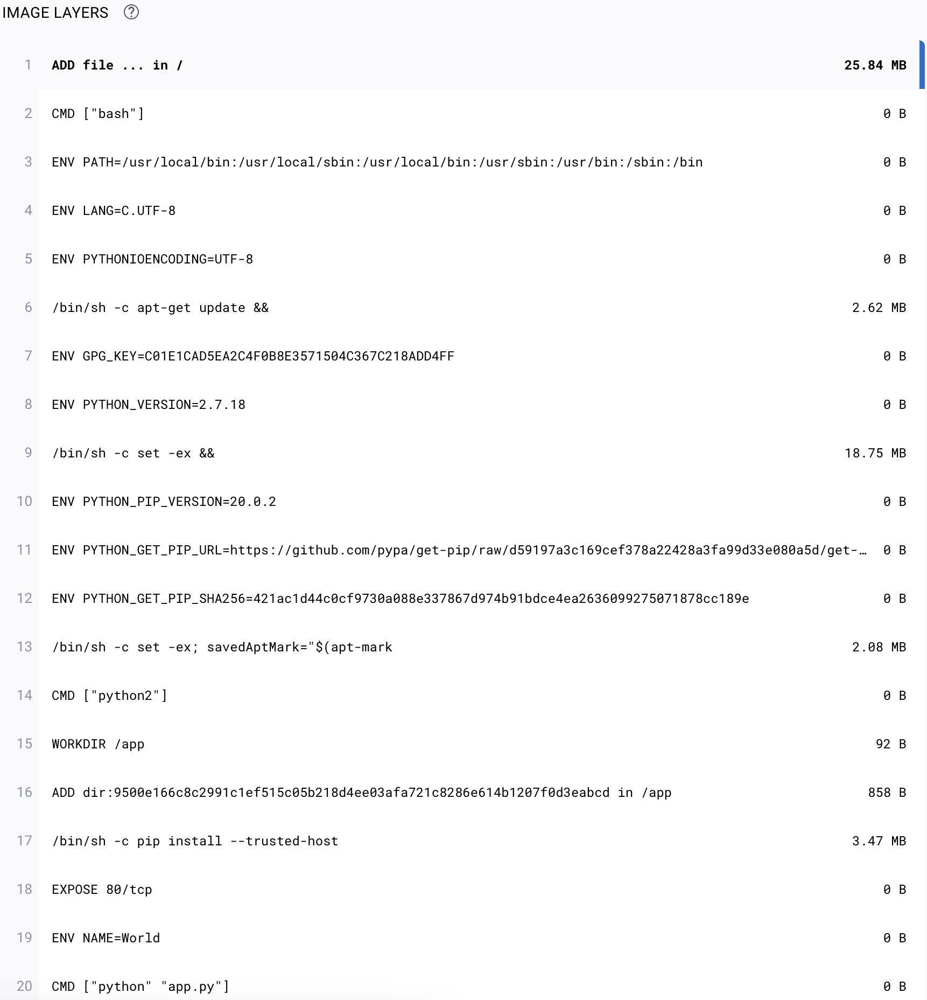

# 《深入剖析 Kubernetes》学习笔记 Day 3

今天学习了容器技术概念入门篇 (5讲)的第4讲，白话容器基础。

**前文回顾**

分别从 Linux Namespace 的隔离能力、Linux Cgroups 的限制能力，以及基于 rootfs 的文件系统三个角度，剖析了一个 Linux 容器的核心实现原理。

之所以要强调 Linux 容器，是因为比如 Docker on Mac，以及 Windows Docker（Hyper-V 实现），实际上是基于虚拟化技术实现的，跟 Linux 容器完全不同。

**重新认识Docker容器**

用 Docker 部署一个用 Python 编写的 Web 应用。

安装并启动 docker

```
# os version
cat /etc/redhat-release
CentOS Linux release 7.3.1611 (Core)

# install docker
yum install docker -y

# disabled selinux
vim /etc/sysconfig/docker
OPTIONS='--selinux-enabled=false'

# start docker
service docker start
```

Dockerfile 的设计思想，是使用一些标准的原语（即大写高亮的词语），描述我们所要构建的 Docker 镜像。并且这些原语，都是按顺序处理的。


```
# 使用官方提供的Python开发镜像作为基础镜像
FROM python:2.7-slim

# 将工作目录切换为/app
WORKDIR /app

# 将当前目录下的所有内容复制到/app下
ADD . /app

# 使用pip命令安装这个应用所需要的依赖
RUN pip install --trusted-host pypi.python.org -r requirements.txt

# 允许外界访问容器的80端口
EXPOSE 80

# 设置环境变量
ENV NAME World

# 设置容器进程为：python app.py，即：这个Python应用的启动命令
CMD ["python", "app.py"]
```

docker build 会自动加载当前目录下的 Dockerfile 文件，然后按照顺序，执行文件中的原语。而这个过程，实际上可以等同于 Docker 使用基础镜像启动了一个容器，然后在容器中依次执行 Dockerfile 中的原语。


```
# docker build -t helloworld .
Sending build context to Docker daemon 4.096 kB
Step 1/7 : FROM python:2.7-slim
 ---> eeb27ee6b893
Step 2/7 : WORKDIR /app
 ---> Using cache
 ---> 69ed17cd1d0c
Step 3/7 : ADD . /app
 ---> Using cache
 ---> db4730cd9342
Step 4/7 : RUN pip install --trusted-host pypi.python.org -r requirements.txt
 ---> Using cache
 ---> c9a4c1ac89d8
Step 5/7 : EXPOSE 80
 ---> Using cache
 ---> 4378f8d7dd07
Step 6/7 : ENV NAME World
 ---> Using cache
 ---> fed3b384d5c0
Step 7/7 : CMD python app.py
 ---> Using cache
 ---> 4c28113dd571
Successfully built 4c28113dd571
```

```
# docker image ls
REPOSITORY          TAG                 IMAGE ID            CREATED             SIZE
helloworld          latest              4c28113dd571        6 minutes ago       158 MB
docker.io/python    2.7-slim            eeb27ee6b893        2 years ago         148 MB
```

```
# docker ps
CONTAINER ID        IMAGE               COMMAND             CREATED             STATUS              PORTS                  NAMES
e3bc44aa3034        helloworld          "python app.py"     2 minutes ago       Up 2 minutes        0.0.0.0:4000->80/tcp   kind_dubinsky
```


```
# curl http://localhost:4000
<h3>Hello World!</h3><b>Hostname:</b> e3bc44aa3034<br/>
```

上传镜像到 docker hub

访问 https://hub.docker.com/ ，注册账号 fw0x，创建仓库 helloworld。

```
# docker tag helloworld fw0x/helloworld:v1

# docker image ls
REPOSITORY          TAG                 IMAGE ID            CREATED             SIZE
fw0x/helloworld     v1                  4c28113dd571        26 minutes ago      158 MB
helloworld          latest              4c28113dd571        26 minutes ago      158 MB
docker.io/python    2.7-slim            eeb27ee6b893        2 years ago         148 MB

# docker login -u fw0x
Password:
Login Succeeded

# docker push fw0x/helloworld:v1
The push refers to a repository [docker.io/fw0x/helloworld]
1f64cc049d67: Pushed
decabc1017f7: Pushed
d9adbc8cecbe: Pushed
7a287aad297b: Pushed
7ea2b60b0a08: Pushed
568944187d93: Pushed
b60e5c3bcef2: Pushed
v1: digest: sha256:d8abe00441e90eaabcb75e95796279a50a840188ceb4b441e4ae3ac3e297ddff size: 1787
```

在 docker hub 上可以查看镜像的层结构以及每层的文件大小



可以使用 docker commit 指令，把一个正在运行的容器，直接提交为一个镜像。一般来说，需要这么操作原因是：这个容器运行起来后，我又在里面做了一些操作，并且要把操作结果保存到镜像里。

docker commit，实际上就是在容器运行起来后，把最上层的“可读写层”，加上原先容器镜像的只读层，打包组成了一个新的镜像。当然，下面这些只读层在宿主机上是共享的，不会占用额外的空间。

而由于使用了联合文件系统，你在容器里对镜像 rootfs 所做的任何修改，都会被操作系统先复制到这个可读写层，然后再修改。这就是所谓的：Copy-on-Write。

Init 层的存在，就是为了避免你执行 docker commit 时，把 Docker 自己对 /etc/hosts 等文件做的修改，也一起提交掉。

```
# 进入容器
# docker exec -it 7f735f36acfa /bin/bash
root@7f735f36acfa:/app# ls
Dockerfile  app.py  new.txt  requirements.txt
root@7f735f36acfa:/app# touch new.txt
root@7f735f36acfa:/app# exit
exit
# docker commit 7f735f36acfa fw0x/helloworld:v2

# 查看容器进程号
# docker inspect --format '{{ .State.Pid }}' e3bc44aa3034

# 查看 Namespace 文件
# ls -l /proc/33165/ns
total 0
lrwxrwxrwx. 1 root root 0 Jan 19 01:07 ipc -> ipc:[4026532634]
lrwxrwxrwx. 1 root root 0 Jan 19 00:15 mnt -> mnt:[4026532632]
lrwxrwxrwx. 1 root root 0 Jan 19 00:15 net -> net:[4026532637]
lrwxrwxrwx. 1 root root 0 Jan 19 01:07 pid -> pid:[4026532635]
lrwxrwxrwx. 1 root root 0 Jan 19 01:13 user -> user:[4026531837]
lrwxrwxrwx. 1 root root 0 Jan 19 01:07 uts -> uts:[4026532633]
```

一个进程，可以选择加入到某个进程已有的 Namespace 当中，从而达到“进入”这个进程所在容器的目的，这正是 docker exec 的实现原理。

通过操作系统进程相关的知识，逐步剖析 Docker 容器的方法，是理解容器的一个关键思路。

Docker Volume 机制，允许你将宿主机上指定的目录或者文件，挂载到容器里面进行读取和修改操作。

"容器进程"，是 Docker 创建的一个容器初始化进程 (dockerinit)，而不是应用进程 (ENTRYPOINT + CMD)。dockerinit 会负责完成根目录的准备、挂载设备和目录、配置 hostname 等一系列需要在容器内进行的初始化操作。最后，它通过 execv() 系统调用，让应用进程取代自己，成为容器里的 PID=1 的进程。

Linux 的绑定挂载（bind mount）机制。它的主要作用就是，允许你将一个目录或者文件，而不是整个设备，挂载到一个指定的目录上。并且，这时你在该挂载点上进行的任何操作，只是发生在被挂载的目录或者文件上，而原挂载点的内容则会被隐藏起来且不受影响。

绑定挂载实际上是一个 inode 替换的过程。在 Linux 操作系统中，inode 可以理解为存放文件内容的“对象”，而 dentry，也叫目录项，就是访问这个 inode 所使用的“指针”。

mount --bind /home /test，会将 /home 挂载到 /test 上。其实相当于将 /test 的 dentry，重定向到了 /home 的 inode。


```
# docker run -v /test -p 4000:80 helloworld

# docker ps
CONTAINER ID        IMAGE               COMMAND             CREATED              STATUS              PORTS                  NAMES
7f735f36acfa        helloworld          "python app.py"     About a minute ago   Up About a minute   0.0.0.0:4000->80/tcp   reverent_payne

# docker exec -it 7f735f36acfa
# ls
Dockerfile  app.py  requirements.txt
# df -h
Filesystem           Size  Used Avail Use% Mounted on
overlay               17G  6.0G   12G  35% /
tmpfs                912M     0  912M   0% /dev
tmpfs                912M     0  912M   0% /sys/fs/cgroup
/dev/mapper/cl-root   17G  6.0G   12G  35% /test
shm                   64M     0   64M   0% /dev/shm
tmpfs                912M     0  912M   0% /proc/acpi
tmpfs                912M     0  912M   0% /proc/scsi
tmpfs                912M     0  912M   0% /sys/firmware
# cd /test
# ls
# touch test.txt

# docker volume ls
DRIVER              VOLUME NAME
local               8533ad89838e7d1cd71c01d6ca967f4a8b06982503131426f8cd11928607515f

# ls /var/lib/docker/volumes/8533ad89838e7d1cd71c01d6ca967f4a8b06982503131426f8cd11928607515f/_data/
test.txt
```

> 感悟：今天主要是用实操来理解docker实现原理，透彻！

学习来源： 极客时间 https://time.geekbang.org/column/intro/100015201?tab=catalog


