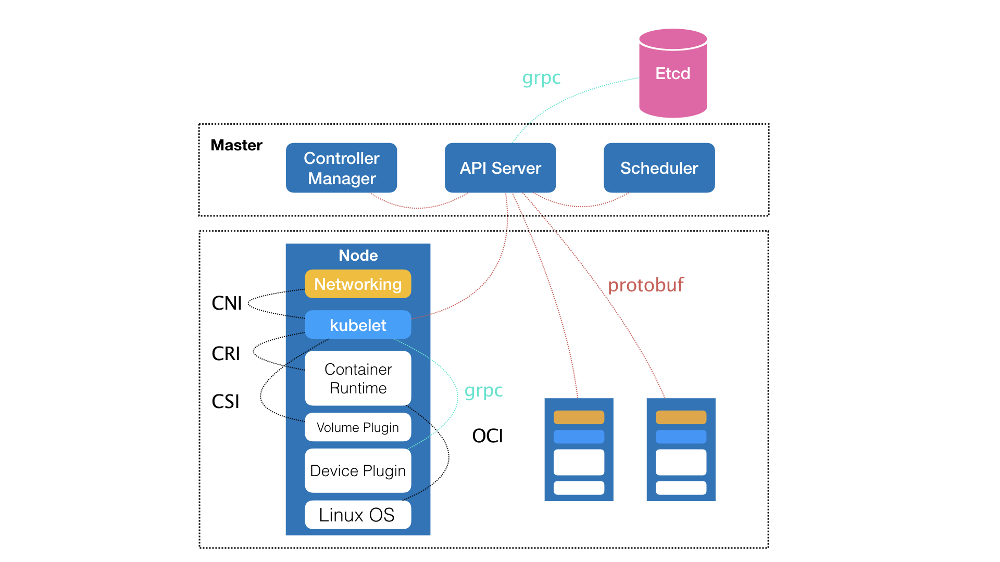

# 《深入剖析 Kubernetes》学习笔记 Day 4

今天学习了容器技术概念入门篇 (5讲)的第5讲，从容器到容器云：谈谈Kubernetes的本质。

**前文回顾**

以 Docker 项目为例，一步步剖析了 Linux 容器的具体实现方式。一个“容器”，实际上是一个由 Linux Namespace、Linux Cgroups 和 rootfs 三种技术构建出来的进程的隔离环境。

一个正在运行的 Linux 容器，分为：

* 容器镜像（Container Image）：一组联合挂载在 /var/lib/docker/aufs/mnt 上的 rootfs，是容器的静态视图
* 容器运行时（Container Runtime）：一个由 Namespace+Cgroups 构成的隔离环境，是容器的动态视图

在整个“开发 - 测试 - 发布”的流程中，真正承载着容器信息进行传递的，是容器镜像，而不是容器运行时。

通过容器镜像，可以和潜在用户即开发者直接关联起来。

容器就从一个开发者手里的小工具，一跃成为了云计算领域的绝对主角；而能够定义容器组织和管理规范的“容器编排”技术，则当仁不让地坐上了容器技术领域的“头把交椅”。

**谈谈Kubernetes的本质**

Kubernetes 项目的理论基础则要比工程实践走得靠前得多，这归功于 Google 公司在 2015 年 4 月发布的 Borg 论文。

Borg 要承担的责任，是承载 Google 公司整个基础设施的核心依赖。在 Google 公司已经公开发表的基础设施体系论文中，Borg 项目当仁不让地位居整个基础设施技术栈的最底层。


图片来源：[Malte Schwarzkopf. “Operating system support for warehouse-scale computing”. PhD thesis. University of Cambridge Computer Laboratory (to appear), 2015, Chapter 2.](http://malteschwarzkopf.de/research/assets/google-stack.pdf)

Kubernetes 项目在 Borg 体系的指导下，体现出了一种独有的“先进性”与“完备性”，而这些特质才是一个基础设施领域开源项目赖以生存的核心价值。

> 感悟：又一个站在巨人肩膀上创新的典范，相比较大多数公司热衷于拆建一个又一个新烟囱的行为，不知道高明了多少！

**Kubernetes 项目要解决的问题是什么？**

运行在大规模集群中的各种任务之间，实际上存在着各种各样的关系。这些关系的处理，才是作业编排和管理系统最困难的地方。



Kubernetes 项目的架构，由 Master 和 Node 两种节点组成，分别对应着控制节点和计算节点。

控制节点，即 Master 节点，由三个紧密协作的独立组件组合而成，它们分别是负责 API 服务的 kube-apiserver、负责调度的 kube-scheduler，以及负责容器编排的 kube-controller-manager。整个集群的持久化数据，则由 kube-apiserver 处理后保存在 Etcd 中。

而计算节点上最核心的部分，则是一个叫作 kubelet 的组件。主要负责同容器运行时（比如 Docker 项目）打交道。而这个交互所依赖的，是一个称作 CRI（Container Runtime Interface）的远程调用接口，这个接口定义了容器运行时的各项核心操作，比如：启动一个容器需要的所有参数。kubelet 的另一个重要功能，则是调用网络插件和存储插件为容器配置网络和持久化存储。这两个插件与 kubelet 进行交互的接口，分别是 CNI（Container Networking Interface）和 CSI（Container Storage Interface）。

Docker 项目，则一般通过 OCI 这个容器运行时规范同底层的 Linux 操作系统进行交互，即：把 CRI 请求翻译成对 Linux 操作系统的调用（操作 Linux Namespace 和 Cgroups 等）。

从一开始，Kubernetes 项目就没有像同时期的各种“容器云”项目那样，把 Docker 作为整个架构的核心，而仅仅把它作为最底层的一个容器运行时实现。

> 感悟：面向借口编程的典范，将 Docker 作为其中一个实现，这是何等的大局观！

**Kubernetes 项目核心功能的全景图**


从容器这个最基础的概念出发，首先遇到了容器间“紧密协作”关系的难题，于是就扩展到了 Pod；

有了 Pod 之后，我们希望能一次启动多个应用的实例，这样就需要 Deployment 这个 Pod 的多实例管理器；

而有了这样一组相同的 Pod 后，我们又需要通过一个固定的 IP 地址和端口以负载均衡的方式访问它，于是就有了 Service。

Kubernetes 项目并没有像其他项目那样，为每一个管理功能创建一个指令，然后在项目中实现其中的逻辑。其推崇的使用方法是“声明式 API”。这种 API 对应的“编排对象”和“服务对象”，都是 Kubernetes 项目中的 API 对象（API Object）。

* 编排对象：比如 Pod、Job、CronJob 等，来描述你试图管理的应用
* 服务对象，比如 Service、Secret、Horizontal Pod Autoscaler（自动水平扩展器）等。这些对象，会负责具体的平台级功能

> 感悟：开闭原则的应用典范，没有在 Pod 对象基础上不断增加新的特性，而是另辟蹊径设计出拥有新的特性的新的对象，更好的解耦和扩展。

**Kubernetes 项目如何启动一个容器化任务呢？**

编写一个 YAML 文件 nginx-deployment.yaml

```
apiVersion: apps/v1
kind: Deployment
metadata:
  name: nginx-deployment
  labels:
    app: nginx
spec:
  replicas: 2
  selector:
    matchLabels:
      app: nginx
  template:
    metadata:
      labels:
        app: nginx
    spec:
      containers:
      - name: nginx
        image: nginx:1.7.9
        ports:
        - containerPort: 80
```

执行

```
kubectl create -f nginx-deployment.yaml
```

**Kubernetes 项目的本质**

调度和编排的区别：

* 调度：把一个容器，按照某种规则，放置在某个最佳节点上运行起来。
* 编排：按照用户的意愿和整个系统的规则，完全自动化地处理好容器之间的各种关系。

Kubernetes 项目的本质，是为用户提供一个具有普遍意义的容器编排工具。又不仅限于一个工具，它真正的价值，在于提供了一套基于容器构建分布式系统的基础依赖。

> 感悟：强大的编排让 k8s 脱颖而出！

学习来源： 极客时间 https://time.geekbang.org/column/intro/100015201?tab=catalog


