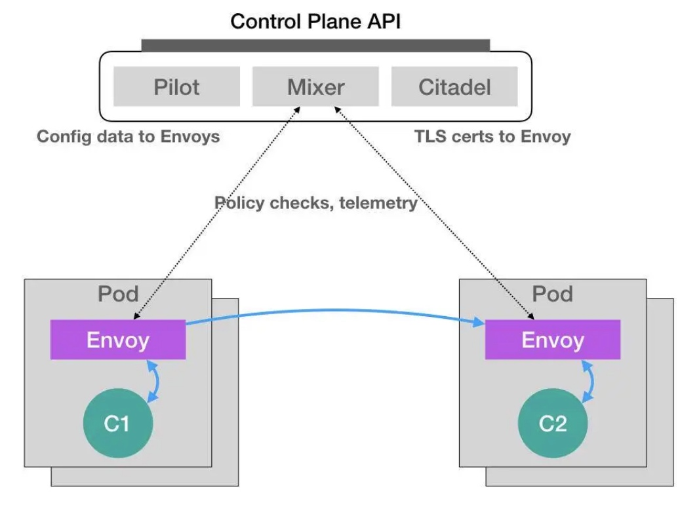

### 《深入剖析 Kubernetes》学习笔记 Day 21

今天继续学习容器编排与Kubernetes作业管理 (15讲)之「23 | 声明式API与Kubernetes编程范式」。

#### 前文回顾

分享了 Job 这个离线业务的编排方法，讲解了 completions 和 parallelism 字段的含义，以及 Job Controller 的执行原理。

#### 声明式API与Kubernetes编程范式

**命令式命令行操作**

```
$ docker service create --name nginx --replicas 2  nginx
$ docker service update --image nginx:1.7.9 nginx
```

**命令式配置文件操作**

先 kubectl create，再 replace 的操作。

**声明式 API**

kubectl apply 命令。

kubectl replace：使用新的 YAML 文件中的 API 对象，替换原有的 API 对象
kubectl apply：执行了一个对原有 API 对象的 PATCH 操作
kubectl set image 和 kubectl edit 也是对已有 API 对象的修改

kube-apiserver 在响应命令式请求（比如kubectl replace）的时候，一次只能处理一个写请求，否则会有产生冲突的可能。而对于声明式请求（比如kubectl apply），一次能处理多个写操作，并且具备 Merge 能力。

**Istio**

微服务热潮，Service Mesh 新的编排概念。

无论是对 sidecar 容器的巧妙设计，还是对 Initializer 的合理利用，Istio 项目的设计与实现，其实都依托于 Kubernetes 的声明式 API 和它所提供的各种编排能力。可以说，Istio 是在 Kubernetes 项目使用上的一位“集大成者”。



Istio 项目的核心，就是由无数个运行在应用 Pod 中的 Envoy 容器组成的服务代理网格。

Istio 最根本的组件，是以 sidecar 方式运行在每一个被治理应用 Pod 里的 Envoy 容器，一个高性能 C++ 网络代理。

Pod 里的所有容器都共享同一个 Network Namespace，能够通过配置 Pod 里的 iptables 规则，把整个 Pod 的进出流量接管下来。Istio 的控制层（Control Plane）里的 Pilot 组件，就能够通过调用每个 Envoy 容器的 API，对这个 Envoy 代理进行配置，从而实现微服务治理。

**Dynamic Admission Control**

Initializer 工作原理和使用方法：

1. Istio 将 Envoy 容器定义以 ConfigMap 的方式保存在 k8s 当中。
2. Istio 将 Initializer 作为一个 Pod 部署在 k8s 中。
3. Initializer 的控制器，不断获取到的“实际状态”，就是新创建的 Pod。而它的“期望状态”则是：这个 Pod 里添加了 Envoy 容器的定义。
4. 使用新旧两个 Pod 对象，生成一个 TwoWayMergePatch
5. 配置指定要对什么样的资源进行这个 Initialize 操作

```
apiVersion: v1
kind: ConfigMap
metadata:
  name: envoy-initializer
data:
  config: |
    containers:
      - name: envoy
        image: lyft/envoy:845747db88f102c0fd262ab234308e9e22f693a1
        command: ["/usr/local/bin/envoy"]
        args:
          - "--concurrency 4"
          - "--config-path /etc/envoy/envoy.json"
          - "--mode serve"
        ports:
          - containerPort: 80
            protocol: TCP
        resources:
          limits:
            cpu: "1000m"
            memory: "512Mi"
          requests:
            cpu: "100m"
            memory: "64Mi"
        volumeMounts:
          - name: envoy-conf
            mountPath: /etc/envoy
    volumes:
      - name: envoy-conf
        configMap:
          name: envoy
```

```
apiVersion: v1
kind: Pod
metadata:
  labels:
    app: envoy-initializer
  name: envoy-initializer
spec:
  containers:
    - name: envoy-initializer
      image: envoy-initializer:0.0.1
      imagePullPolicy: Always
```

```
func doSomething(pod) {
  cm := client.Get(ConfigMap, "envoy-initializer")

  newPod := Pod{}
  newPod.Spec.Containers = cm.Containers
  newPod.Spec.Volumes = cm.Volumes

  // 生成patch数据
  patchBytes := strategicpatch.CreateTwoWayMergePatch(pod, newPod)

  // 发起PATCH请求，修改这个pod对象
  client.Patch(pod.Name, patchBytes)
}
```

```
# method 1
apiVersion: admissionregistration.k8s.io/v1alpha1
kind: InitializerConfiguration
metadata:
  name: envoy-config
initializers:
  // 这个名字必须至少包括两个 "."
  - name: envoy.initializer.kubernetes.io
    rules:
      - apiGroups:
          - "" // 前面说过， ""就是core API Group的意思
        apiVersions:
          - v1
        resources:
          - pods

# method 2
apiVersion: v1
kind: Pod
metadata
  annotations:
    "initializer.kubernetes.io/envoy": "true"
    ...
```

**声明式 API 的独特之处**

声明式 API，是 k8s 项目编排能力赖以生存的核心所在。

1. 所谓“声明式”，指的是只需要提交一个定义好的 API 对象来“声明”，我所期望的状态是什么样子
2. 允许有多个 API 写端，以 PATCH 的方式对 API 对象进行修改，而无需关心本地原始 YAML 文件的内容
3. 最重要的，有了上述两个能力，可以基于对 API 对象的增、删、改、查，在完全无需外界干预的情况下，完成对“实际状态”和“期望状态”的调谐（Reconcile）过程

**k8s 编程范式**

如何使用控制器模式，同 Kubernetes 里 API 对象的“增、删、改、查”进行协作，进而完成用户业务逻辑的编写过程。

> 感悟：从“使用 Kubernetes 部署代码”，到“使用 Kubernetes 编写代码”的蜕变过程，是从一个 Kubernetes 用户，到 Kubernetes 玩家的晋级之路。加油，老方！

学习来源： 极客时间 https://time.geekbang.org/column/intro/100015201?tab=catalog


