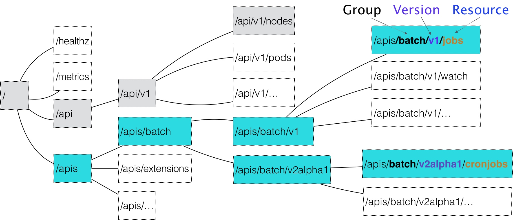
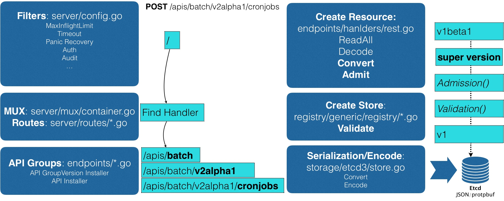

### 《深入剖析 Kubernetes》学习笔记 Day 22

今天学习容器编排与Kubernetes作业管理 (15讲)之「24 | 深入解析声明式API（一）：API对象的奥秘」。

#### 前文回顾

详细讲解了 Kubernetes 声明式 API 的设计、特点，以及使用方式。

#### 深入解析声明式API（一）：API对象的奥秘

当我把一个 YAML 文件提交给 Kubernetes 之后，它究竟是如何创建出一个 API 对象的呢？

**API对象结构**

一个 API 对象在 Etcd 里的完整资源路径：

* Group：API 组
* Version：API 版本
* Resource：API 资源类型

**API对象创建过程**

1. 过滤请求。比如授权、超时处理、审计。
2. MUX和Routers。URL和Handler绑定，找到CronJob类型定义。
3. 根据YAML文件，创建API对象。
4. Admission() 和 Validation() 操作。
5. 序列化后存入Etcd。

**API 插件机制：CRD**

CRD：Custom Resource Definition。自定义API资源类型。

demo： https://github.com/resouer/k8s-controller-custom-resource

> 感悟：已经开始涉及到go代码编写，需要补下课了！

学习来源： 极客时间 https://time.geekbang.org/column/intro/100015201?tab=catalog

