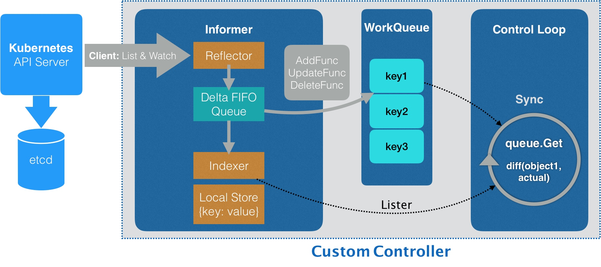

### 《深入剖析 Kubernetes》学习笔记 Day 23

容器编排与Kubernetes作业管理 (15讲)：「25 | 深入解析声明式API（二）：编写自定义控制器」

#### 前文回顾

详细讲解了 Kubernetes 中声明式 API 的实现原理，并且通过一个添加 Network 对象的实例，讲述了在 Kubernetes 里添加 API 资源的过程。

#### 深入解析声明式API（二）：编写自定义控制器

为 Network 这个自定义 API 对象编写一个自定义控制器（Custom Controller）。

**Controller & Informer 工作原理**

1. 控制器使用 Informer 从 Kubernetes 的 APIServer 里获取 Network 对象
2. Informer Reflector 使用 ListAndWatch，获取并监听 Network 对象实例的变化
3. 同步本地缓存，根据事件类型，触发事先注册好的 ResourceEventHandler
4. Handler 将该事件对应的 API 对象的 Key 入队列
5. 控制循环，不断地从队列里拿到这些 Key，然后开始执行真正的控制逻辑
6. 每经过 resyncPeriod 指定的时间，Informer 维护的本地缓存，都会使用最近一次 LIST 返回的结果强制更新一次，也就是 resync

**编写自定义控制器**

https://github.com/resouer/k8s-controller-custom-resource

1. 编写 main 函数
2. 编写自定义控制器的定义
3. 编写控制器里的业务逻辑

**K8s API 编程范式的核心思想**

所谓的 Informer，就是一个自带缓存和索引机制，可以触发 Handler 的客户端库。这个本地缓存在 Kubernetes 中一般被称为 Store，索引一般被称为 Index。

Informer 使用了 Reflector 包，它是一个可以通过 ListAndWatch 机制获取并监视 API 对象变化的客户端封装。

Reflector 和 Informer 之间，用到了一个“增量先进先出队列”进行协同。而 Informer 与要编写的控制循环之间，则使用了一个工作队列来进行协同。

在实际应用中，除了控制循环之外的所有代码，实际上都是 Kubernetes 自动生成的，即：pkg/client/{informers, listers, clientset}里的内容。

而这些自动生成的代码，提供了一个可靠而高效地获取 API 对象“期望状态”的编程库。

作为开发者只需要关注如何拿到“实际状态”，然后如何拿它去跟“期望状态”做对比，从而决定接下来要做的业务逻辑即可。

> 感悟：理论部分能理解。go代码部分还不太熟悉，有点吃力！

学习来源： 极客时间 https://time.geekbang.org/column/intro/100015201?tab=catalog

