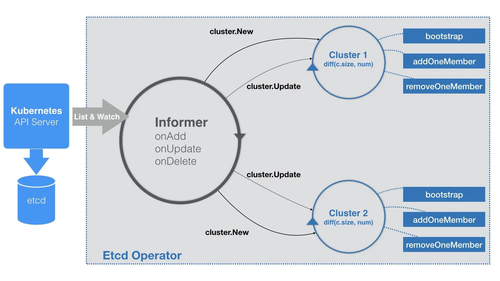

### 《深入剖析 Kubernetes》学习笔记 Day 25

容器编排与Kubernetes作业管理 (15讲)：「27 | 聪明的微创新：Operator工作原理解读」

#### 前文回顾

详细讲解了 Kubernetes 项目中的大部分编排对象（比如 Deployment、StatefulSet、DaemonSet，以及 Job），也介绍了“有状态应用”的管理方法，还阐述了为 Kubernetes 添加自定义 API 对象和编写自定义控制器的原理和流程。

#### Operator工作原理解读

以 Etcd Operator 为例，介绍一个相对更加灵活和编程友好的管理有状态应用的解决方案。

**工作原理**

利用 k8s 的自定义 API 资源（CRD），来描述要部署的有状态应用；然后在自定义控制器里，根据自定义 API 对象的变化，完成具体的部署和运维工作。

把下列过程自动化，即用代码来生成每个 Etcd 节点 Pod 的启动命令，然后把它们启动起来。

```
$ etcd --name infra0 --initial-advertise-peer-urls http://10.0.1.10:2380 \
  --listen-peer-urls http://10.0.1.10:2380 \
...
  --initial-cluster-token etcd-cluster-1 \
  --initial-cluster infra0=http://10.0.1.10:2380,infra1=http://10.0.1.11:2380,infra2=http://10.0.1.12:2380 \
  --initial-cluster-state new
  
$ etcd --name infra1 --initial-advertise-peer-urls http://10.0.1.11:2380 \
  --listen-peer-urls http://10.0.1.11:2380 \
...
  --initial-cluster-token etcd-cluster-1 \
  --initial-cluster infra0=http://10.0.1.10:2380,infra1=http://10.0.1.11:2380,infra2=http://10.0.1.12:2380 \
  --initial-cluster-state new
  
$ etcd --name infra2 --initial-advertise-peer-urls http://10.0.1.12:2380 \
  --listen-peer-urls http://10.0.1.12:2380 \
...
  --initial-cluster-token etcd-cluster-1 \
  --initial-cluster infra0=http://10.0.1.10:2380,infra1=http://10.0.1.11:2380,infra2=http://10.0.1.12:2380 \
  --initial-cluster-state new
```

**集群组建**

1. Etcd Operator 会创建一个种子节点
2. Etcd Operator 会不断创建新的 Etcd 节点并逐一加入到这个集群当中，直到集群的节点数等于 size

只要用户提交 YAML 文件时声明创建一个 EtcdCluster 对象（一个 Etcd 集群），那么 Etcd Operator 都应该先创建一个单节点的种子集群（Seed Member），并启动这个种子节点。

```
func (c *Controller) Start() error {
 for {
  err := c.initResource()
  ...
  time.Sleep(initRetryWaitTime)
 }
 c.run()
}

func (c *Controller) run() {
 ...
 
 _, informer := cache.NewIndexerInformer(source, &api.EtcdCluster{}, 0, cache.ResourceEventHandlerFuncs{
  AddFunc:    c.onAddEtcdClus,
  UpdateFunc: c.onUpdateEtcdClus,
  DeleteFunc: c.onDeleteEtcdClus,
 }, cache.Indexers{})
 
 ctx := context.TODO()
 // TODO: use workqueue to avoid blocking
 informer.Run(ctx.Done())
}
```

**启动流程**

1. 创建 EtcdCluster 对象所需要的 CRD
2. 定义一个 EtcdCluster 对象的 Informer
3. 为每一个 EtcdCluster 对象，都启动了一个控制循环，并发响应这些对象的变化。



**EtcdCluster职责**

1. 第一次被创建的时候执行 Bootstrap，即：创建一个单节点的种子集群
2. 启动该集群所对应的控制循环

**控制循环**

1. 定时执行Diff流程：获取到所有正在运行的、属于这个 Cluster 的 Pod 数量，也就是该 Etcd 集群的实际状态
2. 期望状态，是在 EtcdCluster 对象里定义的 size
3. 对比这两个状态差异。如果实际的 Pod 数量不够，执行添加成员节点的操作（即：上述流程图中的 addOneMember 方法）；反之，就执行删除成员节点的操作（即：上述流程图中的 removeOneMember 方法）

**addOneMember流程**

1. 生成一个新节点的 Pod 的名字，比如：example-etcd-cluster-v6v6s6stxd
2. 调用 Etcd Client，执行前面提到过的 etcdctl member add example-etcd-cluster-v6v6s6stxd 命令
3. 使用这个 Pod 名字，和已经存在的所有节点列表，组合成一个新的 initial-cluster 字段的值
4. 使用这个 initial-cluster 的值，生成这个 Pod 里 Etcd 容器的启动命令
5. 容器启动之后，一个新的 Etcd 成员节点就被加入到了集群当中。控制循环会重复这个过程，直到正在运行的 Pod 数量与 EtcdCluster 指定的 size 一致

> 感悟：Operator比之前部署mysql集群时，那种直接在yaml里的写大段命令的方式高级太多了！

学习来源： 极客时间 https://time.geekbang.org/column/intro/100015201?tab=catalog


