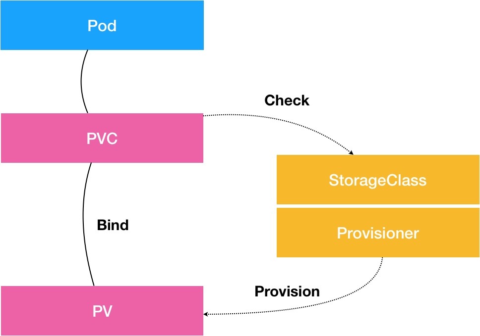

### 《深入剖析 Kubernetes》学习笔记 Day 26

Kubernetes容器持久化存储 (4讲)：「28 | PV、PVC、StorageClass，这些到底在说啥？」

#### 前文回顾

重点分析了 Kubernetes 的各种编排能力。

#### PV、PVC、StorageClass，这些到底在说啥？

剖析 Kubernetes 项目处理容器持久化存储的核心原理。

**PV**

持久化存储数据卷。主要定义的是一个持久化存储在宿主机上的目录，比如一个 NFS 的挂载目录。

**PVC**

Pod 所希望使用的持久化存储的属性。比如，Volume 存储的大小、可读写权限等等。

**Bind**

PVC 要真正被容器使用起来，就必须先和某个符合条件的 PV 进行绑定。

1. PV 和 PVC 的 spec 字段。比如，PV 的存储（storage）大小，就必须满足 PVC 的要求
2. PV 和 PVC 的 storageClassName 字段必须一样

**PersistentVolumeController**

维护着多个控制循环，其中有一个循环，扮演的就是撮合 PV 和 PVC 的红娘的角色。

不断查看当前每一个 PVC，是不是已经处于 Bound（已绑定）状态。如果不是，那它就会遍历所有的、可用的 PV，并尝试将其与这个单身的 PVC 进行绑定。这样，k8s 就可以保证用户提交的每一个 PVC，只要有合适的 PV 出现，它就能够很快进入绑定状态，从而结束单身之旅。

**Volume**

就是将一个宿主机上的目录，跟一个容器里的目录绑定挂载在了一起。

持久化 Volume，指的就是这个宿主机上的目录，具备持久性。即：这个目录里面的内容，既不会因为容器的删除而被清理掉，也不会跟当前的宿主机绑定。

当容器被重启或者在其他节点上重建出来之后，它仍然能够通过挂载这个 Volume，访问到这些内容。

其实现往往依赖于一个远程存储服务，比如：远程文件存储（比如，NFS、GlusterFS）、远程块存储（比如，公有云提供的远程磁盘）等等。

**两阶段处理**

1. Attach。为虚拟机挂载远程磁盘
2. Mount。将磁盘设备格式化并挂载到 Volume 宿主机目录的操作

kubelet 只要把这个 Volume 目录通过 CRI 里的 Mounts 参数，传递给 Docker，然后就可以为 Pod 里的容器挂载这个“持久化”的 Volume 了。

**Dynamic Provisioning**

一套自动创建 PV 的机制。

**StorageClass**

Dynamic Provisioning 机制工作的核心。

1. PV 的属性。比如，存储类型、Volume 的大小等。
2. 创建这种 PV 需要用到的存储插件。比如，Ceph 等。

> 感悟：开始有点枯燥了，说明到了深水区。

学习来源： 极客时间 https://time.geekbang.org/column/intro/100015201?tab=catalog

