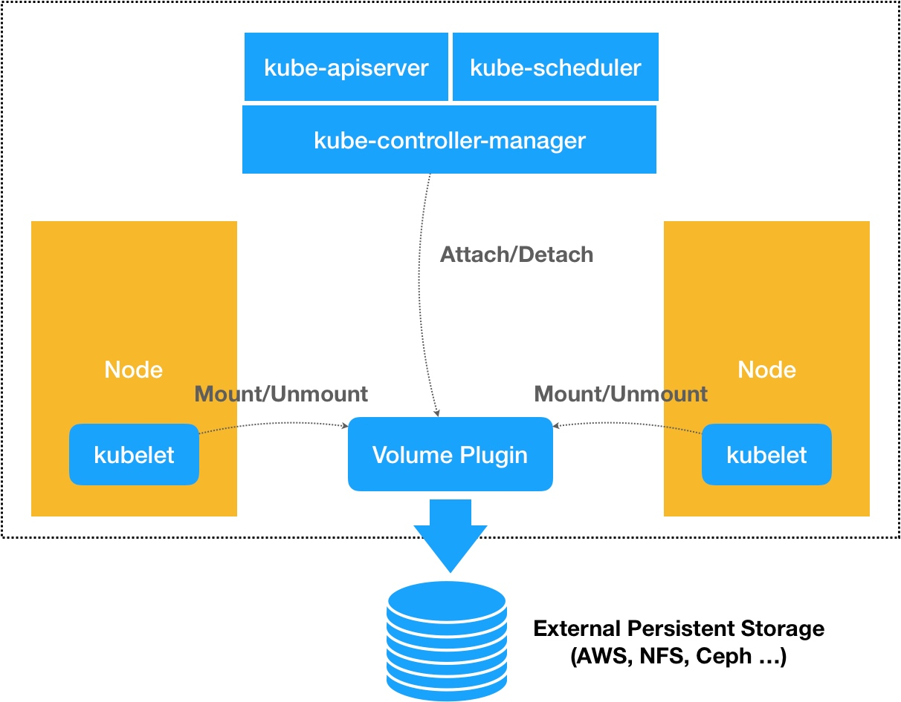
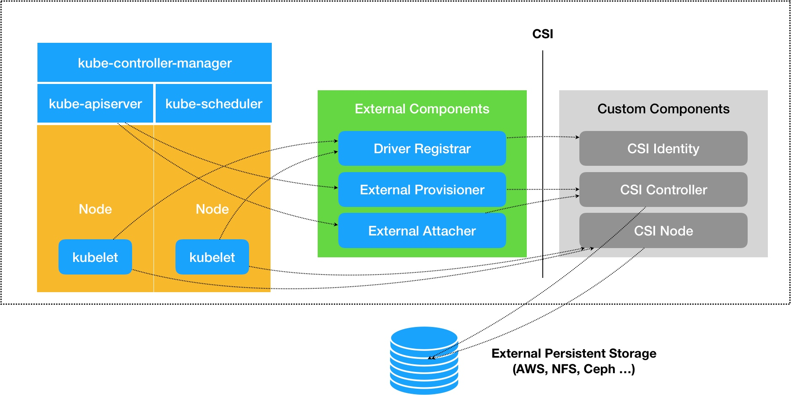

### 《深入剖析 Kubernetes》学习笔记 Day 28

Kubernetes容器持久化存储 (4讲)：「30 | 编写自己的存储插件：FlexVolume与CSI」

#### 前文回顾

详细讲解了Kubernetes 里的持久化存储体系，讲解了 PV 和 PVC 的具体实现原理，并提到了这样的设计实际上是出于对整个存储体系的可扩展性的考虑。

#### 编写自己的存储插件：FlexVolume与CSI

**FlexVolume**

```
kind: PersistentVolume
apiVersion: v1
metadata:
  name: pv-flex-nfs
spec:
  capacity:
    storage: 10Gi
  accessModes:
    - ReadWriteMany
  flexVolume:
    driver: "k8s/nfs"
    fsType: "nfs"
    options:
      server: "10.10.0.25"
      share: "export"
```

kubelet 通过插件在宿主机上执行

```
/usr/libexec/kubernetes/kubelet-plugins/volume/exec/k8s~nfs/nfs mount <mount dir> <json param>
```

* mount dir：当前正在处理的 Volume 在宿主机上的目录
* json params：PV 里定义的 options 字段的值，Pod名字，Namespace等原数据

```
domount() {
 MNTPATH=$1
 
 NFS_SERVER=$(echo $2 | jq -r '.server')
 SHARE=$(echo $2 | jq -r '.share')
 
 ...
 
 mkdir -p ${MNTPATH} &> /dev/null
 
 mount -t nfs ${NFS_SERVER}:/${SHARE} ${MNTPATH} &> /dev/null
 if [ $? -ne 0 ]; then
  err "{ \"status\": \"Failure\", \"message\": \"Failed to mount ${NFS_SERVER}:${SHARE} at ${MNTPATH}\"}"
  exit 1
 fi
 log '{"status": "Success"}'
 exit 0
}
```

**jq**

Lightweight and flexible command-line JSON processor
https://stedolan.github.io/jq/

```
echo '{"foo": 0}'|jq -r '.foo'
0
```

**CSI：Container Storage Interface**

相比于 FlexVolume，CSI 的设计思想，把插件的职责从两阶段处理，扩展成了 Provision、Attach 和 Mount 三个阶段。

* Provision：创建磁盘
* Attach：挂载磁盘到虚拟机
* Mount：将该磁盘格式化后，挂载在 Volume 的宿主机目录上



FlexVolume以及 k8s 内置的其他存储插件，仅仅是 Attach 和 Mount 阶段的具体执行者。而像 Dynamic Provisioning 这样的功能，就不是存储插件的责任，而是 k8s 本身存储管理功能的一部分。

CSI 插件体系的设计思想，就是把这个 Provision 阶段，以及 k8s 里的一部分存储管理功能，从主干代码里剥离出来，做成了几个单独的组件。这些组件会通过 Watch API 监听 k8s 里与存储相关的事件变化，比如 PVC 的创建，来执行具体的存储管理动作。



**External Components**

* Driver Registrar：将插件注册到 kubelet 里面。需要请求 CSI 插件的 Identity 服务来获取插件信息
* External Provisioner：负责 Provision 阶段，监听（Watch）了 APIServer 里的 PVC 对象。当一个 PVC 被创建时，它就会调用 CSI Controller 的 CreateVolume 方法，为你创建对应 PV
* External Attacher：负责 Attach 阶段。监听了 APIServer 里 VolumeAttachment 对象的变化

**CSI 插件服务**

CSI Identity：负责对外暴露这个插件本身的信息
CSI Controller：定义对 CSI Volume（对应 k8s 里的 PV）的管理接口
CSI Node：定义 CSI Volume 需要在宿主机上执行的操作


```
service Identity {
  // return the version and name of the plugin
  rpc GetPluginInfo(GetPluginInfoRequest)
    returns (GetPluginInfoResponse) {}
  // reports whether the plugin has the ability of serving the Controller interface
  rpc GetPluginCapabilities(GetPluginCapabilitiesRequest)
    returns (GetPluginCapabilitiesResponse) {}
  // called by the CO just to check whether the plugin is running or not
  rpc Probe (ProbeRequest)
    returns (ProbeResponse) {}
}
```

```
service Controller {
  // provisions a volume
  rpc CreateVolume (CreateVolumeRequest)
    returns (CreateVolumeResponse) {}
    
  // deletes a previously provisioned volume
  rpc DeleteVolume (DeleteVolumeRequest)
    returns (DeleteVolumeResponse) {}
    
  // make a volume available on some required node
  rpc ControllerPublishVolume (ControllerPublishVolumeRequest)
    returns (ControllerPublishVolumeResponse) {}
    
  // make a volume un-available on some required node
  rpc ControllerUnpublishVolume (ControllerUnpublishVolumeRequest)
    returns (ControllerUnpublishVolumeResponse) {}
    
  ...
  
  // make a snapshot
  rpc CreateSnapshot (CreateSnapshotRequest)
    returns (CreateSnapshotResponse) {}
    
  // Delete a given snapshot
  rpc DeleteSnapshot (DeleteSnapshotRequest)
    returns (DeleteSnapshotResponse) {}
    
  ...
}
```

```
service Node {
  // temporarily mount the volume to a staging path
  rpc NodeStageVolume (NodeStageVolumeRequest)
    returns (NodeStageVolumeResponse) {}
    
  // unmount the volume from staging path
  rpc NodeUnstageVolume (NodeUnstageVolumeRequest)
    returns (NodeUnstageVolumeResponse) {}
    
  // mount the volume from staging to target path
  rpc NodePublishVolume (NodePublishVolumeRequest)
    returns (NodePublishVolumeResponse) {}
    
  // unmount the volume from staging path
  rpc NodeUnpublishVolume (NodeUnpublishVolumeRequest)
    returns (NodeUnpublishVolumeResponse) {}
    
  // stats for the volume
  rpc NodeGetVolumeStats (NodeGetVolumeStatsRequest)
    returns (NodeGetVolumeStatsResponse) {}
    
  ...
  
  // Similar to NodeGetId
  rpc NodeGetInfo (NodeGetInfoRequest)
    returns (NodeGetInfoResponse) {}
}
```

> 感悟：这几天理论学的有点多了，需要实验一下！

学习来源： 极客时间 https://time.geekbang.org/column/intro/100015201?tab=catalog


