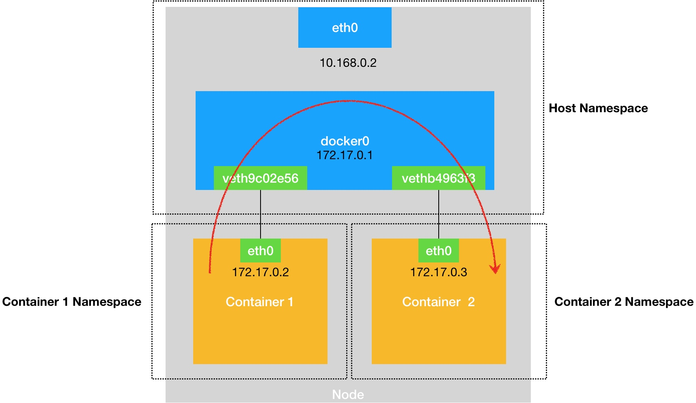
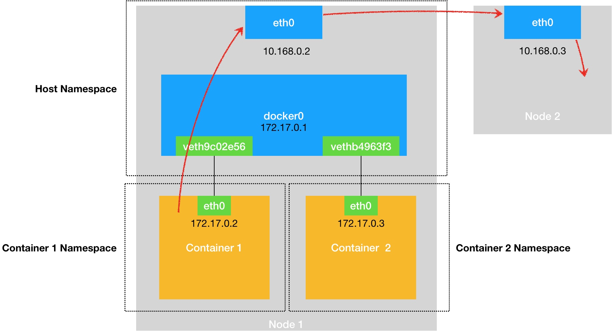
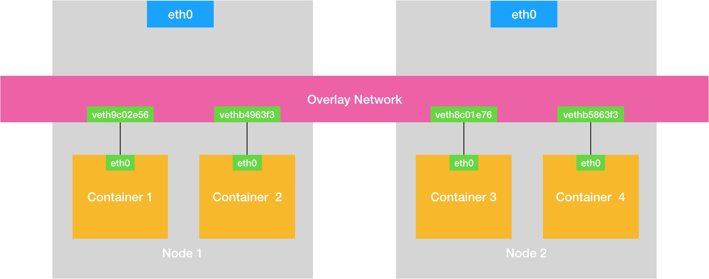

### 《深入剖析 Kubernetes》学习笔记 Day 30

Kubernetes容器网络 (8讲)：「32 | 浅谈容器网络」

#### 前文回顾

详细讲解了 Kubernetes 容器持久化存储体系以及原理。

#### 浅谈容器网络

一个 Linux 容器能看见的网络栈，实际上是被隔离在它自己的 Network Namespace 当中的。

被限制在 Network Namespace 里的容器进程，通过 Veth Pair 设备 + 宿主机网桥的方式，实现了跟其他容器的数据交换。

**网络栈**

* 网卡 Network Interface
* 回环设备 Loopback Device
* 路由表 Routing Table
* 路由规则 Iptables

**OSI Model Layers**

https://www.lifewire.com/layers-of-the-osi-model-illustrated-818017

**网桥 Bridge**

虚拟交换机，工作在数据链路层（Data Link）的设备，根据 MAC 地址学习来将数据包转发到网桥的不同端口（Port）上。

**docker0 网桥**

Docker 默认在宿主机上创建的网桥，凡是连接在 docker0 网桥上的容器，就可以通过它来进行通信。

**Veth Pair 设备**

以两张虚拟网卡（Veth Peer）的形式成对出现。从其中一个网卡发出的数据包，可以直接出现在与它对应的另一张网卡上，即使这两个网卡在不同的 Network Namespace 里。

**ARP：Address Resolution Protocol**

通过三层的 IP 地址找到对应的二层 MAC 地址的协议。

**Iptables**

https://en.wikipedia.org/wiki/Iptables

**同宿主机容器通信流程**

**跨宿主机容器通信流程**

**Overlay Network 覆盖网络**

通过软件构建一个覆盖在已有宿主机网络之上的、可以把所有容器连通在一起的虚拟网络。

> 感悟：容器网络基础，很通透，lifewire.com这网站不错！

学习来源： 极客时间 https://time.geekbang.org/column/intro/100015201?tab=catalog

