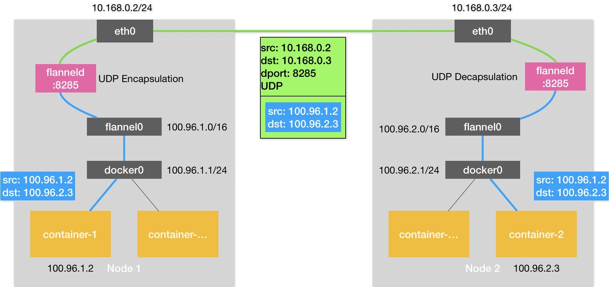
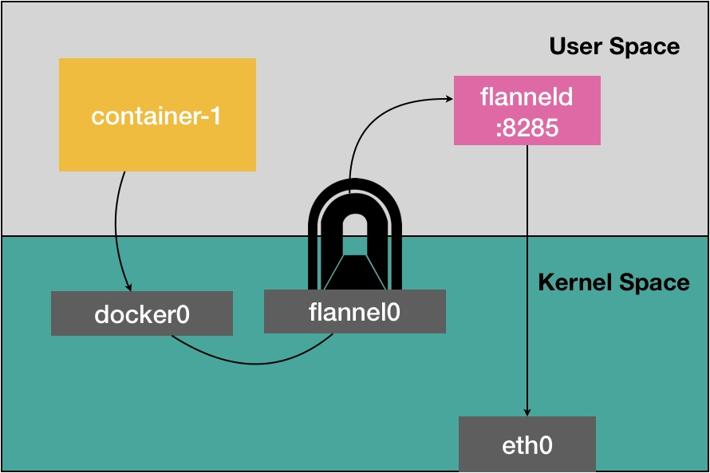
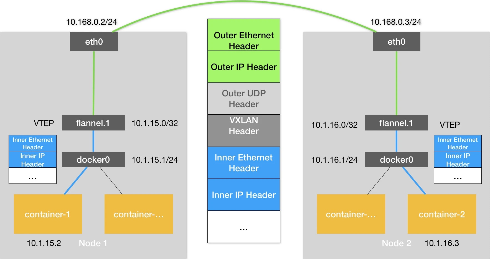

### 《深入剖析 Kubernetes》学习笔记 Day 31

Kubernetes容器网络 (8讲)：「33 | 深入解析容器跨主机网络」

#### 前文回顾

详细讲解了在单机环境下，Linux 容器网络的实现原理（网桥模式）。

#### 深入解析容器跨主机网络

为了解决容器跨主通信的问题，社区里出现了很多容器网络方案，它们的工作原理是什么？

**Flannel**

三种后端实现：

1. UDP
2. VXLAN
3. host-gw

**Flannel UDP**

**flannel0**

TUN 设备（Tunnel 设备），工作在三层（Network Layer）的虚拟网络设备，在操作系统内核和用户应用程序之间传递 IP 包。

**性能问题**

Flannel UDP模式，仅在发出 IP 包的过程中，就需要经过三次用户态与内核态之间的数据拷贝。

**Flannel VXLAN**

VXLAN：Virtual Extensible LAN（虚拟可扩展局域网）。是 Linux 内核支持的一种网络虚似化技术。VXLAN 可以完全在内核态实现上述封装和解封装的工作，从而通过与前面相似的隧道机制，构建出覆盖网络（Overlay Network）。

**flannel.1**

VTEP：VXLAN Tunnel End Point（虚拟隧道端点）。VTEP 设备的作用，是在虚拟的二层网络上打通隧道。它进行封装和解封装的对象，是二层数据帧（Ethernet frame）；这个工作的执行流程，全部在内核里完成（因为 VXLAN 本身就是 Linux 内核中的一个模块）。

> 感悟：大多数软件都是先以最小代价实现功能，当局部成为瓶颈时再优化性能或设计新的方案。就跟软件架构一样，随着业务发展不断打磨不断演进，想最初就一蹴而就的完美主义，会让团队失去先机！

学习来源： 极客时间 https://time.geekbang.org/column/intro/100015201?tab=catalog

