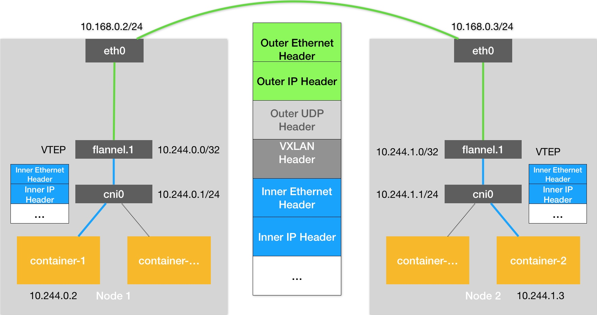

### 《深入剖析 Kubernetes》学习笔记 Day 32

Kubernetes容器网络 (8讲)：「34 | Kubernetes网络模型与CNI网络插件」

#### 前文回顾

以 Flannel 项目为例，详细讲解了容器跨主机网络的两种实现方法：UDP 和 VXLAN。

#### k8s 网络模型与CNI网络插件

容器都连接在 docker0 网桥上，网络插件则在宿主机上创建了一个特殊设备（UDP 模式创建的是 TUN 设备，VXLAN 模式创建的则是 VTEP 设备），docker0 与这个设备之间，通过 IP 转发（路由表）进行协作。

网络插件真正要做的事情，就是把不同宿主机上的特殊设备连通，从而达到容器跨主机通信的目的。

k8s 是通过一个叫作 CNI 的接口，维护了一个单独的网桥来代替 docker0。这个网桥的名字就叫作：CNI 网桥，它在宿主机上的设备名称默认是：cni0。

**Flannel VXLAN**




```
# 在Node 1上
$ route -n
Kernel IP routing table
Destination     Gateway         Genmask         Flags Metric Ref    Use Iface
...
10.244.0.0      0.0.0.0         255.255.255.0   U     0      0        0 cni0
10.244.1.0      10.244.1.0      255.255.255.0   UG    0      0        0 flannel.1
172.17.0.0      0.0.0.0         255.255.0.0     U     0      0        0 docker0
```

**CNI 设计思想**

k8s 在启动 Infra 容器之后，就可以直接调用 CNI 网络插件，为这个 Infra 容器的 Network Namespace，配置符合预期的网络栈。

**CNI 插件基础可执行文件**

```
$ ls -al /opt/cni/bin/
```

* Main 插件，用来创建具体网络设备。比如bridge（网桥设备）、ipvlan、loopback（lo 设备）、macvlan、ptp（Veth Pair 设备），以及 vlan
* IPAM（IP Address Management）插件，负责分配 IP 地址。比如dhcp（向dhcp服务器获取ip）、host-local（使用预分配ip）
* 内置 CNI 插件。比如flannel、tuning（通过 sysctl 调整网络设备参数）、portmap（通过 iptables 配置端口映射）、bandwidth（使用 Token Bucket Filter即TBF限流）

**CNI 插件工作原理**

以网桥类型的 CNI 插件的 ADD 方法为例：

1. 创建 Pod，dockershim 调用 Docker API 创建并启动 Infra 容器，执行 SetUpPod 方法
2. 为 CNI 插件/opt/cni/bin/flannel准备参数，包括由 dockershim 设置的一组 CNI 环境变量如CNI_COMMAND，以及从 CNI 配置文件里加载到的、默认插件的配置信息Network Configuration
3. 调用 CNI 插件为 Infra 容器配置网络
4. Flannel CNI 插件调用 CNI bridge 插件，即执行/opt/cni/bin/bridge
5. CNI bridge 插件开始将容器加入到 CNI 网络里
6. CNI bridge 插件检查宿主机上 CNI 网桥是否存在，如果没有就创建
6. CNI bridge 插件通过 Infra 容器的 Network Namespace 文件，进入到这个 Network Namespace 里面，创建一对 Veth Pair 设备，把 Veth Pair 的其中一端 vethb4963 移动到宿主机上
7. CNI bridge 插件把 vethb4963 设备连接在 CNI 网桥上，为它设置 Hairpin Mode（发夹模式），允许一个数据包从一个端口进来后，再从这个端口发出去，即在 CNI 配置文件里声明 hairpinMode=true
8. CNI bridge 插件会调用 CNI ipam 插件，从 ipam.subnet 定义的网段里为容器分配一个可用的 IP 地址
9. CNI bridge 插件把这个 IP 地址添加在容器的 eth0 网卡上，同时为容器设置默认路由
10. CNI bridge 插件为 CNI 网桥添加 IP 地址
11. CNI 插件把容器 IP 地址等信息返回给 dockershim，然后被 kubelet 写入 Pod 的 Status 字段

> 感悟：CNI插件是真正的面向接口编程，而不是很多Javer写的那种一个接口一个实现的鸡肋。好的架构和框架就是这样自己实现核心的基础组件，把各种具体实现交给更专业的程序员！

学习来源： 极客时间 https://time.geekbang.org/column/intro/100015201?tab=catalog


