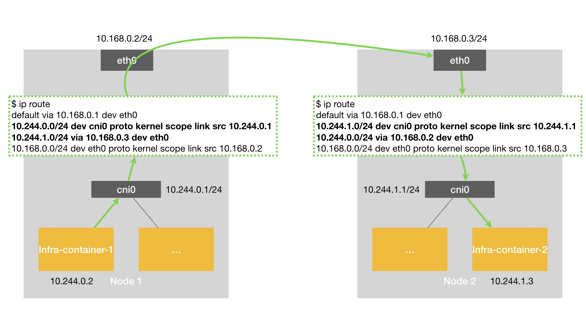
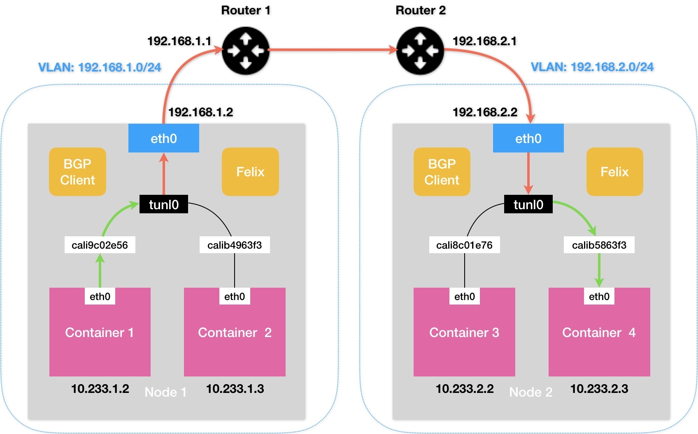

### 《深入剖析 Kubernetes》学习笔记 Day 33

Kubernetes容器网络 (8讲)：「35 | 解读Kubernetes三层网络方案」

#### 前文回顾

以网桥类型的 Flannel 插件为例，讲解了 k8s 里容器网络和 CNI 插件的主要工作原理。

#### 解读Kubernetes三层网络方案

纯三层（Pure Layer 3）网络方案的典型例子，莫过于 Flannel 的 host-gw 模式和 Calico 项目了。

**Flannel host-gw**

Node 1 上的 Infra-container-1，要访问 Node 2 上的 Infra-container-2 为例。



**工作原理**

就是将每个 Flannel 子网（Flannel Subnet，比如：10.244.1.0/24）的下一跳，设置成了该子网对应的主机的 IP 地址。这台主机（Host）会充当这条容器通信路径里的网关（Gateway），这也正是 host-gw 的含义。

**路由过程**

```
$ ip route
...
10.244.1.0/24 via 10.168.0.3 dev eth0
```

路由规则：目的 IP 属于 10.244.1.0/24 网段的 IP 包，应该经过 eth0 设备发出去；并且下一跳地址（next-hop）是 10.168.0.3。

下一跳地址：如果 IP 包从主机 A 发到主机 B，需要经过路由设备 X 的中转。那么 X 的 IP 地址就应该配置为主机 A 的下一跳地址。

当 IP 包从网络层进入链路层封装成帧的时候，eth0 设备就会使用下一跳地址对应的 MAC 地址，作为该数据帧的目的 MAC 地址。

数据帧从 Node 1 通过宿主机的二层网络顺利到达 Node 2 上。

Node 2 的内核网络栈从二层数据帧里拿到 IP 包后，看到目的 IP 地址是 10.244.1.3，即 Infra-container-2 的 IP 地址。根据 Node 2 上的路由表，该目的地址会匹配到第二条路由规则（也就是 10.244.1.0 对应的路由规则），从而进入 cni0 网桥，进而进入到 Infra-container-2 当中。

**限制条件**

Flannel host-gw 模式必须要求集群宿主机之间是二层连通的。

**Calico**

和 Flannel 的 host-gw 模式，几乎是完全一样的。不同的是 Calico 使用了 BGP 来自动地在整个集群中分发路由信息。

**BGP：Border Gateway Protocol**

边界网关协议。Linux 内核原生就支持的、专门用在大规模数据中心里维护不同的自治系统之间路由信息的、无中心的路由协议。

**Calico IPIP**



> 感悟：补了一下网络基础，还需要结合命令行工具来加深理解。

学习来源： 极客时间 https://time.geekbang.org/column/intro/100015201?tab=catalog

