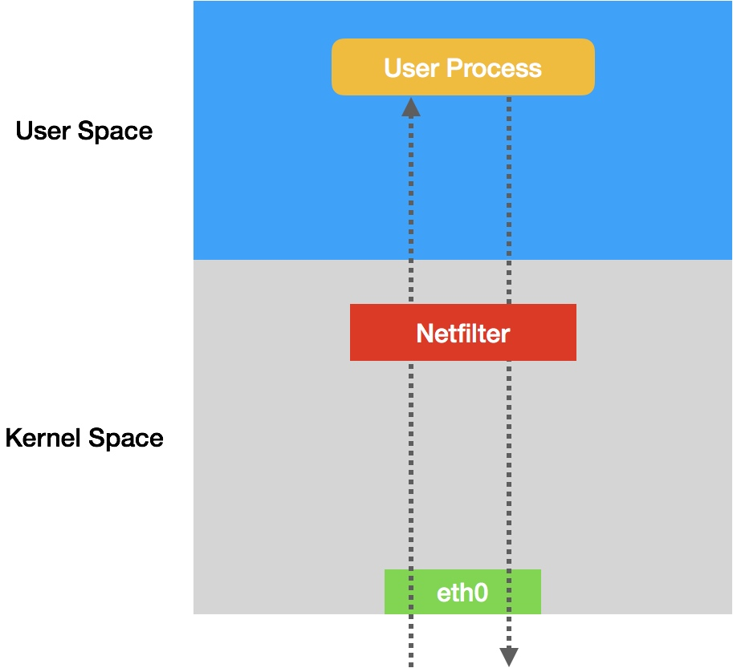
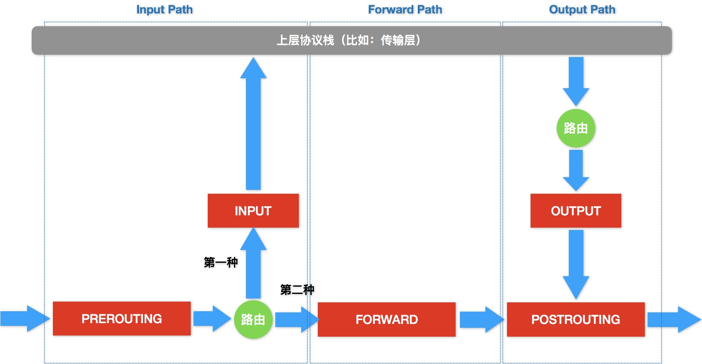
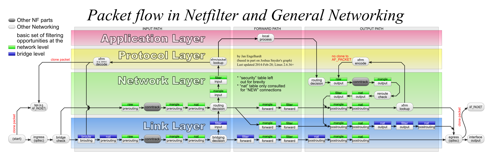

### 《深入剖析 Kubernetes》学习笔记 Day 34

Kubernetes容器网络 (8讲)：「36 | 为什么说 Kubernetes 只有soft multi-tenancy？」

#### 前文回顾

详细讲解了 k8s 生态里，主流容器网络方案的工作原理。

#### 为什么说 Kubernetes 只有弱多租户soft multi-tenancy？

k8s 的网络方案对隔离到底是如何考虑的呢？难道就不管网络多租户的需求吗？

**NetworkPolicy**

k8s 网络插件对 Pod 隔离，是通过在宿主机上生成 NetworkPolicy 对应的 iptable 规则来实现的。

```
kind: NetworkPolicy
apiVersion: extensions/v1beta1
metadata:
  name: test-network-policy
  namespace: default
spec:
  podSelector:
    matchLabels:
      role: db
  ingress:
   - from:
     - namespaceSelector:
         matchLabels:
           project: myproject
     - podSelector:
         matchLabels:
           role: frontend
     ports:
       - protocol: tcp
         port: 6379
```

**Pod 隔离**

Pod 默认都是允许所有（Accept All）的，可以接收来自任何发送方的请求，向任何接收方发送请求。

一旦 Pod 被 NetworkPolicy 选中，那么这个 Pod 就会进入拒绝所有（Deny All）的状态。这个 Pod 既不允许被外界访问，也不允许对外界发起访问。而 NetworkPolicy 定义的规则，其实就是白名单。

policyTypes

* ingress：流入请求
* egress：流出请求

**KUBE-NWPLCY-CHAIN 规则**

```
for dstIP := range 所有被networkpolicy.spec.podSelector选中的Pod的IP地址
  for srcIP := range 所有被ingress.from.podSelector选中的Pod的IP地址
    for port, protocol := range ingress.ports {
      iptables -A KUBE-NWPLCY-CHAIN -s $srcIP -d $dstIP -p $protocol -m $protocol --dport $port -j ACCEPT 
    }
  }
} 
```

* 规则名字：KUBE-NWPLCY-CHAIN
* IP 包的源地址：$srcIP
* 目的地址：$dstIP
* 协议：$protocol
* 目的端口：$port
* 跳转目标：允许它通过（ACCEPT）

**访问被隔离 Pod**

拦截访问请求：

```
for pod := range 该Node上的所有Pod {
    if pod是networkpolicy.spec.podSelector选中的 {
        iptables -A FORWARD -d $podIP -m physdev --physdev-is-bridged -j KUBE-POD-SPECIFIC-FW-CHAIN
        iptables -A FORWARD -d $podIP -j KUBE-POD-SPECIFIC-FW-CHAIN
        ...
    }
}
```

第一条 FORWARD 链：同宿主机上容器之间经过 CNI 网桥进行通信的流入数据包
第二条 FORWARD 链：跨宿主机容器之间通信

**KUBE-POD-SPECIFIC-FW-CHAIN 规则：**

```
iptables -A KUBE-POD-SPECIFIC-FW-CHAIN -j KUBE-NWPLCY-CHAIN
iptables -A KUBE-POD-SPECIFIC-FW-CHAIN -j REJECT --reject-with icmp-port-unreachable
```

**k8s 的网络模型跟 IaaS VM 的区别**

k8s 大多数容器网络实现，既不会保证容器之间二层网络的互通，也不会实现容器之间的二层网络隔离。这跟 IaaS 项目管理虚拟机的方式，是完全不同的。

k8s 项目在云计算生态里的定位，是基础设施与 PaaS 之间的中间层。

**iptables原理**

一个操作 Linux 内核 Netfilter 子系统的界面。Netfilter 子系统的作用，就是 Linux 内核里挡在网卡和用户态进程之间的一道防火墙。



链（Chain）：IP 包一进一出的两条路径上，几个关键的检查点。是 Netfilter 设置防火墙的地方。

其工作原理如下图：



* PREROUTING：经过路由表路由之前检查点
* INPUT：向上层协议栈流动，进入传输层之前检查点
* OUTPUT：通过传输层进入用户空间，用户进程处理完成，经过路由表路由结束后检查点
* FORWARD：不会进入传输层，继续在网络层流动，进入到转发路径中检查点
* POSTROUTING：OUTPUT 和 FORWARD 两条路径之后的最终检查点

数据包在 Linux Netfilter 子系统里完整的流动过程如下：



链路层（二层）的检查点对应的操作界面叫作 ebtables。

图中绿色部分，就是网络层的 iptables 链的工作流程。

iptables 表：每一个白色的检查点上，有一个绿色的标签，比如：raw、nat、filter 等等。

其作用是，在某个具体的检查点（比如 Output）上，按顺序执行几个不同的检查动作（比如，先执行 nat，再执行 filter）。

> 感悟：搞懂了一点iptables原理以及路由规则语法。

学习来源： 极客时间 https://time.geekbang.org/column/intro/100015201?tab=catalog

