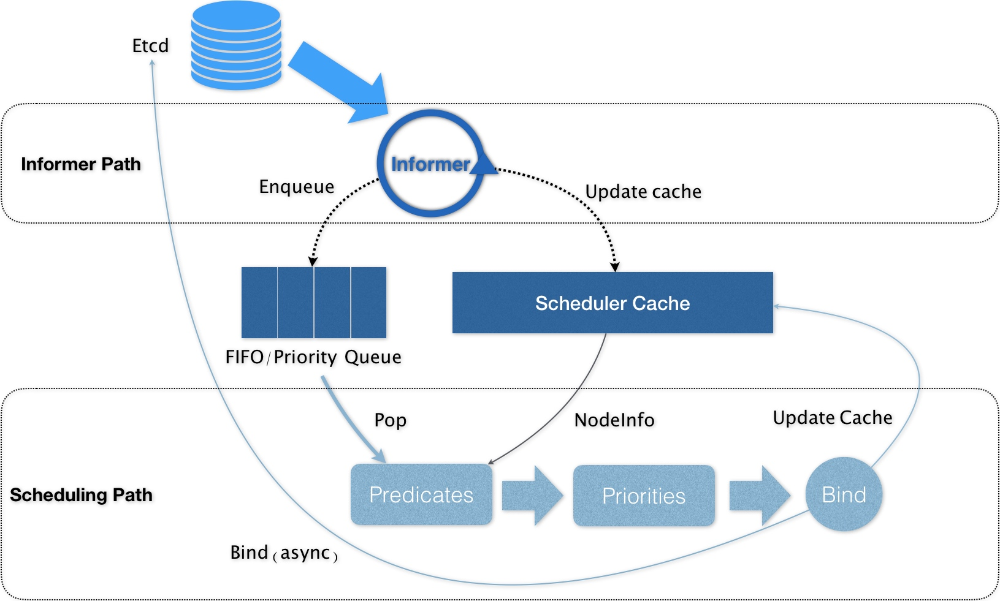
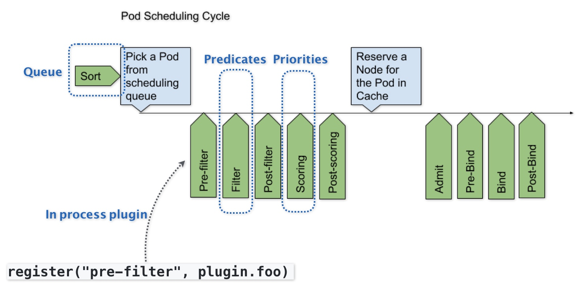

### 《深入剖析 Kubernetes》学习笔记 Day 39

Kubernetes作业调度与资源管理 (5讲)：「41 | 十字路口上的Kubernetes默认调度器」

#### 前文回顾

介绍了 Kubernetes 里关于资源模型和资源管理的设计方法。

#### 十字路口上的Kubernetes默认调度器

**Default Scheduler**

默认调度器的主要职责，就是为一个新创建出来的 Pod，寻找一个最合适的节点（Node）。

1. Predicate：从集群所有的节点中，根据调度算法挑选出所有可以运行该 Pod 的节点
2. Priority：从第一步的结果中，再根据调度算法挑选一个最符合条件的节点作为最终结果
3. 将 Pod 的 spec.nodeName 字段填上调度结果的节点名字

调度器的核心，就是下图两个相互独立的控制循环。

**Informer Path**

1. 启动一系列 Informer，监听（Watch）Etcd 中 Pod、Node、Service 等 API 对象的变化
2. 通过 Pod Informer 的 Handler，将待调度 Pod 添加进调度队列
3. 对调度器缓存（scheduler cache）进行更新

**Scheduling Path**

1. 从调度队列里出队一个 Pod
2. 调用 Predicates 算法对从 Scheduler Cache 里拿到的 Node进行过滤，得到可以运行这个 Pod 的 Node 列表
3. 调用 Priorities 算法为 Node 打分（0 - 10分），得到得分最高的 Node
4. 将上述 Node 的名字绑定（Bind）到 Pod 对象的 nodeName 字段，更新 Scheduler Cache 里 Pod 和 Node 的信息
5. 创建 Goroutine 异步向 APIServer 发起更新 Pod 的请求，完成 Bind 操作

**Performance**

* Cache 化。尽最大可能将集群信息 Cache 化，以便从根本上提高 Predicate 和 Priority 调度算法的执行效率。
* 乐观绑定。为了不在关键调度路径里远程访问 APIServer，调度器在 Bind 阶段，只会更新 Scheduler Cache 里的 Pod 和 Node 的信息。
* 无锁化。调度器会启动多个 Goroutine 以节点为粒度并发执行 Predicates 算法。Priorities 算法也会以 MapReduce 的方式并行计算然后再进行汇总。在这些需要并发的路径上，调度器会避免设置任何全局的竞争资源，以减少使用锁进行同步带来的巨大的性能损耗。

**Scheduler Framework**

在调度器生命周期的各个关键点上，暴露出可以进行扩展和实现的接口，从而实现自定义调度器的能力。

上图中，每一个绿色的箭头都是一个可以插入自定义逻辑的接口。

这些可插拔式逻辑，都是标准的 Go 语言插件机制（Go plugin 机制），可以选择把哪些插件编译进去。

> 感悟：无锁并发大幅提升了调度性能，很赞！

学习来源： 极客时间 https://time.geekbang.org/column/intro/100015201?tab=catalog

