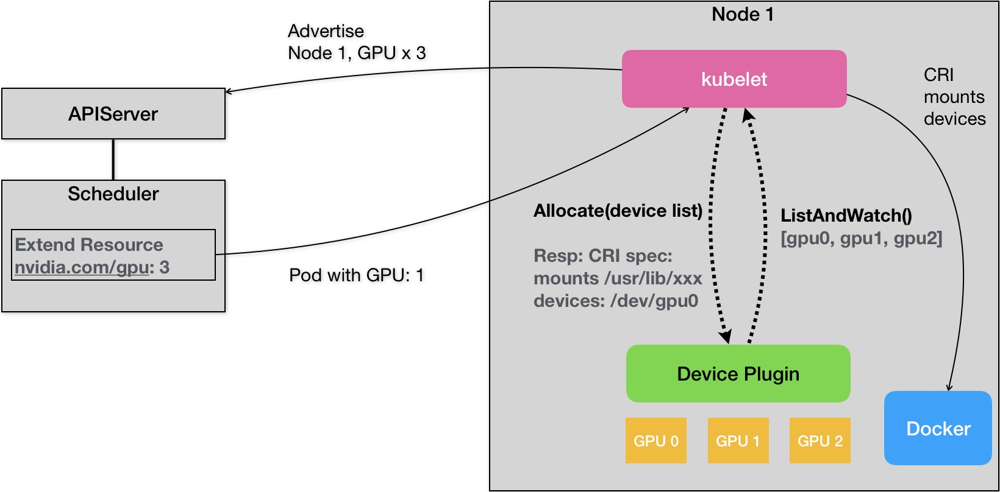

### 《深入剖析 Kubernetes》学习笔记 Day 42

Kubernetes作业调度与资源管理 (5讲)：「44 | Kubernetes GPU管理与Device Plugin机制」

#### 前文回顾

详细讲述了 Kubernetes 里关于 Pod 的优先级和抢占机制的设计与实现。

#### Kubernetes GPU管理与Device Plugin机制

对于云的用户来说，在 GPU 的支持上，他们最基本的诉求：在 Pod 的 YAML 里面，声明某容器需要的 GPU 个数，创建的容器里就应该出现对应的 GPU 设备，以及它对应的驱动目录。

**NVIDIA GPU**

创建后的容器应该出现：

* GPU 设备，比如 /dev/nvidia0
* GPU 驱动目录，比如 /usr/local/nvidia/*

以下这个 Pod 声明了自己要使用一个 NVIDIA 类型的 GPU：

```
apiVersion: v1
kind: Pod
metadata:
  name: cuda-vector-add
spec:
  restartPolicy: OnFailure
  containers:
    - name: cuda-vector-add
      image: "k8s.gcr.io/cuda-vector-add:v0.1"
      resources:
        limits:
          nvidia.com/gpu: 1
```

使用 PATCH API对 Node 添加自定义资源：

```
# start k8s proxy
$ kubectl proxy

# curl API Server
$ curl --header "Content-Type: application/json-patch+json" \
--request PATCH \
--data '[{"op": "add", "path": "/status/capacity/nvidia.com/gpu", "value": "1"}]' \
http://localhost:8001/api/v1/nodes/${node-name}/status
```

```
apiVersion: v1
kind: Node
...
Status:
  Capacity:
   cpu:  2
   memory:  2049008Ki
   nvidia.com/gpu: 1
```

**Device Plugin**




```
  service DevicePlugin {
        // ListAndWatch returns a stream of List of Devices
        // Whenever a Device state change or a Device disappears, ListAndWatch
        // returns the new list
        rpc ListAndWatch(Empty) returns (stream ListAndWatchResponse) {}
        // Allocate is called during container creation so that the Device
        // Plugin can run device specific operations and instruct Kubelet
        // of the steps to make the Device available in the container
        rpc Allocate(AllocateRequest) returns (AllocateResponse) {}
  }
```

**NVIDIA Device Plugin**

> https://github.com/NVIDIA/k8s-device-plugin

1. 每一种硬件设备都有其对应的 Device Plugin，通过 gRPC 同 kubelet 连接
2. Device Plugin 通过 ListAndWatch API，定期向 kubelet 汇报该 Node 上 GPU 列表
3. 在 Pod 的 limits 字段声明 nvidia.com/gpu: 1
4. 调度器从缓存寻找 GPU 数量满足条件的 Node，缓存里 GPU 数量减1，绑定 Pod 与 Node
5. kubelet 从自己持有的 GPU 列表里，为 Pod 分配一个 GPU
6. kubelet 向本机的 Device Plugin 发起 Allocate，参数为 GPU ID 列表
7. Device Plugin 找到对应的设备路径和驱动目录，发送应答给 kubelet
8. kubelet 完成 GPU 分配操作
9. kubelet 发送携带所分配 GPU 信息的 CRI 请求给 Docker
10. Docker 创建带 GPU 设备的容器，挂载 GPU 设备驱动目录

**常见 Device Plugin**

* https://github.com/intel/intel-device-plugins-for-kubernetes
* https://github.com/intel/sriov-network-device-plugin
* https://github.com/hustcat/k8s-rdma-device-plugin

> 感悟：当年（2018年）的Device Plugin还很稚嫩，只能处理设备个数，扩展性不足，需要看一下目前的发展状况。

学习来源： 极客时间 https://time.geekbang.org/column/intro/100015201?tab=catalog

