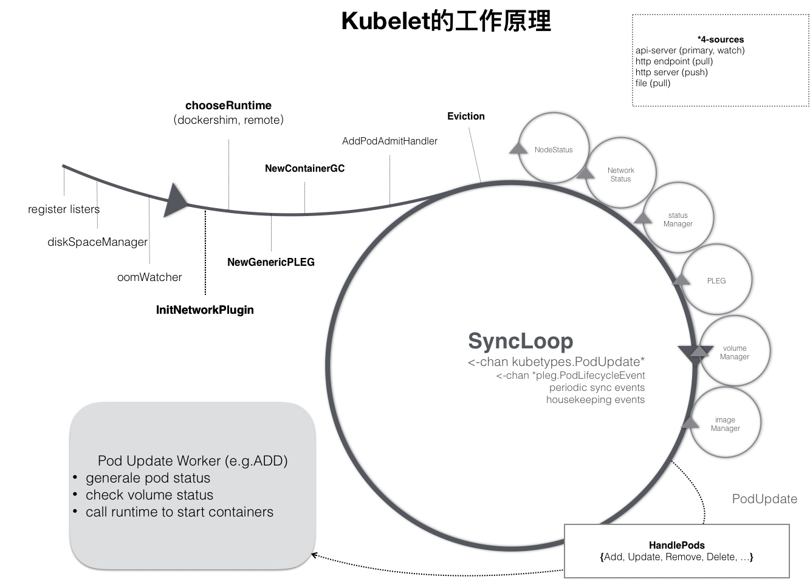
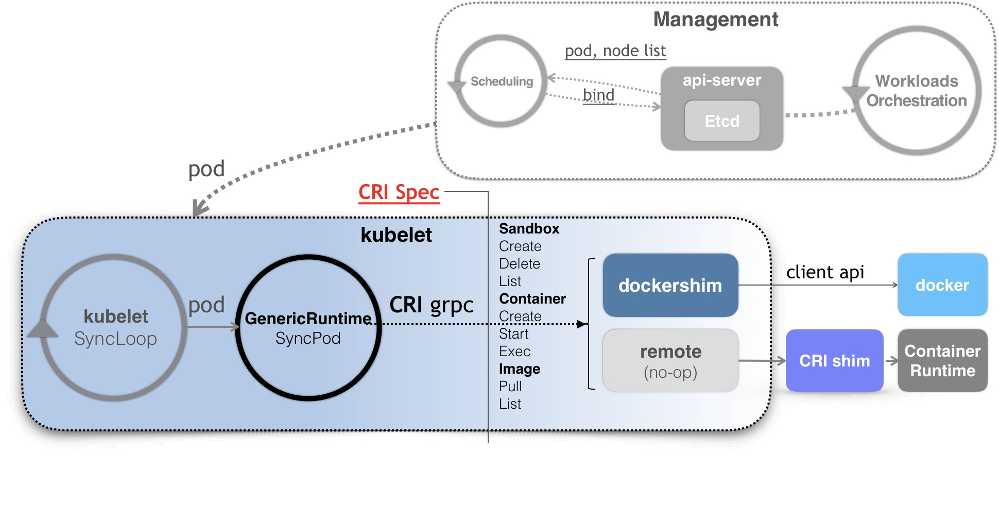

### 《深入剖析 Kubernetes》学习笔记 Day 43

Kubernetes容器运行时 (3讲)：「45 | 幕后英雄：SIG-Node与CRI」

#### 前文回顾

详细讲解了关于 Kubernetes 调度和资源管理相关的内容。

#### 幕后英雄：SIG-Node与CRI

在调度这一步完成后，k8s 就需要负责将这个调度成功的 Pod，在宿主机上创建出来，并把它所定义的各个容器启动起来。这些，都是 kubelet 这个核心组件的主要功能。

与 kubelet 以及容器运行时管理相关的内容，都属于 SIG-Node 的范畴。

**SyncLoop**

kubelet 是按照控制器模式来工作的。其工作核心是一个控制循环，即下图的 SyncLoop。

**SyncLoop 驱动事件**

* Pod 更新事件
* Pod 生命周期变化
* kubelet 本身设置的执行周期
* 定时的清理事件

**子控制循环**

图中的小圆圈部分，包括：

* Volume Manager
* Image Manager
* Node Status Manager：响应 Node 的状态变化，通过 Heartbeat 方式上报给 APIServer
* CPU Manager：维护该 Node 的 CPU 核的信息，Pod 通过 cpuset 请求 CPU 核时，正确管理 CPU 核的使用量和可用量

**Watch机制**

1. kubelet 通过 Watch 机制，监听 nodeName 字段与自己相同的 Pod 对象变化。
2. Pod 的变化触发 kubelet 在控制循环里注册的 Handler，即上图中的 HandlePods
3. 启动单独的名为 Pod Update Worker 的 Goroutine 处理

**Pod Update Worker**

1. ADD 事件：kubelet 生成对应的 Pod Status，检查 Volume 是否就绪，调用容器运行时创建 Pod 定义的容器
2. UPDAETE 事件：kubelet 根据 Pod 对象具体变更情况，调用容器运行时重建容器

**CRI：Container Runtime Interface**

对 k8s 屏蔽下层容器运行时的差异。

**Docker shim**

kubelet 代码的一部分，职责是：把 CRI 请求里的内容拿出来，然后组装成 Docker API 请求发给 Docker Daemon。

**CRI shim**

扮演 kubelet 与容器项目之间的垫片（shim），实现 CRI 规定的每个接口，然后把具体的 CRI 请求翻译成对后端容器项目的请求或者操作。

> 感悟：kubelet 的 SyncLoop 设计类似 Linux epoll，都是事件驱动机制。对应的虚拟化平台的cloudstack-agent，是 Command 模式，一请求一线程。

学习来源： 极客时间 https://time.geekbang.org/column/intro/100015201?tab=catalog

