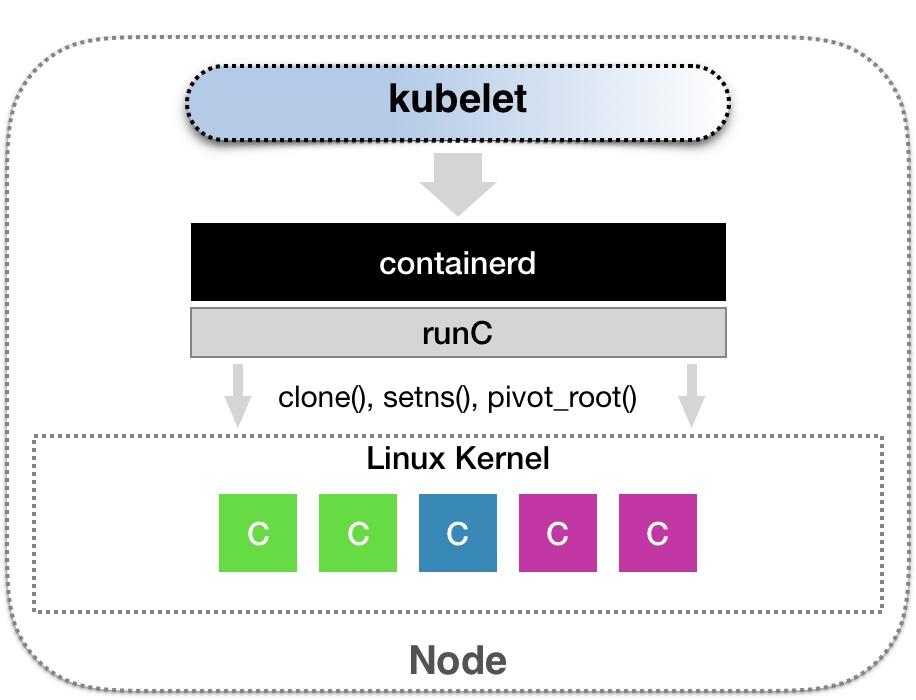
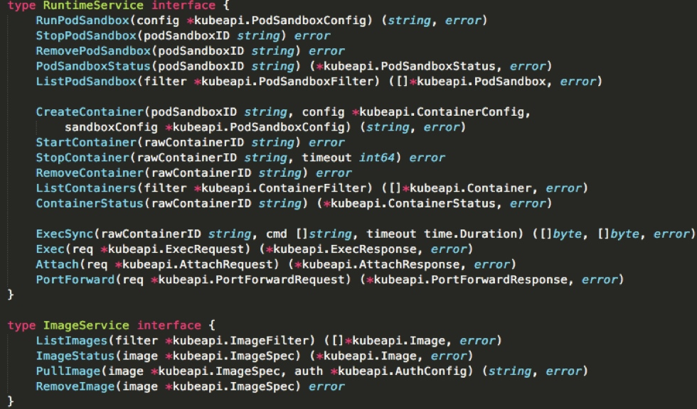
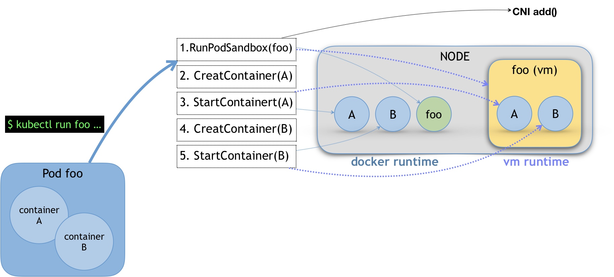
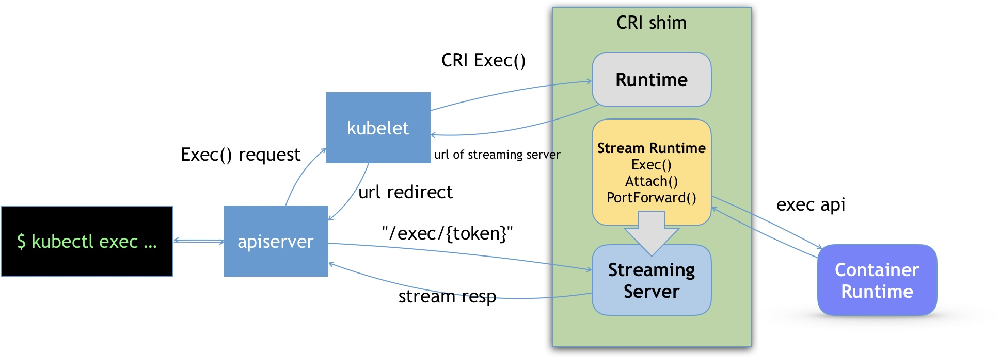

### 《深入剖析 Kubernetes》学习笔记 Day 44

Kubernetes容器运行时 (3讲)：「46 | 解读 CRI 与 容器运行时」

#### 前文回顾

详细讲解了 kubelet 的工作原理和 CRI 的来龙去脉。

#### 解读 CRI 与 容器运行时

CRI 机制能够发挥作用的核心，在于每一种容器项目都可以自己实现 CRI shim，自行对 CRI 请求进行处理。除了 dockershim 之外，其他容器运行时的 CRI shim，都是需要额外部署在宿主机上的。

**CNCF containerd**

**CRI接口定义**

* RuntimeService：创建和启动容器、删除容器、执行 exec 命令等
* ImageService：拉取镜像、删除镜像等

**RuntimeService**

CRI 设计的一个重要原则，就是确保这个接口本身，只关注容器，不关注 Pod。

1. Pod 是 k8s 的编排概念，而不是容器运行时的概念
2. CRI 和 Pod API 对象解耦，避免 CRI 接口频繁变更

**Pod 模型**

PodSandbox 这个接口描述的，是 k8s 将 Pod 这个概念映射到容器运行时层面所需要的字段，或者说是一个 Pod 对象子集。比如 HostName、DnsConfig、CgroupParent 等。

具体的容器项目，自行决定如何使用这些字段来实现 Pod 模型：

* docker runtime：一个 infra 容器，A、B两个 Docker 容器
* vm runtime：一个 轻量级虚拟机，A、B容器对应的 Mount Namespace

**Streaming API**

exec、logs 等 gRRC 接口调用期间，kubelet 需要跟容器项目的 Streaming Server 保持长连接。

> 感悟：k8s CRI 的设计边界划分清晰，哪些做哪些不做，哪些有限定条件的做，真是教科书一般的存在！

学习来源： 极客时间 https://time.geekbang.org/column/intro/100015201?tab=catalog

