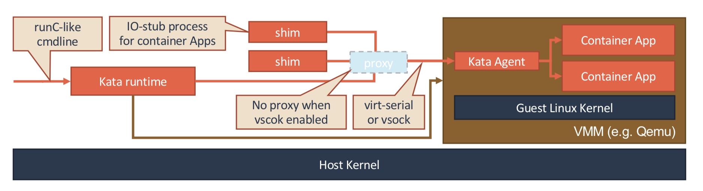
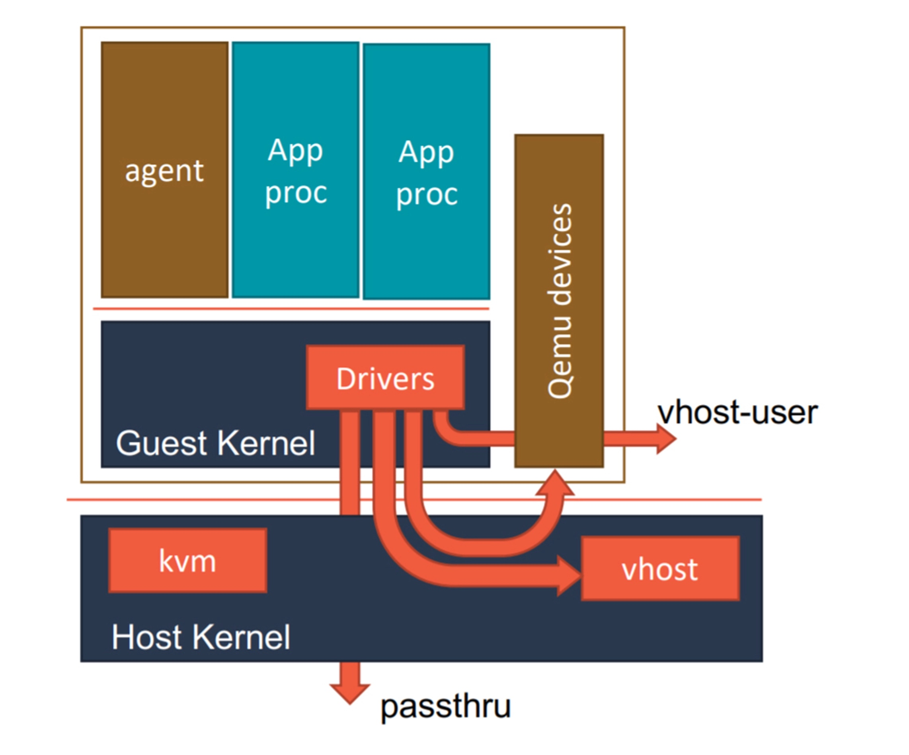
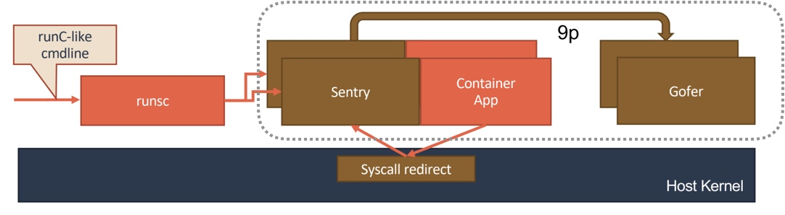
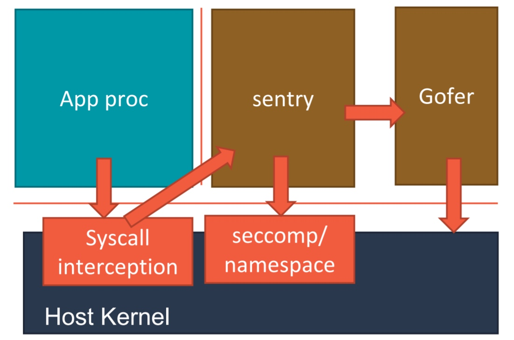
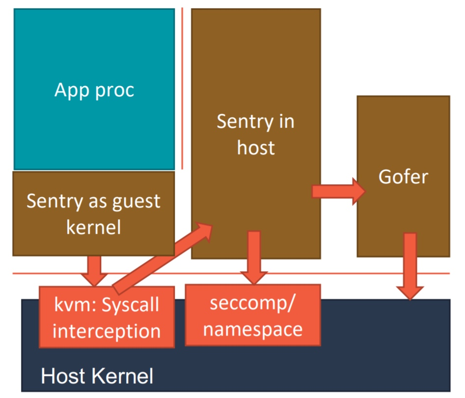

### 《深入剖析 Kubernetes》学习笔记 Day 45

Kubernetes容器运行时 (3讲)：「47 | 绝不仅仅是安全：Kata Containers 与 gVisor」

#### 前文回顾

详细地讲解了 kubelet 和 CRI 的设计和具体的工作原理。

#### 绝不仅仅是安全：Kata Containers 与 gVisor

CRI 诞生的一个重要推动力，就是基于虚拟化或者独立内核的安全容器项目的逐渐成熟。

**Kata Containers 历史**

2015 年，Intel OTC （Open Source Technology Center） 和国内的 HyperHQ 团队开源了两个基于虚拟化技术的容器实现，分别叫做 Intel Clear Container 和 runV 项目。

2017 年，这两个相似的容器运行时项目在中立基金会的撮合下最终合并为 Kata Containers 项目。

Kata 本质就是一个精简后的轻量级虚拟机，它像虚拟机一样安全，像容器一样敏捷。

**KataContainers 原理**

1. 一个虚拟机，就是一个 Pod；而用户定义的容器，就是运行在这个轻量级虚拟机里的进程
2. 虚拟机里有一个特殊的 Init 进程负责管理用户容器，为容器开启 Mount Namespace
3. 用户容器之间，原生共享 Network 及其他 Namespace
2. 启动一系列跟用户容器对应的 shim 进程，来负责操作这些用户容器的生命周期
3. 用户容器只能看到虚拟机里被裁减过的 Guest Kernel，以及通过 Hypervisor 虚拟出来的硬件设备
4. 通过 vhost 技术（比如：vhost-user）来实现 Guest 与 Host 之间的高效的网络通信
5. 使用 PCI Passthrough （PCI 穿透）技术来让 Guest 里的进程直接访问到宿主机上的物理设备

**gVisor 历史**

2018 年，Google 公司发布的项目。给容器进程配置一个用 Go 语言实现的、运行在用户态的、极小的独立内核。

这个内核对容器进程暴露 Linux 内核 ABI，扮演着 Guest Kernel 的角色，从而达到了将容器和宿主机隔离开的目的。

**gVisor 原理**

1. 为用户容器启动了一个名叫 Sentry 的进程，提供一个传统的操作系统内核的能力，即：运行用户程序，执行系统调用
2. 实现一个完整的 Linux 内核网络栈，以便处理应用进程的通信请求。把封装好的二层帧直接发送给 k8s 设置的 Pod 的 Network Namespace
3. 对于 Volume 的操作，通过 9p 协议交给叫做 Gofer 的代理进程来完成
4. Gofer 代替应用进程操作宿主机上的文件，并依靠 seccomp 机制将自己的能力限制在最小集，从而防止恶意应用进程逃逸

**gVisor Sentry**

使用 Ptrace 机制来拦截用户应用的系统调用（System Call），然后把这些系统调用交给 Sentry 来进行处理。缺点性能太差。

使用 KVM 来进行系统调用的拦截。

该实现 Sentry 并不会真的像虚拟机那样去虚拟出硬件设备、安装 Guest 操作系统。它只是借助 KVM 进行系统调用的拦截，以及处理地址空间切换等细节。

**Firecracker**

用 Rust 语言编写的 VMM（即：虚拟机管理器），和 Kata Containers 的本质原理一样。

Kata Containers 默认使用的 VMM 是 Qemu，而 Firecracker，则使用自己编写的 VMM。

> 感悟：最先想出kata这个方案的人，真他妈是个人才！基本宣告了纯虚拟机的死亡，也展现了容器技术的美好未来！

学习来源： 极客时间 https://time.geekbang.org/column/intro/100015201?tab=catalog

