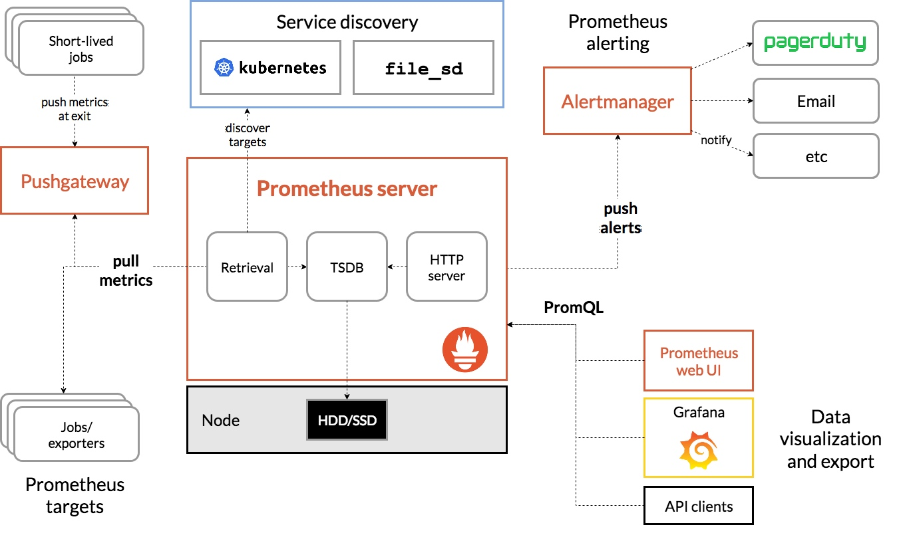
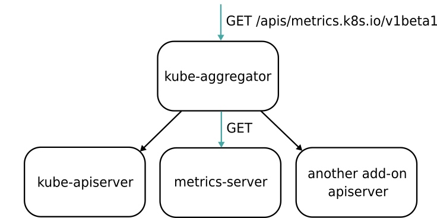

### 《深入剖析 Kubernetes》学习笔记 Day 46

Kubernetes容器监控与日志 (3讲)：「48 | Prometheus、Metrics Server与Kubernetes监控体系」

#### 前文回顾

详细地讲解了 Kubernetes 的核心架构，编排概念，以及具体的设计与实现。

#### Prometheus、Metrics Server与Kubernetes监控体系

以 Prometheus 项目为核心的一套统一的方案。

**Prometheus**

Prometheus 项目来自于 Google 的 Borg 体系，它的原型系统叫作 BorgMon，是一个几乎与 Borg 同时诞生的内部监控系统。



1. Pullmetrics：搜集被监控对象的 Metrics 数据（监控指标数据），保存到 TSDB （时间序列数据库，比如 OpenTSDB、InfluxDB 等）
2. Pushgateway：被监控对象可以 Push 方式推送 Metrics 数据
3. Alertmanager：根据 Metrics 信息灵活地设置报警
4. Grafana：可以灵活配置的监控数据可视化界面

**Metrics 数据来源**

1. 宿主机的监控数据。借助以 DaemonSet 的方式运行在宿主机上的 Node Exporter，代替被监控对象暴露出可以被抓取的 Metrics 信息。如节点的 CPU、内存、磁盘、网络等
2. APIServer、kubelet 等组件的 /metrics API。如各个 Controller 的工作队列，请求的 QPS 和延迟数据等
3. k8s 核心监控数据。如 Pod、Node、容器、Service 等核心对象的 Metrics

**Metrics Server**

通过标准的 k8s API 来访问健康数据。如 Pod 的监控数据：

```
http://127.0.0.1:8001/apis/metrics.k8s.io/v1beta1/namespaces/<namespace-name>/pods/<pod-name>
```

这些数据，从 kubelet 的 Summary API （即 :/stats/summary）采集而来。Summary API 返回的信息，既包括了 cAdVisor 的监控数据，也包括了 kubelet 本身汇总的信息。

**Aggregator APIServer**

kube-aggregator 是一个根据 URL 选择具体的 API 后端的代理服务器。通过这种方式，可以很方便地扩展 Kubernetes 的 API。



**监控指标规划**

USE 原则：资源监控指标

1. 利用率（Utilization），资源被有效利用起来提供服务的平均时间占比
2. 饱和度（Saturation），资源拥挤的程度，比如工作队列的长度
3. 错误率（Errors），错误的数量

RED 原则：服务监控指标

1. 每秒请求数量（Rate）
2. 每秒错误数量（Errors）
3. 服务响应时间（Duration）

> 感悟：统一的监控系统方案，极大简化了应用可观测性的实施！

学习来源： 极客时间 https://time.geekbang.org/column/intro/100015201?tab=catalog


