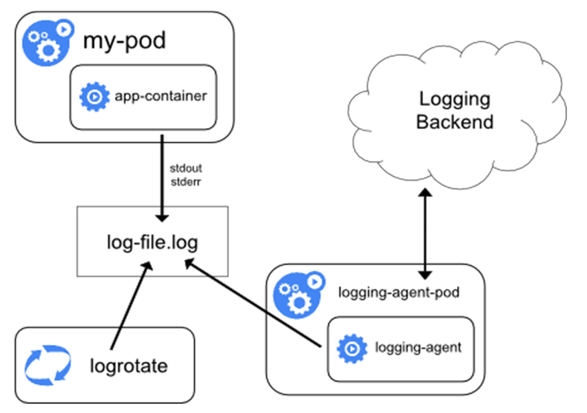
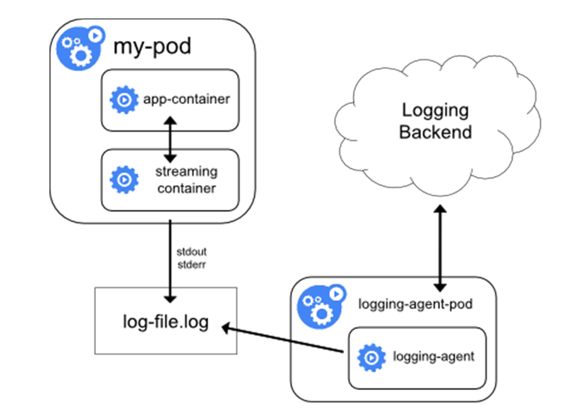
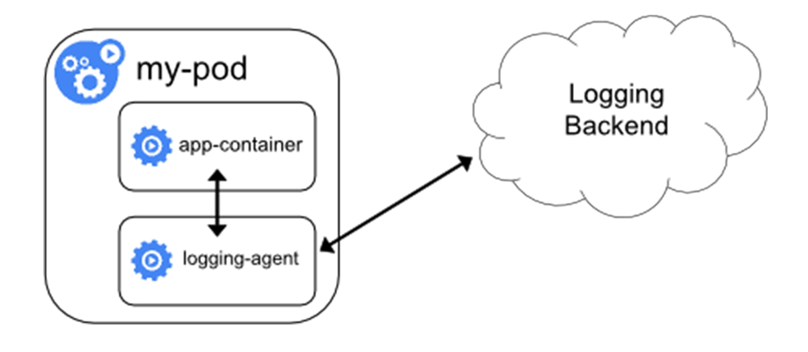
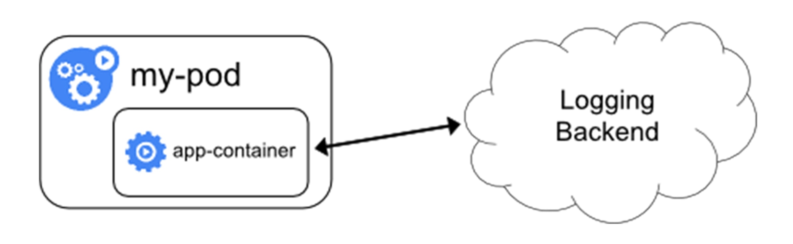

### 《深入剖析 Kubernetes》学习笔记 Day 48

Kubernetes容器监控与日志 (3讲)：「50 | 让日志无处可逃：容器日志收集与管理」

#### 前文回顾

详细地讲解了 Kubernetes 自定义监控体系的设计与实现思路。

#### 让日志无处可逃：容器日志收集与管理

**cluster-level-logging**

日志处理系统，与容器、Pod 以及 Node 的生命周期是完全无关的。无论是容器挂了、Pod 被删除，甚至节点宕机，应用日志依然可以被正常获取到。

应用把日志输出到 stdout 和 stderr 之后，容器项目默认输出到宿主机的一个 JSON 文件里。通过 kubectl logs 命令就可以看到这些容器的日志了。

**日志方案**

* 在 Node 上部署 logging agent，将日志文件转发到后端存储里保存起来。

* 为 Pod 添加两个 sidecar 容器，将日志文件里的内容重新以 stdout 和 stderr 的方式输出

* 通过一个 sidecar 容器，直接把应用的日志文件发送到远程存储

* 应用直接把日志发送到存储后端

> 感悟：做一件事有很多选择，一般情况下最简单的那个往往就是最好的！

学习来源： 极客时间 https://time.geekbang.org/column/intro/100015201?tab=catalog

