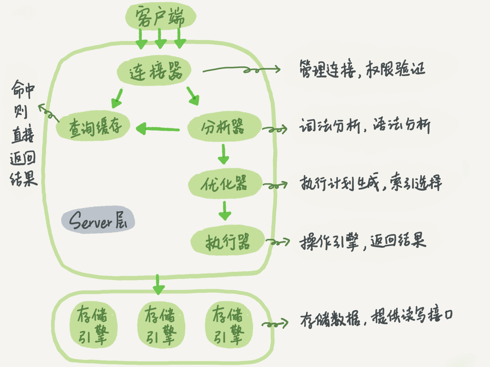

### 《MySQL 实战 45 讲》学习笔记 Day 02

01 | 基础架构：一条SQL查询语句是如何执行的？

```
mysql> select * from T where ID=10；
```

#### MySQL逻辑架构



* Server层：包括连接器、查询缓存、分析器、优化器、执行器等，涵盖大多数核心服务功能，以及所有的内置函数，所有跨存储引擎的功能都在该层实现，比如存储过程、触发器、视图等
* 存储引擎层：负责数据的存储和提取。插件式架构，支持 InnoDB（默认）、MyISAM、Memory 等多个存储引擎

> 感悟：这个架构图是精华！

#### 连接器

负责跟客户端建立连接、获取权限、维持和管理连接。

```
mysql -h$ip -P$port -u$user -p
```

如果用户名或密码不对，就会收到"Access denied for user"的错误，然后客户端程序结束执行。

如果用户名密码认证通过，连接器会到权限表里面查出该用户拥有的权限。之后，这个连接里面的权限判断逻辑，都将依赖于此时读到的权限。

客户端如果太长时间没动静，连接器就会自动将它断开。默认值是 8 小时。

> 感悟：程序员经常遇到的问题，需要配置好数据库连接池的空闲连接检测参数。

#### 查询缓存

之前执行过的语句及结果可能会以 key-value 对的形式，被直接缓存在内存中。key 是查询的语句，value 是查询的结果。

如果能够在缓存中找到 key，直接返回 value 给客户端。

只要有对一个表的更新，这个表上所有的查询缓存都会被清空。

MySQL 8.0 将查询缓存的整块功能删掉了。

> 感悟：被redis干掉了：）

#### 分析器

* 词法分析：识别 SQL 里的字符串分别是什么，代表什么。比如 select 识别为查询，T 识别为 表名T，ID 识别为 列ID
* 语法分析：判断 SQL 语句是否满足 MySQL 语法。不满足报错“You have an error in your SQL syntax”

#### 优化器

在表里面有多个索引的时候，决定使用哪个索引。

在一个语句有多表关联（join）的时候，决定各个表的连接顺序。

> 感悟：explain SQL！

#### 执行器

1. 判断对表 T 有没有执行查询的权限，没有则返回错误
2. 根据引擎定义去使用引擎提供的接口，打开表继续执行
3. 调用 InnoDB 引擎接口取这个表的第一行，判断 ID 值是不是 10，如果不是则跳过，如果是则将这行存在结果集中
4. 调用引擎接口取下一行，重复相同的判断逻辑，直到取到这个表的最后一行
5. 执行器将上述遍历过程中所有满足条件的行组成的记录集作为结果集返回给客户端

学习来源： 极客时间 https://time.geekbang.org/column/intro/100020801

