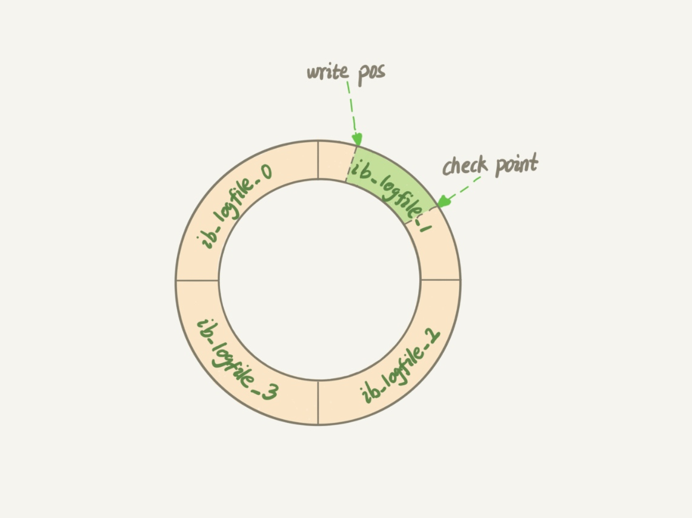
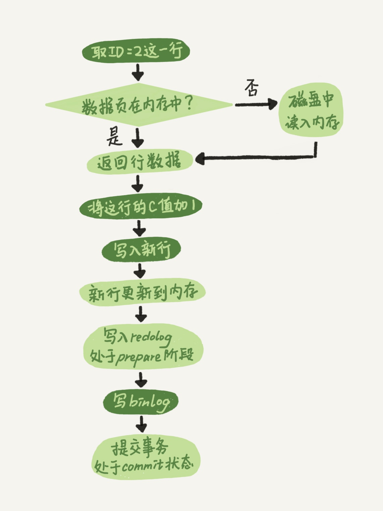

### 《MySQL 实战 45 讲》学习笔记 Day 03

02 | 日志系统：一条SQL更新语句是如何执行的？

MySQL 可以恢复到半个月内任意一秒的状态，这是怎样做到的呢？

查询语句的那一套流程，更新语句也是同样会走一遍。即经过连接器、分析器、优化器、执行器等功能模块，最后到达存储引擎。

#### 引擎层日志 redolog

如果每一次的更新操作都需要写进磁盘，然后磁盘也要找到对应的那条记录，然后再更新，整个过程 IO 成本、查找成本都很高。

WAL：Write-Ahead Logging。先写日志，再写磁盘。

InnoDB 引擎先把记录写到 redo log 里面，并更新内存，这个时候更新就算完成了。同时，InnoDB 引擎会在适当的时候，将这个操作记录更新到磁盘里面，而这个更新往往是在系统比较空闲的时候做。

InnoDB 的 redo log 是固定大小的，比如可以配置为一组 4 个文件，每个文件的大小是 1GB，那么总共就可以记录 4GB 的操作。从头开始写，写到末尾就又回到开头循环写，如下图：

write pos：当前记录的位置，边写边后移，写到第 3 号文件末尾后就回到 0 号文件开头。

checkpoint：当前要擦除的位置，往后推移并且循环，擦除记录前要把记录更新到数据文件。

write pos 和 checkpoint 之间还空着的部分，用来记录新的操作。如果 write pos 追上 checkpoint，表示满了，这时候不能再执行新的更新，得停下来先擦掉一些记录，把 checkpoint 推进一下。

crash-safe：有了 redo log，InnoDB 就可以保证即使数据库发生异常重启，之前提交的记录都不会丢失。

#### Server层日志 binlog

redolog 和 binlog 区别：

* redolog 是 InnoDB 引擎特有的；binlog 是 Server 层实现的，所有引擎可用
* redolog 是物理日志，记录的是在某个数据页上做了什么修改
* binlog 是逻辑日志，记录的是 SQL 语句的原始逻辑，比如给 ID=2 这一行的 c 字段加 1
* redolog 是循环写的，空间固定会用完；binlog 是追加写入的，即写到一定大小后会切换到下一个，不会覆盖以前的日志

#### update 执行流程

1. 执行器找引擎取 ID=2 这一行。ID 是主键，引擎直接用树搜索找到这一行。如果 ID=2 这一行所在的数据页在内存中，就直接返回给执行器；否则，需要先从磁盘读入内存，然后再返回
2. 执行器拿到引擎给的行数据，把这个值加上 1，比如原来是 N，现在就是 N+1，得到新的一行数据，再调用引擎接口写入这行新数据
3. 引擎将这行新数据更新到内存中，同时将这个更新操作记录到 redolog 里面，此时 redolog 处于 prepare 状态。然后告知执行器执行完成了，随时可以提交事务
4. 执行器生成这个操作的 binlog，并把 binlog 写入磁盘
5. 执行器调用引擎的提交事务接口，引擎把刚刚写入的 redolog 改成 commit 状态，更新完成

第3、5步为 redolog 的两阶段提交，为让 redolog 和 binlog 这两个状态保持逻辑上的一致。

#### 数据恢复

某天下午两点发现中午十二点有一次误删表，找回数据步骤：

1. 从最近的一次全量备份，恢复到临时库
2. 从备份的时间点开始，将备份的 binlog 依次取出来，重放到中午误删表之前的那个时刻
3. 把表数据从临时库取出来，按需要恢复到线上库去

#### 重要参数

* innodb_flush_log_at_trx_commit：设置成 1，表示每次事务的 redo log 都直接持久化到磁盘，可以保证 MySQL 异常重启之后数据不丢失
* sync_binlog：设置成 1 ，表示每次事务的 binlog 都持久化到磁盘，可以保证 MySQL 异常重启之后 binlog 不丢失

> 感悟：redolog 和 binlog 的两阶段提交设计很赞！

学习来源： 极客时间 https://time.geekbang.org/column/intro/100020801

