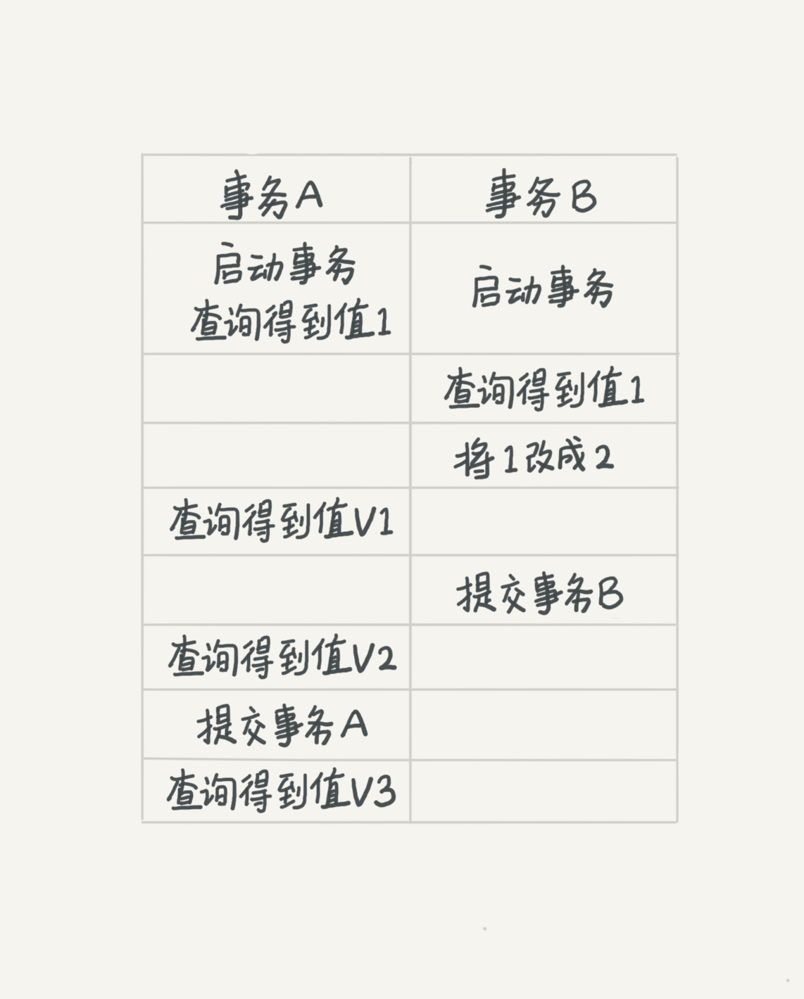

### 《MySQL 实战 45 讲》学习笔记 Day 04

03 | 事务隔离：为什么你改了我还看不见？

事务就是要保证一组数据库操作，要么全部成功，要么全部失败。在 MySQL 中，事务支持是在引擎层实现的。

以 InnoDB 为例，剖析 MySQL 在事务支持方面的特定实现，并基于原理给出相应的实践建议

#### 隔离性与隔离级别

**ACID**

* Atomicity 原子性
* Consistency 一致性
* Isolation 隔离性
* Durability 持久性

**隔离级别**

为了解决当有多个事务同时执行时可能出现的脏读（dirty read）、不可重复读（non-repeatable read）、幻读（phantom read）的问题。

隔离得越严实，效率就会越低。

* 读未提交 READ-UNCOMMITTED：一个事务还没提交时，它做的变更就能被别的事务看到
* 读已提交 READ-COMMITTED：一个事务提交之后，它做的变更才会被其他事务看到
* 可重复读 REPEATABLE-READ：一个事务执行过程中看到的数据，总是跟这个事务在启动时看到的数据是一致的。当然在可重复读隔离级别下，未提交变更对其他事务也是不可见的
* 串行化 Serializable：对同一行记录，写会加写锁，读会加读锁。当出现读写锁冲突的时候，后访问的事务必须等前一个事务执行完成，才能继续执行

**举个例子**

```
mysql> create table T(c int) engine=InnoDB;
insert into T(c) values(1);
```




不同的隔离级别下，事务 A 里 V1、V2、V3 的返回值如下：

* READ-UNCOMMITTED：V1 的值就是 2。这时候事务 B 虽然还没有提交，但是结果已经被 A 看到了。因此，V2、V3 也都是 2
* READ-COMMITTED：V1 是 1，V2 的值是 2。事务 B 的更新在提交后才能被 A 看到。所以， V3 的值也是 2
* REPEATABLE-READ：V1、V2 是 1，V3 是 2。之所以 V2 还是 1，遵循的就是这个要求：事务在执行期间看到的数据前后必须是一致的
* Serializable：在事务 B 执行“将 1 改成 2”的时候，会被锁住。直到事务 A 提交后，事务 B 才可以继续执行。所以从 A 的角度看， V1、V2 值是 1，V3 的值是 2

#### 事务隔离的实现

**回滚日志**

每条记录在更新的时候都会同时记录一条回滚操作。

记录上的最新值，通过回滚操作，都可以得到前一个状态的值。

一个值从 1 被按顺序改成了 2、3、4，回滚日志记录如下图：


回滚日志删除时机：当系统里没有比这个回滚日志更早的 read-view 的时候。

**MVCC：Multiversion concurrency control**

多版本并发控制。同一条记录在系统中可以存在多个版本。

**事务启动方式**

* begin 或 start transaction：显式启动事务。对应的提交语句是 commit，回滚语句是 rollback
* set autocommit=0：关闭当前线程的自动提交。意味着如果只执行一个 select 语句，这个事务就启动了，而且并不会自动提交。这个事务持续存在直到你主动执行 commit 或 rollback 语句，或者断开连接

**长事务缺点**

* 长事务占用大量存储空间：导致存在很老的事务视图，这些事务随时可能访问数据库里面的任何数据，所以这个事务提交之前，数据库里面它可能用到的回滚记录都必须保留
* 长事务占用锁资源，也可能拖垮整个库

**查询长事务**

持续时间超过 60s 的事务：

```
select * from information_schema.innodb_trx where TIME_TO_SEC(timediff(now(),trx_started))>60
```

> 感悟：隔离本质上是为了解决并发访问相同数据时的一致性和性能问题，没有银弹，都是权衡！

学习来源： 极客时间 https://time.geekbang.org/column/intro/100020801


