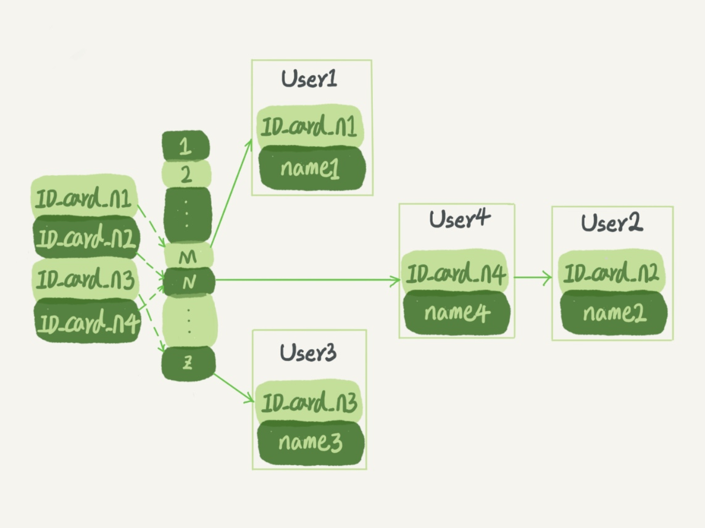
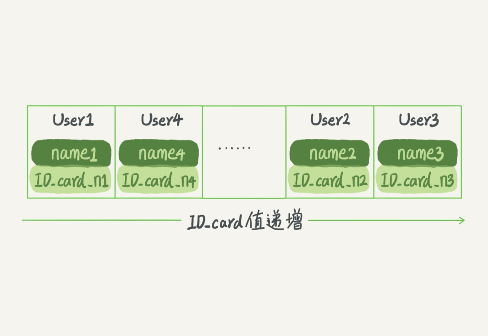
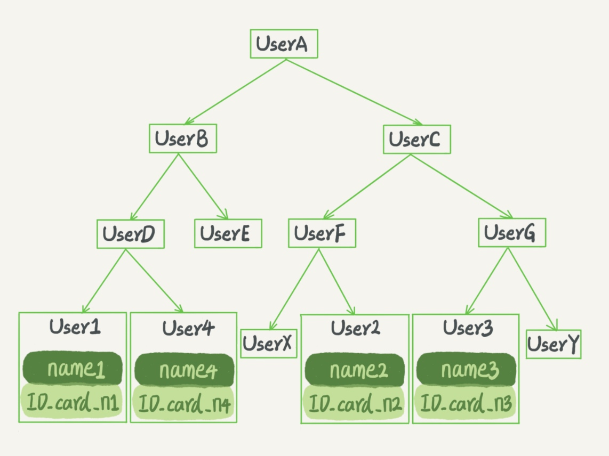
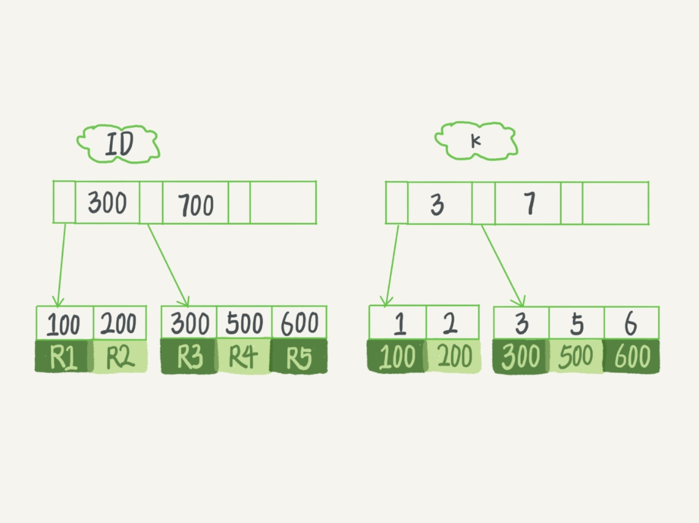

### 《MySQL 实战 45 讲》学习笔记 Day 05

04 | 深入浅出索引（上）

索引的出现是为了提高数据查询的效率，就像书的目录一样。

#### 索引的常见模型

数据库底层存储的核心就是基于这些数据模型的。每碰到一个新数据库，我们需要先关注它的数据模型，这样才能从理论上分析出这个数据库的适用场景。

以根据身份证号查找对应的名字为例。

**哈希表**

适用场景：等值查询
优点：新增快
缺点：范围查询慢

以键 - 值（key-value）存储数据的结构。把值放在数组里，用一个哈希函数把 key 换算成一个确定的位置，然后把 value 放在数组的这个位置。

多个 key 值经过哈希函数的换算，会出现同一个值的情况。处理这种情况的一种方法是，拉出一个链表。



**有序数组**

适用场景：等值查询和范围查询，静态存储。
优点：查询快
缺点：新增慢，需要挪动数据



**二叉搜索树**

适用场景：等值查询和范围查询，静态存储。
优点：查询最快，时间复杂度 O(log(N))
缺点：索引不止存在内存中，还要写到磁盘上

父节点左子树所有结点的值小于父节点的值，右子树所有结点的值大于父节点的值。

查 ID_card_n2 的搜索路径：UserA -> UserC -> UserF -> User2。



**N 叉树（B+树）**

适用场景：广泛应用在数据库引擎中
优点：读写性能好，适配磁盘的访问模式

100 万节点的平衡二叉树，树高 20。一次查询可能需要访问 20 个数据块。从机械磁盘随机读一个数据块需要 10 ms。也就是说访问一个 100 万行的表记录，可能需要 20*10 = 200ms。

如果使用 N 叉树，以 InnoDB 的一个整数字段索引为例，这个 N 差不多是 1200。这棵树高是 4 的时候，就可以存 1200 的 3 次方，即 17 亿个值。考虑到树根的数据块总是在内存中的，一个 10 亿行的表，查找一个值最多只需要访问 3 次磁盘。其实，树的第二层也有很大概率在内存中，那么访问磁盘的平均次数就更少了。

**跳表、LSM 树**

#### InnoDB 的索引模型

**一个索引对应一棵 B+ 树**

```
mysql> create table T(
id int primary key, 
k int not null, 
name varchar(16),
index (k))engine=InnoDB;
```

表中 R1~R5 的 (ID,k) 值分别为 (100,1)、(200,2)、(300,3)、(500,5) 和 (600,6)

两棵树的示意图如下：



**索引类型**

* 主键索引：叶子节点存的是整行数据。也称为聚簇索引 clustered index
* 非主键索引：叶子节点存的是主键的值。也称为二级索引 secondary index

**查询区别**

* 主键索引查询：select * from T where ID=500，只需要搜索 ID 这棵 B+ 树
* 普通索引查询：select * from T where k=5，需要先搜索 k 索引树，得到 ID 的值为 500，再到 ID 索引树搜索一次即回表

#### 索引维护

为了维护索引有序性，在插入新值的时候需要做必要的维护。

如果插入新的行 ID 值为 700，则只需要在 R5 的记录后面插入一个新记录。如果新插入的 ID 值为 400，就需要逻辑上挪动后面的数据，空出位置。

当然有分裂就有合并。当相邻两个页由于删除了数据，利用率很低之后，会将数据页做合并。合并的过程，可以认为是分裂过程的逆过程。

**页分裂**

而更糟的情况是，如果 R5 所在的数据页已经满了，根据 B+ 树的算法，这时候需要申请一个新的数据页，然后挪动部分数据过去。

影响：挪动数据带来性能开销，数据页整体空间利用率降低大约 50%。

**页合并**

当相邻两个页由于删除了数据，利用率很低之后，会将数据页做合并。

**自增主键**

定义：NOT NULL PRIMARY KEY AUTO_INCREMENT

主键长度越小，普通索引的叶子节点就越小，普通索引占用的空间也就越小。

从性能和存储空间方面考量，自增主键往往是更合理的选择。

KV场景即只有一个索引且该索引必须是唯一索引，将这个字段作为主键可避免每次查询搜索两棵树。

> 感悟：通透，没啥可说的！

学习来源： 极客时间 https://time.geekbang.org/column/intro/100020801

