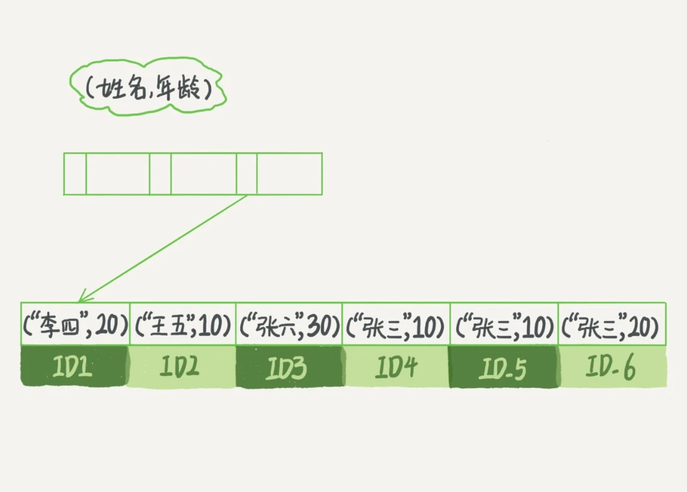

### 《MySQL 实战 45 讲》学习笔记 Day 06

05 | 深入浅出索引（下）

#### 回表搜索

select * from T where k between 3 and 5，需要执行几次树的搜索操作，会扫描多少行？

```
mysql> create table T (
ID int primary key,
k int NOT NULL DEFAULT 0, 
s varchar(16) NOT NULL DEFAULT '',
index k(k))
engine=InnoDB;

insert into T values(100,1, 'aa'),(200,2,'bb'),(300,3,'cc'),(500,5,'ee'),(600,6,'ff'),(700,7,'gg');
```


**SQL 执行流程**

1. 在 k 索引树上找到 k=3 的记录，取得 ID = 300
2. 再到 ID 索引树查到 ID=300 对应的 R3
3. 在 k 索引树取下一个值 k=5，取得 ID=500
4. 再回到 ID 索引树查到 ID=500 对应的 R4
5. 在 k 索引树取下一个值 k=6，不满足条件，循环结束

回到主键索引树搜索的过程，称为回表。读了 k 索引树的 3 条记录（步骤 1、3 和 5），回表了两次（步骤 2 和 4）。

#### 覆盖索引

select ID from T where k between 3 and 5，这时只需要查 ID 的值，而 ID 的值已经在 k 索引树上了，因此可以直接提供查询结果，不需要回表。也就是说，在这个查询里面，索引 k 已经覆盖了查询需求，称为覆盖索引。

根据市民的身份证号查询姓名，建立联合索引（身份证号、姓名）可以用到覆盖索引，

#### 最左前缀

B+ 树这种索引结构，可以利用索引的最左前缀，来定位记录。

索引项是按照索引定义里面出现的字段顺序排序的。



以下SQL都可命中索引：

* where name = '张三'
* where name like '张%'

**联合索引字段顺序**

* 复用：通过调整顺序，能否少维护一个索引
* 空间：name字段比age字段大，则创建(name, age)和(age)两个索引

#### 索引下推 index condition pushdown

对于联合索引（name, age），

select * from tuser where name like '张%' and age=10 and ismale=1;

在索引遍历过程中，对索引中包含的字段先做判断，直接过滤掉不满足条件的记录，减少回表次数。


每一个虚线箭头表示回表一次。

> 感悟：最左前缀的设计很巧妙，用的最多！

学习来源： 极客时间 https://time.geekbang.org/column/intro/100020801

