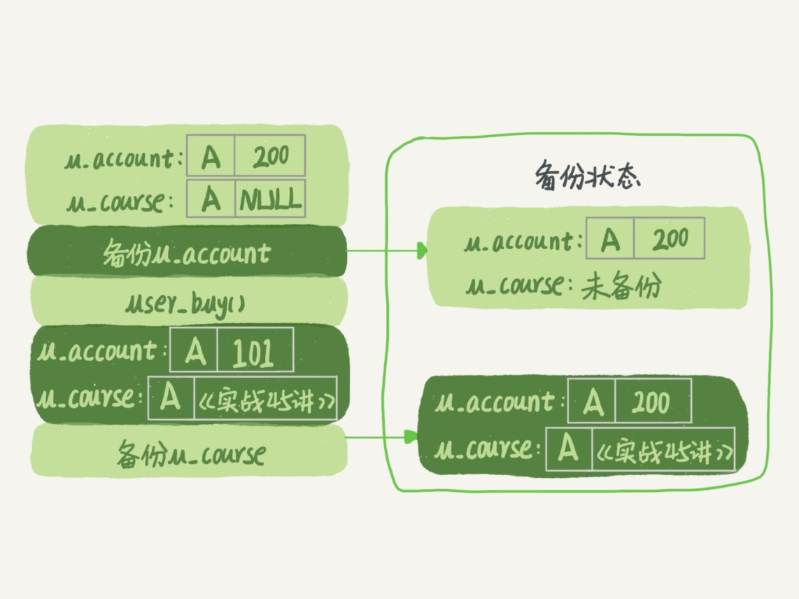
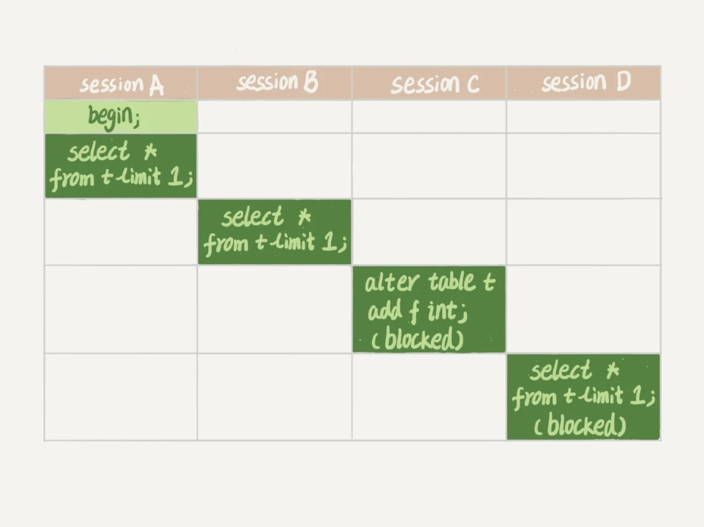

### 《MySQL 实战 45 讲》学习笔记 Day 07

06 | 全局锁和表锁 ：给表加个字段怎么有这么多阻碍？

数据库锁设计的初衷是处理并发问题。包括全局锁、表级锁和行锁。

#### 全局锁

**全库逻辑备份**

Flush tables with read lock (FTWRL)

执行后整个库处于只读状态，其他线程的以下语句会被阻塞：

* 数据更新语句（数据的增删改）
* 数据定义语句（包括建表、修改表结构等）
* 更新类事务的提交语句

客户端异常断开，MySQL 会自动释放这个全局锁。

**备份加锁原因**

不加锁的话，备份的库不是一个逻辑时间点，这个视图是逻辑不一致的。



**一致性读**

mysqldump --single-transaction

在可重复读隔离级别下开启一个事务，可拿到一致性视图。由于 MVCC 的存在，备份过程中数据是可以正常更新的。

对于 MyISAM 这种不支持事务的引擎，只能使用 FTWRL 命令。

#### 表级锁

**表锁 lock tables … read/write**

可以用 unlock tables 主动释放锁，也可以在客户端断开的时候自动释放。

lock tables 语法除了会限制别的线程的读写外，也限定了本线程接下来的操作对象：

* 线程 A 执行 lock tables t1 read, t2 write ，其他线程写 t1、读写 t2 的语句都会被阻塞
* 线程 A 在执行 unlock tables 之前，也只能执行读 t1、读写 t2 的操作
* 连写 t1 都不允许，自然也不能访问其他表

**元数据锁 MDL（metadata lock)**

MDL 不需要显式使用，在访问一个表的时候会被自动加上。

如果一个查询正在遍历一个表中的数据，而执行期间另一个线程对这个表结构做变更，删了一列，那么查询线程拿到的结果跟表结构对不上，就出错了。

* 当对表做增删改查操作的时候，加 MDL 读锁
* 当对表做结构变更操作的时候，加 MDL 写锁
* 读锁之间不互斥，可以有多个线程同时对一张表增删改查
* 读写锁之间、写锁之间是互斥的，以保证变更表结构操作的安全性
* MDL 锁，在语句执行开始时申请，等到整个事务提交后再释放

**加字段导致整个库挂了**

如果某个表上的查询语句频繁，而且客户端有重试机制，也就是说超时后会再起一个新 session 再请求的话，这个库的线程很快就会爆满。

1. session A 加 MDL 读锁
2. session B 加 MDL 读锁， 正常执行
3. session C 被阻塞，等待 MDL 写锁
4. session D 及后续的申请 MDL 读锁请求被阻塞



**安全加字段**

长事务会一直占着 MDL 锁，在 information_schema.innodb_trx 表中可以查到。

如果要做 DDL 变更的表刚好有长事务在执行，要考虑先暂停 DDL，或者 kill 掉这个长事务。

如果要变更的表是一个热点表，虽然数据量不大，但是上面的请求很频繁，这时候 kill 可能未必管用，因为新的请求马上就来了。

可以在 alter table 语句里面设定等待时间，如果在这个指定的等待时间里面能够拿到 MDL 写锁最好，拿不到也不要阻塞后面的业务语句，先放弃。之后再通过重试命令重复这个过程。

DDL NOWAIT/WAIT n

```
ALTER TABLE tbl_name NOWAIT add column ...
ALTER TABLE tbl_name WAIT N add column ... 
```

> 感悟：从锁粒度的历史来看，MySQL 有今天的地位也不是一蹴而就。说明事物都有其发展规律，日拱一卒，不期速成！

学习来源： 极客时间 https://time.geekbang.org/column/intro/100020801


