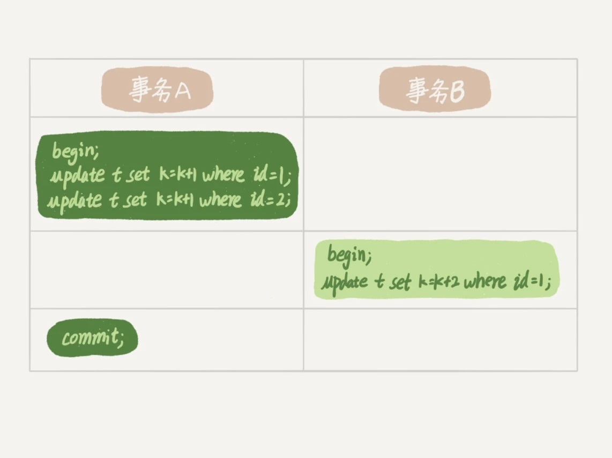
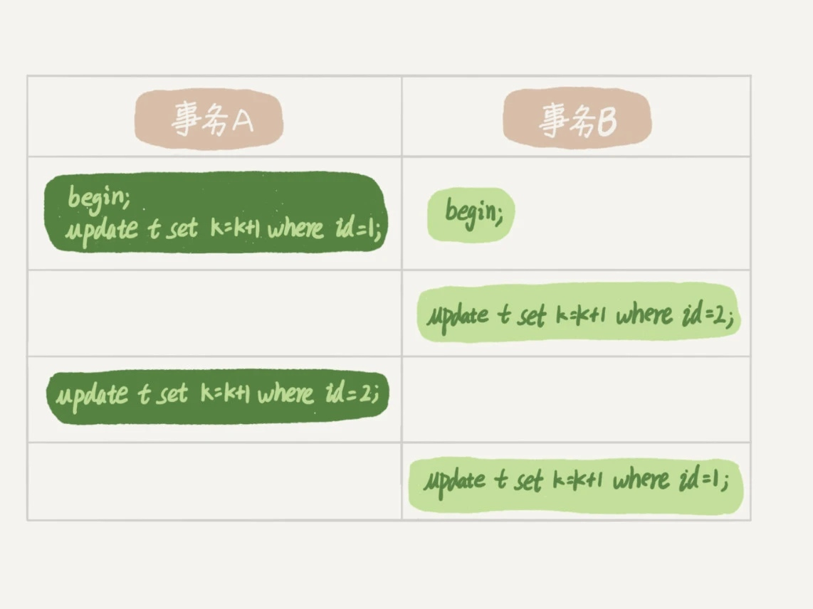

### 《MySQL 实战 45 讲》学习笔记 Day 08

07 | 行锁功过：怎么减少行锁对性能的影响？

行锁就是针对数据表中行记录的锁。比如事务 A 更新了一行，而这时候事务 B 也要更新同一行，则必须等事务 A 的操作完成后才能进行更新。

#### 两阶段锁

在 InnoDB 事务中，行锁是在需要的时候才加上，但要等到事务结束时才释放。

* 事务 A 持有两条记录的行锁
* 事务 B 的 update 语句会被阻塞
* 事务 A 的 commit 释放两个行锁
* 事务 B 继续执行

如果事务中需要锁多个行，要把最可能造成锁冲突、最可能影响并发度的锁尽量往后放。

一个电影票在线交易业务，顾客 A 和 C 都要在影院 B 购买电影票。涉及以下操作：

1. 从顾客 A 或 C 账户余额中扣除电影票价
2. 给影院 B 的账户余额增加这张电影票价
3. 记录一条交易日志

比如按照 3、1、2 这样的顺序，那么影院账户余额这一行的锁时间就最少。这就最大程度地减少了事务之间的锁等待，提升了并发度。

#### 死锁和死锁检测

**死锁例子**

* 事务 A 在等待事务 B 释放 id=2 的行锁
* 事务 B 在等待事务 A 释放 id=1 的行锁
* 事务 A 和事务 B 在互相等待对方的资源释放，进入了死锁状态

**解决死锁策略**

* innodb_lock_wait_timeout：等待超时
* innodb_deadlock_detect：死锁检测，主动回滚其中一个事务

#### 秒杀场景

影院做活动，低价预售一年内所有电影票，该活动只做一天。于是活动刚开始，MySQL 就挂了。

**所有事务更新同一行？**

每个新来的被堵住的线程，都要执行一次死锁检测，时间复杂度为 O(n)。

假设有 1000 个并发线程，那么死锁检测总次数就是 100 万量级。

虽然最终检测的结果是没有死锁，但是会消耗大量的 CPU 资源。

因此，就会看到 CPU 占用率很高，但是每秒却执行不了几个事务。

**怎么解决？**

1. 临时关闭死锁检测。死锁回滚了可以重试，关闭死锁检测可能出现大量超时即业务有损
2. 客户端控制并发度。每个客户端控制到 5 个并发线程，600 个客户端峰值并发也可能到 3000
3. 服务端控制并发度。修改中间件 或 MySQL，在进入引擎之前排队，减少死锁检测
4. 设计上控制并发度。将一行改成逻辑上的多行来减少锁冲突，比如影院的账户总额改成 10 个记录的值的总和。每次要给影院账户加金额的时候，随机选其中一条记录来加。这样每次冲突概率变成原来的 1/10

> 感悟：遥想起2013年数据库大会当时还在淘宝的丁奇演讲《秒杀场景下MySQL的低效--原因和改进》，一晃十年！这就是专注的力量！

学习来源： 极客时间 https://time.geekbang.org/column/intro/100020801

