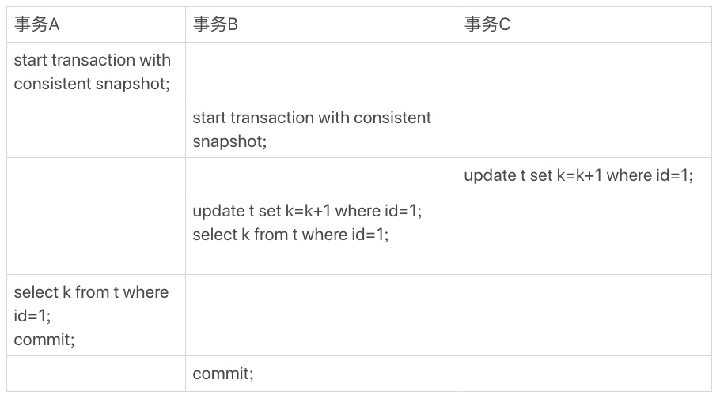

### 《MySQL 实战 45 讲》学习笔记 Day 09

08 | 事务到底是隔离的还是不隔离的？

事务 A 拥有一条记录的行锁，事务 B 也要更新同一行，等到事务 B 拿到行锁时读到的值时什么呢？

#### 并发事务

```
mysql> CREATE TABLE `t` (
  `id` int(11) NOT NULL,
  `k` int(11) DEFAULT NULL,
  PRIMARY KEY (`id`)
) ENGINE=InnoDB;
insert into t(id, k) values(1,1),(2,2);
```



**事务启动时机**

* begin/start transaction：一致性视图是在执行第一个快照读语句时创建的
* start transaction with consistent snapshot：一致性视图立即创建

事务 B 查到的 k 的值是 3，而事务 A 查到的 k 的值是 1。Why ？

**两种视图**

1. view：一个用查询语句定义的虚拟表，在调用时执行查询语句并生成结果。创建视图的语法是 create view … ，它的查询方法与表一样
2. consistent read view。MVCC 用到的一致性读视图，用于 Read Committed 和 Repeatable Read 隔离级别的实现

#### MVCC Snapshot

事务启动时，基于整库创建的秒级快照。

**transaction id**

InnoDB 里面每个事务唯一的事务 ID。在事务开始的时候向事务系统申请，是按申请顺序严格递增的。

**row trx_id**

每次事务更新数据的时候，都会生成一个新的数据版本，并且把 transaction id 赋值给这个数据版本的事务 ID，记为 row trx_id。同时，旧的数据版本要保留，并且在新的数据版本中，能够有信息可以直接拿到它。

也就是说，数据表中的一行记录，可能有多个版本 (row)，每个版本有自己的 row trx_id。


**undo log**

三个虚线箭头，就是 undo log。

V1、V2、V3 并不是物理上真实存在，而是每次需要的时候根据当前版本和 undo log 计算出来的。

**快照定义**

以事务启动的时刻为准。

* 如果一个数据版本是在该事务启动之前生成的，就认
* 如果是启动以后才生成的，就不认，必须要找到它的上一个版本
* 如果是这个事务自己更新的数据，它自己要认

**快照实现**

* 活跃事务：启动了但还没提交
* 视图数组：保存该事务启动瞬间当前所有活跃事务 ID
* 低水位：视图数组里事务 ID 的最小值
* 高水位：当前系统里已经创建过的事务 ID 的最大值加 1
* 一致性视图 read-view ：视图数组 + 高水位

**可见性规则**

数据版本的可见性，基于数据的 row trx_id 和一致性视图的对比结果得到。


1. 绿色部分，表示这个版本是已提交的事务或者是当前事务自己生成的，可见
2. 红色部分，表示这个版本是由将来启动的事务生成的，不可见
3. 黄色部分，两种情况：1）若 row trx_id 在数组中，表示这个版本是由还没提交的事务生成的，不可见 2）若 row trx_id 不在数组中，表示这个版本是已经提交了的事务生成的，可见

**事务 A 查询逻辑**


#### 更新逻辑

**事务 B 更新逻辑**

当前读 current read：更新数据都是先读后写的，而这个读，只能读当前的值。

S 锁：读锁，共享锁
X 锁：写锁，排他锁


**可重复读**

核心就是一致性读 consistent read。

事务更新数据的时候，只能用当前读。如果当前记录的行锁被其他事务占用，进入锁等待。

读提交的逻辑和可重复读的逻辑类似，区别是：

* 在可重复读隔离级别下，只需要在事务开始的时候创建一致性视图，之后事务里的其他查询都共用这个一致性视图
* 在读提交隔离级别下，每一个语句执行前都会重新算出一个新的视图

**读提交**


事务 A 查询结果 k=2。事务 B 查询结果 k=3。

> 感悟：稍微有点费脑子，这类学习最好放到早上头脑清醒时！

学习来源： 极客时间 https://time.geekbang.org/column/intro/100020801


