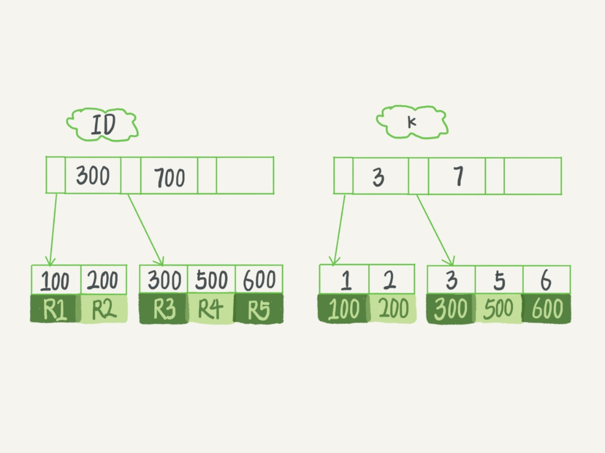
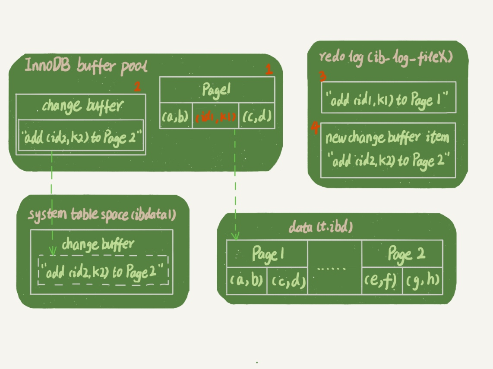
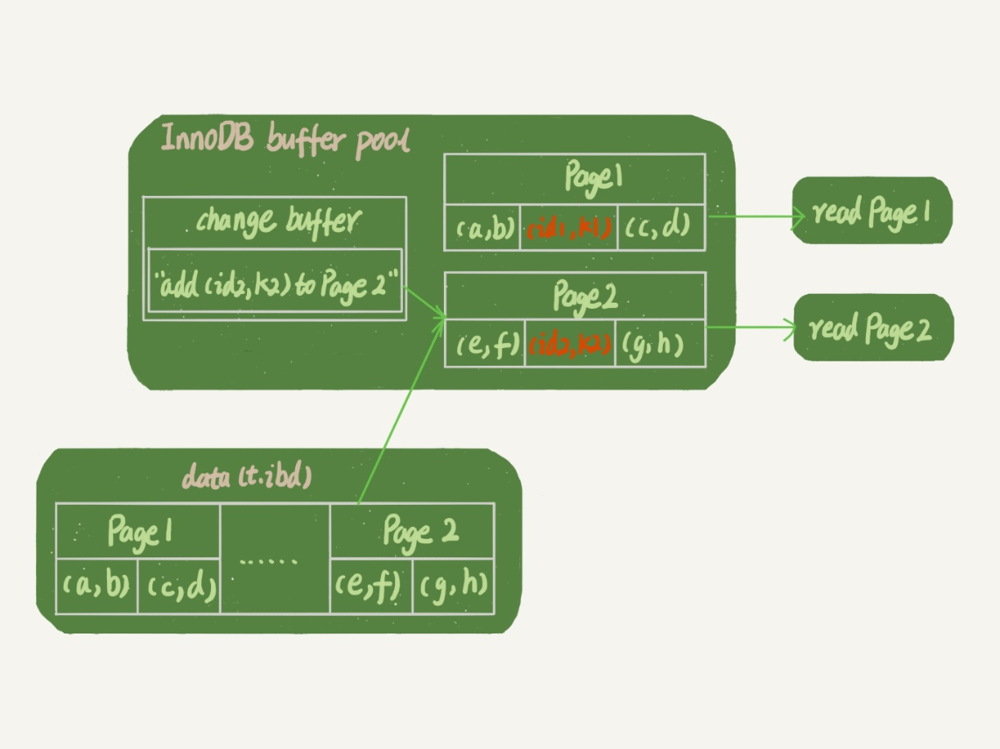

### 《MySQL 实战 45 讲》学习笔记 Day 10

09 | 普通索引和唯一索引，应该怎么选择？

一个市民系统，每个人都有一个唯一的身份证号。如果需要按照身份证号查姓名，就会执行类似这样的 SQL 语句：

```
select name from CUser where id_card = 'xxxxxxxyyyyyyzzzzz';
```

在 id_card 字段上建索引，从性能角度，选择唯一索引还是普通索引呢？



#### 查询过程

select id from T where k=5

性能差距微乎其微。

* 对于普通索引来说，查找到满足条件的第一个记录 (5,500) 后，需要查找下一条记录，直到碰到第一个不满足 k=5 条件的记录
* 对于唯一索引来说，由于索引定义了唯一性，查找到第一个满足条件的记录后，就会停止继续检索

引擎是按页读写的，当找到 k=5 的记录时，它所在的数据页就都在内存里了。那么，对于普通索引来说，要多做的那一次查找和判断下一条记录的操作，就只需要一次指针寻找和一次计算。

#### 更新过程

**change buffer**

更新一个数据页时，如果数据页在内存中就直接更新，如果内存中没有，在不影响数据一致性的前提下，InnoDB 会将这些更新操作缓存在 change buffer 中。

实际上它是可以持久化的数据。也就是说，change buffer 在内存中有拷贝，也会被写入到磁盘上。

意义：减少读磁盘，语句的执行速度会得到明显的提升，避免占用 buffer pool 内存，提高内存利用率。

适用于普通索引。

**merge**

将 change buffer 中的操作应用到原数据页，得到最新结果的过程。

触发时机：

1. 访问这个数据页时
2. 后台定时线程
3. 数据库正常关闭（shutdown）的过程中

**插入新记录 (4,400)**

目标页在内存中：

* 对于唯一索引来说，找到 3 和 5 之间的位置，判断到没有冲突，插入这个值
* 对于普通索引来说，找到 3 和 5 之间的位置，插入这个值

目标页不在内存中：

* 对于唯一索引来说，需要将数据页读入内存，判断到没有冲突，插入这个值
* 对于普通索引来说，则是将更新记录在 change buffer

#### change buffer 使用场景

一个数据页做 merge 之前，change buffer 记录的变更越多（也就是这个页面上要更新的次数越多），收益就越大。

对于写多读少的业务，页面在写完以后马上被访问到的概率比较小，此时 change buffer 的使用效果最好。常见的业务模型如账单类、日志类。

假设一个业务的更新模式是写入之后马上会做查询，那么即使满足了条件，将更新先记录在 change buffer，但之后由于马上要访问这个数据页，会立即触发 merge 过程。这样随机访问 IO 的次数不会减少，反而增加了 change buffer 的维护代价。对于这种业务模式来说，change buffer 反而起到了副作用。

#### 索引选择和实践

尽量选择普通索引。

* 普通索引和唯一索引，在查询能力上是没差别的，主要考虑的是对更新性能的影响
* 如果所有的更新后面，都马上伴随着对这个记录的查询，那么应该关闭 change buffer
* 而在其他情况下，change buffer 都能提升更新性能
* 普通索引和 change buffer 的配合使用，对于数据量大的表的更新优化很明显

#### change buffer 和 redo log

* change buffer 节省的是随机读磁盘的 IO 消耗
* redo log 节省的是随机写磁盘的 IO 消耗（转成顺序写）


**带 change buffer 的写过程**

```
mysql> insert into t(id,k) values(id1,k1),(id2,k2);
```



1. Page 1 在内存中，直接更新内存
2. Page 2 没有在内存中，就在内存的 change buffer 区域，记录下“要往 Page 2 插入一行”这个信息
3. 将上述两个动作记入 redo log 中（图中 3 和 4）

**带 change buffer 的读过程**

```
select * from t where k in (k1, k2)
```



1. 读 Page 1 的时候，直接从内存返回
2. 读 Page 2 的时候，需要把 Page 2 从磁盘读入内存中，然后应用 change buffer 里面的操作日志，生成一个正确的版本并返回结果

> 感悟：change buffer 的设计思路，可以用在应用的一些缓存场景！

学习来源： 极客时间 https://time.geekbang.org/column/intro/100020801

