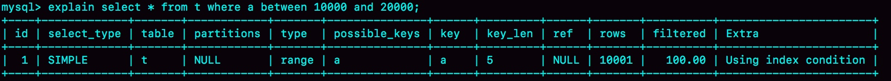
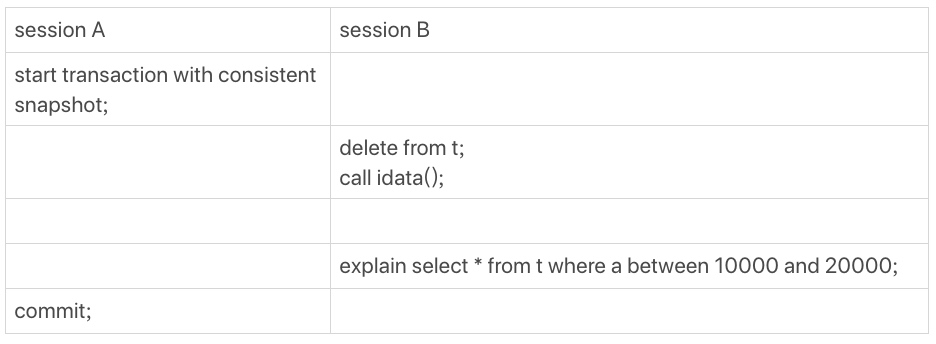
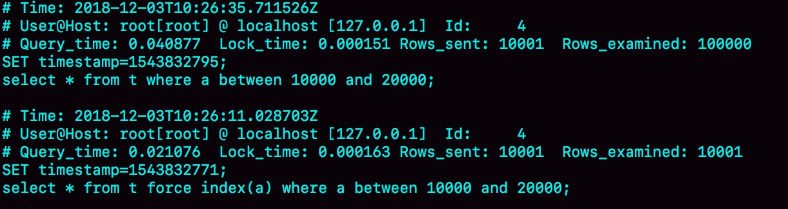
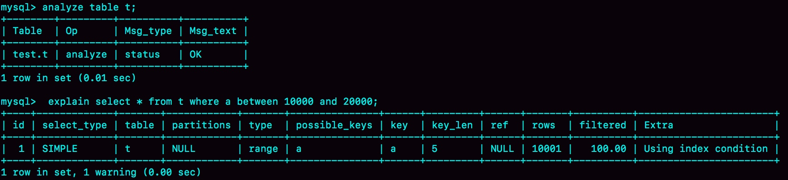
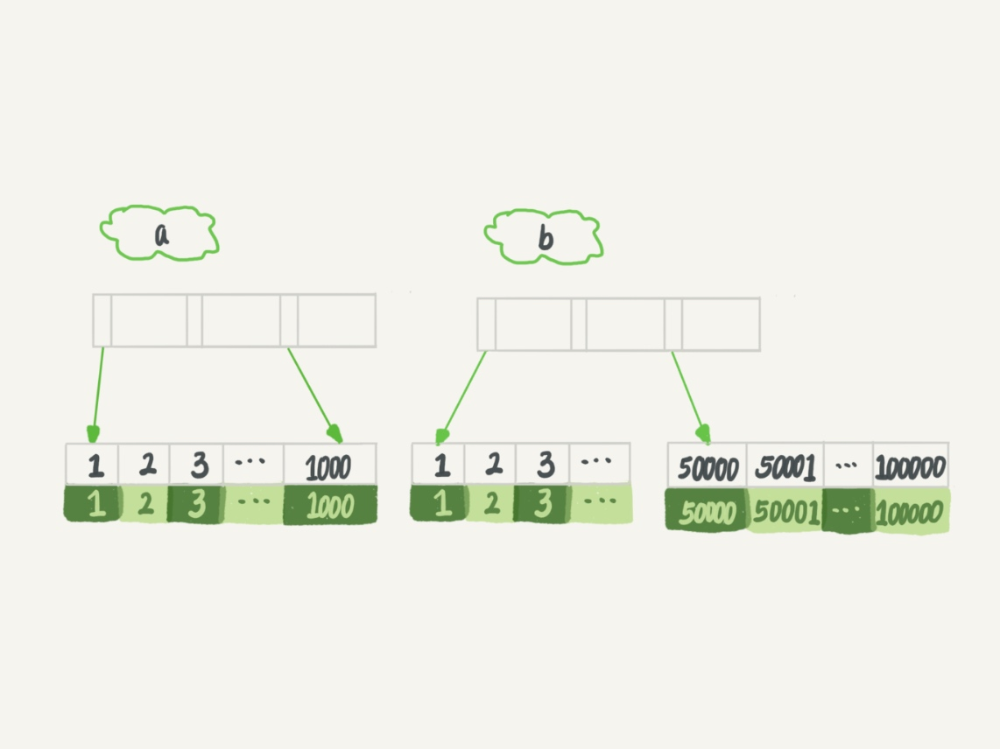
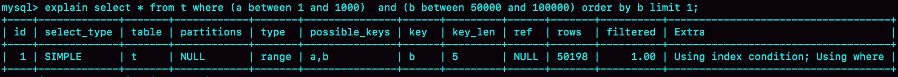
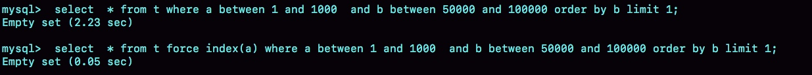
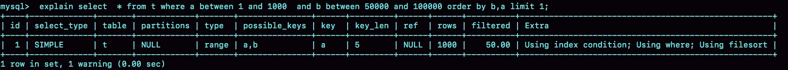

### 《MySQL 实战 45 讲》学习笔记 Day 11

10 | MySQL为什么有时候会选错索引？

一条本来可以执行得很快的语句，却由于 MySQL 选错了索引，而导致执行速度变得很慢？

#### 选错索引

```
CREATE TABLE `t` (
  `id` int(11) NOT NULL AUTO_INCREMENT,
  `a` int(11) DEFAULT NULL,
  `b` int(11) DEFAULT NULL,
  PRIMARY KEY (`id`),
  KEY `a` (`a`),
  KEY `b` (`b`)
) ENGINE=InnoDB;
```

插入 10 万行记录：

```
delimiter ;;
create procedure idata()
begin
  declare i int;
  set i=1;
  while(i<=100000)do
    insert into t values(i, i, i);
    set i=i+1;
  end while;
end;;
delimiter ;
call idata();
```

分析下面这条 SQL ：

```
mysql> select * from t where a between 10000 and 20000;
```

正确的索引：



制造混乱：



session B 的查询语句 select * from t where a between 10000 and 20000 会错误的选择索引 b。

```
set long_query_time=0;
select * from t where a between 10000 and 20000; /*Q1*/
select * from t force index(a) where a between 10000 and 20000;/*Q2*/
```

慢 SQL 日志：



#### 优化器逻辑

选择索引的目的，是找到一个最优的执行方案，并用最小的代价去执行语句。

**选择因子**

* 扫描行数
* 是否使用临时表
* 是否排序
* 是否回表
* ...

**采样统计**

* 全表扫统计代价太高
* 索引基数 cardinality：InnoDB 默认会选择 N 个数据页，统计这些页面上的不同值，得到一个平均值，然后乘以这个索引的页面数
* 当变更的数据行数超过 1/M 的时候，会自动触发重新做一次索引统计

**analyze table**

手工触发重新统计索引信息。



#### 索引选择异常处理

```
mysql> select * from t where (a between 1 and 1000)  and (b between 50000 and 100000) order by b limit 1;
```



* 使用索引 a 需要扫描 1000 行：扫描索引 a 的前 1000 个值，取到对应的 id，回到主键索引上去查出每一行，然后根据字段 b 来过滤。
* 使用索引 b 需要扫描 50001 行：扫描索引 b 的最后 50001 个值，取到对应的 id，回到主键索引上取值判断

选错索引：




**force index**

强行选择一个索引。



缺点如下：

* 这么写不优美
* 索引改了名字，这个语句也得改
* 迁移到别的数据库，语法可能不兼容

**修改 SQL 引导 MySQL**



**新建一个更合适的索引**

本例不适用。

**删掉误用的索引**

结合业务分析，简单直接。

> 感悟：程序都会有bug，mysql、linux、windows 都有！程序员在设计阶段应该多花些时间，尽力让逻辑完备，减少bug的数量！

学习来源： 极客时间 https://time.geekbang.org/column/intro/100020801


