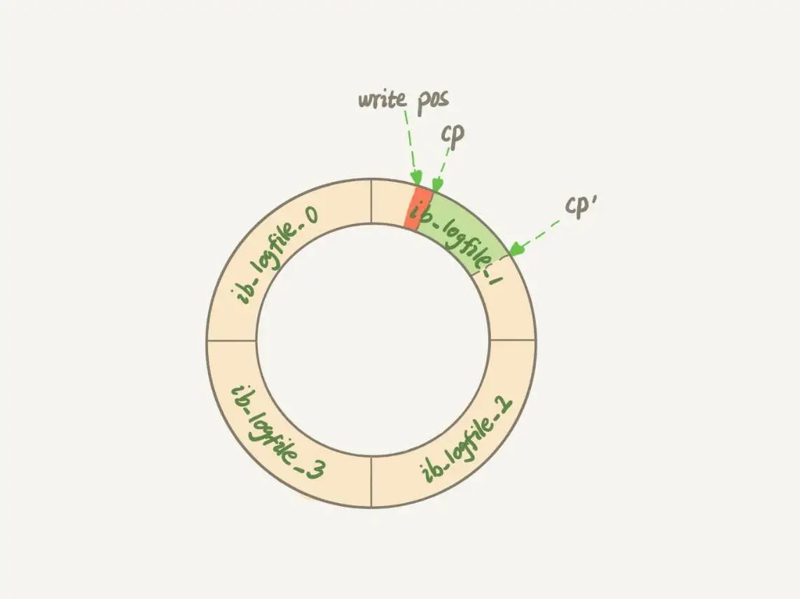

### 《MySQL 实战 45 讲》学习笔记 Day 13

12 | 为什么我的MySQL会“抖”一下？

一条 SQL 语句，正常执行的时候特别快，有时就会变得特别慢，这样的场景很难复现，它不只随机，而且持续时间还很短。

#### 你的 SQL 语句为什么变“慢”了

脏页：跟磁盘数据页内容不一致的内存数据页。

干净页：内存数据写入到磁盘后，内存和磁盘上的数据页的内容就一致了

**孔乙己赊账**


平时执行很快的更新操作，其实就是在写内存和日志，而 MySQL 偶尔抖一下的那个瞬间，可能就是在刷脏页（flush）。

**flush 触发时机**

1. redo log 写满了。系统停止所有更新操作，把 checkpoint 往前推进，为 redo log 留出空间。把对应脏页全部 flush 到磁盘
2. 系统内存不足，要淘汰一些数据页。如果淘汰的是脏页，就 flush
3. 系统空闲时，flush 一些脏页
4. 系统停止前，flush 所有脏页

**redo log 状态图**



**buffer pool**

管理内存，缓冲池中的内存页有三种状态：

1. 还没有使用的
2. 使用了并且是干净页
3. 使用了并且是脏页

**性能分析**

刷脏页虽然是常态，但是出现以下情况，会明显影响性能

1. 一个查询要淘汰的脏页个数太多，会导致查询的响应时间明显变长
2. 日志写满，更新全部堵住，写性能跌为 0，敏感业务不能接受

#### 刷脏页配置

**innodb_io_capacity**

全力刷脏页的能力。建议设置成磁盘的 IOPS。

```
 fio -filename=$filename -direct=1 -iodepth 1 -thread -rw=randrw -ioengine=psync -bs=16k -size=500M -numjobs=10 -runtime=10 -group_reporting -name=mytest 
```

**innodb_max_dirty_pages_pct**

脏页比例上限，默认值是 75%。

```
mysql> select VARIABLE_VALUE into @a from global_status where VARIABLE_NAME = 'Innodb_buffer_pool_pages_dirty';
select VARIABLE_VALUE into @b from global_status where VARIABLE_NAME = 'Innodb_buffer_pool_pages_total';
select @a/@b;
```

**innodb_flush_neighbors**

值为 1：flush 邻居脏页
值为 0：表示不找邻居，自己刷自己的。

> 感悟：脏页设计，简单说就是异步落盘。先写高速设备，再写低速设备，从而提高性能和吞吐量！

学习来源： 极客时间 https://time.geekbang.org/column/intro/100020801


