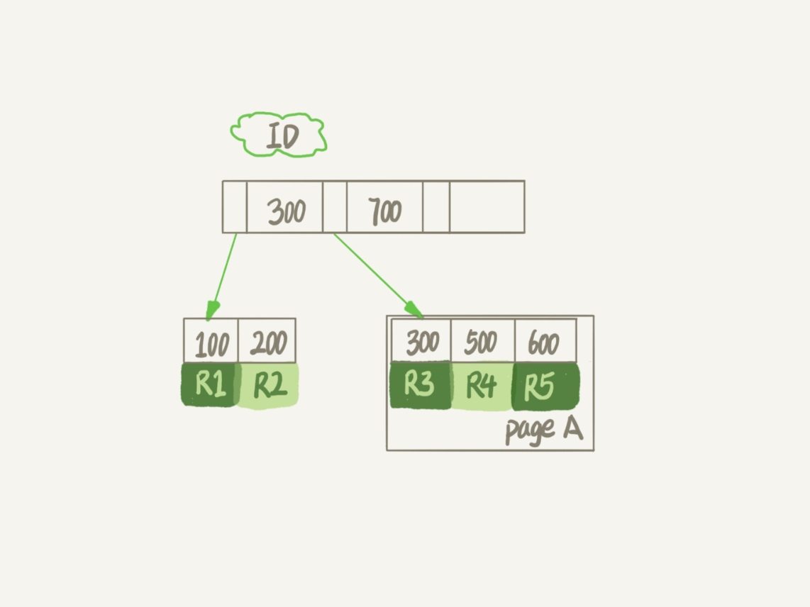
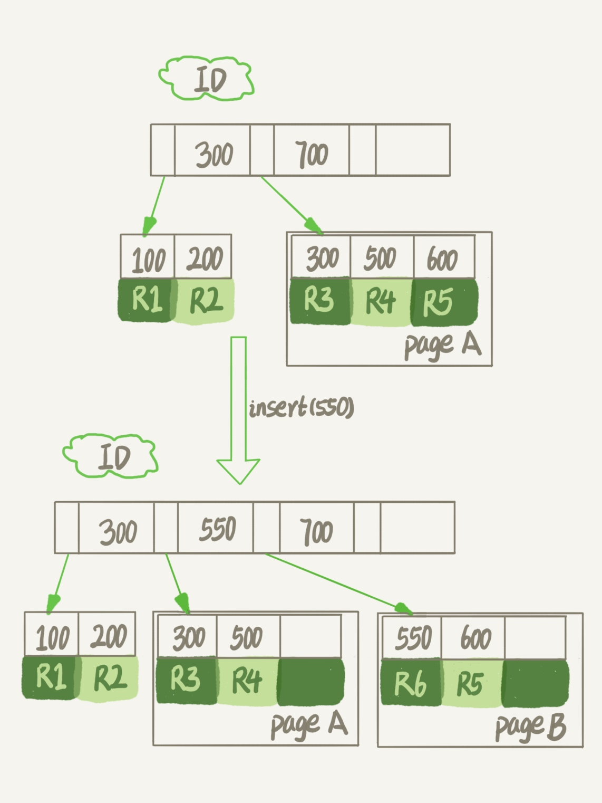
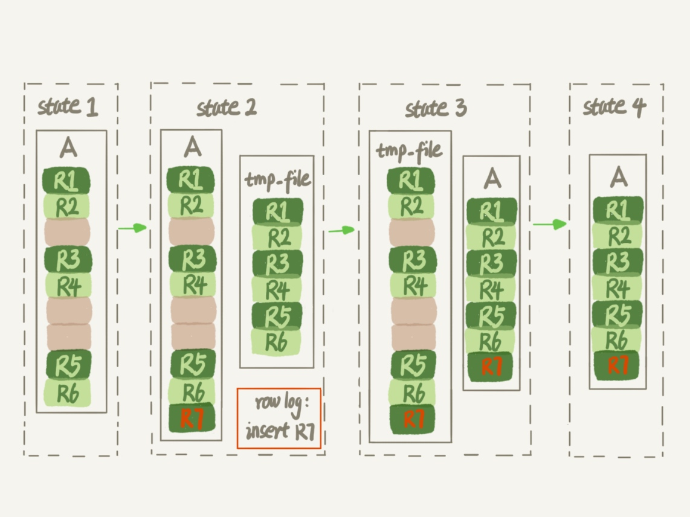

### 《MySQL 实战 45 讲》学习笔记 Day 14

13 | 为什么表数据删掉一半，表文件大小不变？

#### innodb_file_per_table

1. OFF：表的数据放在系统共享表空间，也就是跟数据字典放在一起
2. ON：每个 InnoDB 表数据存储在一个以 .ibd 为后缀的文件中

#### 数据删除流程

InnoDB 里的数据都是用 B+ 树的结构组织的。



删除数据会造成空洞，磁盘文件大小不会缩小：

1. 删掉 R4 记录，可能会复用该位置
2. 删掉 page A 所有记录，page A 被标记为可复用
3. 合并相邻的数据页到其中一页，另一个数据页被标记为可复用
4. 用 delete 删除整个表数据，所有数据页被标记为可复用

插入数据会导致页分裂，会造成空洞：



更新索引上的值，可以理解为删除一个旧的值，再插入一个新值。同样会造成空洞。

#### 重建表

重建表可以消除空洞，收缩表文件大小。

**Online DDL**

```
alter table A engine=InnoDB
```

1. alter 语句在启动时获取 MDL 写锁，在真正拷贝数据之前退化成读锁
2. MDL 读锁不会阻塞增删改操作，同时禁止其他线程对该表做 DDL
3. 最耗时的过程是拷贝数据到临时表



**inplace**

1. 根据表 A 重建出来的数据是放在 InnoDB 内部创建出来的临时文件 tmp_file 上
2. 整个 DDL 过程都在 InnoDB 内部完成
3. 对于 server 层来说，没有把数据挪动到临时表，是一个原地 inplace 操作

**几种重建表方式**

1. alter table t engine = InnoDB：重建表 recreate，默认是 inplace 流程
2. analyze table t：对表的索引信息做重新统计，没有修改数据，加 MDL 读锁
3. optimize table t：recreate + analyze。

> 感悟：MySQL InnoDB 的核心就是 B+ 树，所有的优化都围绕 B+ 树来进行！

学习来源： 极客时间 https://time.geekbang.org/column/intro/100020801

