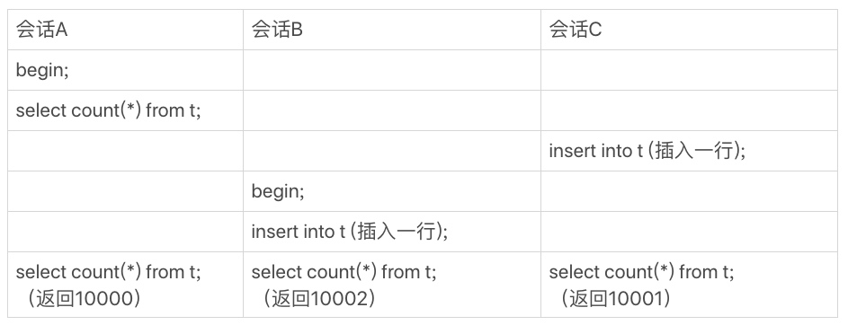
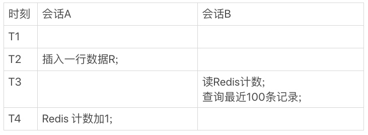
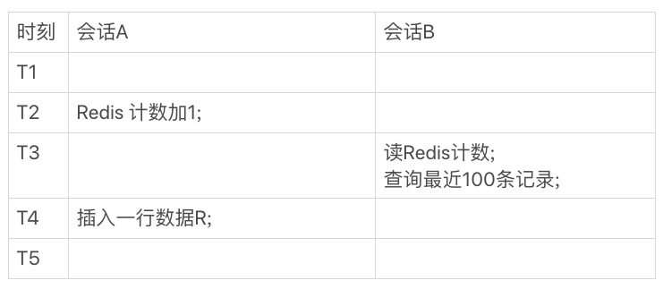
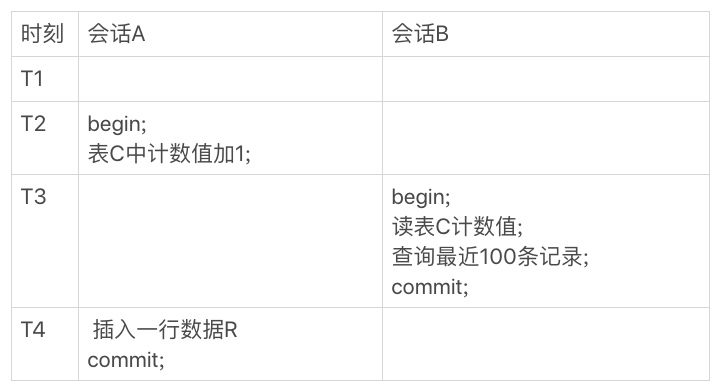

### 《MySQL 实战 45 讲》学习笔记 Day 15

14 | count(*)这么慢，我该怎么办？

count(*) 语句到底是怎样实现的？MySQL 为什么会这么实现？如果应用中有这种频繁变更并需要统计表行数的需求，业务设计上可以怎么做？

#### count(*) 的实现方式

MyISAM：把一个表的总行数存在了磁盘上，会直接返回这个数，效率很高
InnoDB：需要把数据一行一行地从引擎里面读出来，然后累积计数

**InnoDB 故意的？**

即使是同一时刻的多个查询，由于多版本并发控制（MVCC）的原因，InnoDB 表应该返回多少行也是不确定的。

在最后一个时刻，三个会话 A、B、C 会同时查询表 t 的总行数，但拿到的结果却不同。

**一些优化**

InnoDB 是索引组织表，主键索引树的叶子节点是数据，而普通索引树的叶子节点是主键值。所以，普通索引树比主键索引树小很多。

对于 count(*) 这样的操作，遍历哪个索引树得到的结果逻辑上都是一样的。因此，MySQL 优化器会找到最小的那棵树来遍历。

在保证逻辑正确的前提下，尽量减少扫描的数据量，是数据库系统设计的通用法则之一。

**小结一下**

* MyISAM 表 count(*) 很快，不支持事务
* show table status 返回很快，但是不准确
* InnoDB 表 count(*) 会遍历全表，虽然结果准确，性能低下

#### 用保存计数

在 Redis 中来保存表的总行数。每被插入一行 Redis 计数就加 1，每被删除一行 Redis 计数就减 1。

如果 Redis 异常重启，执行一次 count(*) 获取数据库行数，把这个值写回到 Redis。

由于 Redis 计数和数据库写数据有时间差，所以这个计数逻辑上可能不一致。

#### 在数据库保存计数

会话 B 的读操作仍然是在 T3 执行的，但是因为这时候更新事务还没有提交，所以计数值加 1 这个操作对会话 B 还不可见。

会话 B 查计数值和最近 100 条记录看到的结果，逻辑上是一致的。

#### count(*) or count(1)

**count() 语义**

一个聚合函数，对于返回的结果集，一行行地判断，如果参数不是 NULL，累计值就加 1，否则不加。最后返回累计值。

**分析性能差别**

1. server 层要什么就给什么
2. InnoDB 只给必要的值
3. 优化器只优化了 count(*) 的语义为取行数

**不同 count 分析**

1. count(主键 id)：遍历整张表，把每一行的 id 值都取出来，返回给 server 层。server 层拿到 id 后，判断是不可能为空的，按行累加
2. count(1) ：遍历整张表，但不取值。server 层对于返回的每一行，放一个数字1进去，判断是不可能为空的，按行累加
3. count(字段)：not null，一行行地从记录里面读出这个字段，按行累加；允许为 null，把值取出来判断一下，不是 null 才累加
4. count(*) ：专门做了优化，不取值，按行累加

**按照效率排序**

count(字段) < count(主键 id) < count(1) ≈ count(*)

尽量使用 count(*)。

> 感悟：困扰多年的 count 之谜终于解开了：）

学习来源： 极客时间 https://time.geekbang.org/column/intro/100020801

