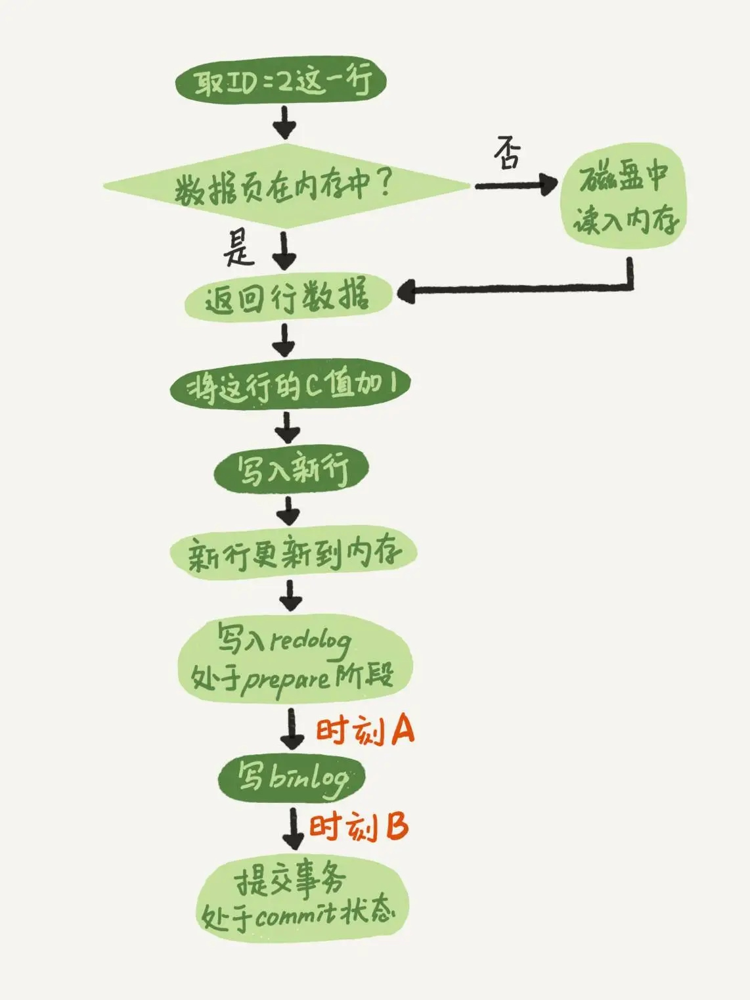
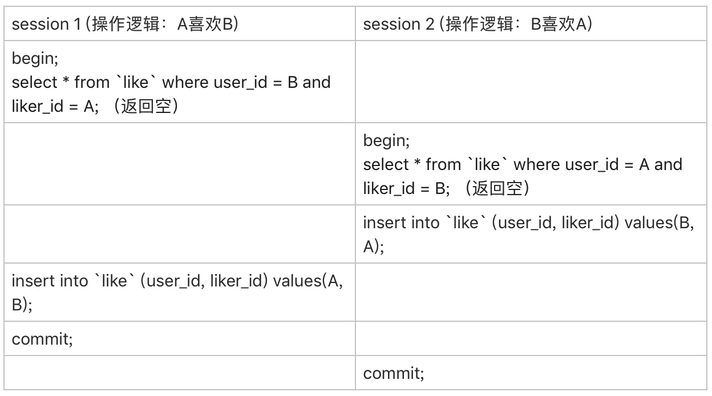

### 《MySQL 实战 45 讲》学习笔记 Day 16

15 | 答疑文章（一）：日志和索引相关问题

#### 日志相关问题

**两阶段提交的不同瞬间，MySQL 如果发生异常重启，是怎么保证数据完整性的？**

* 时刻 A：也就是写入 redo log 处于 prepare 阶段之后、写 binlog 之前，发生了崩溃（crash），由于此时 binlog 还没写，redo log 也还没提交，所以崩溃恢复的时候，这个事务会回滚。这时候，binlog 还没写，所以也不会传到备库
* 时刻 B：也就是 binlog 写完，redo log 还没 commit 前发生 crash

**崩溃恢复时的判断规则**

1. 如果 redo log 里面的事务是完整的，也就是已经有了 commit 标识，则直接提交
2. 如果 redo log 里面的事务只有完整的 prepare，则判断对应的事务 binlog 是否存在并完整：a. 如果是，则提交事务；b. 否则，回滚事务

**怎么知道 binlog 是完整的？**

1. statement 格式的 binlog，最后会有 COMMIT
2. row 格式的 binlog，最后会有一个 XID event
3. binlog-checksum 参数

**redo log 和 binlog 是怎么关联起来的?**

XID

#### 业务设计问题

如果 A、B 同时关注对方，会出现不会成为好友的情况。因为上面第 1 步，双方都没关注对方。第 1 步即使使用了排他锁也不行，因为记录不存在，行锁无法生效。请问这种情况，在 MySQL 锁层面有没有办法处理？

> 感悟：redo log 负责崩溃恢复， binlog 用于高可用，缺一不可！

学习来源： 极客时间 https://time.geekbang.org/column/intro/100020801

