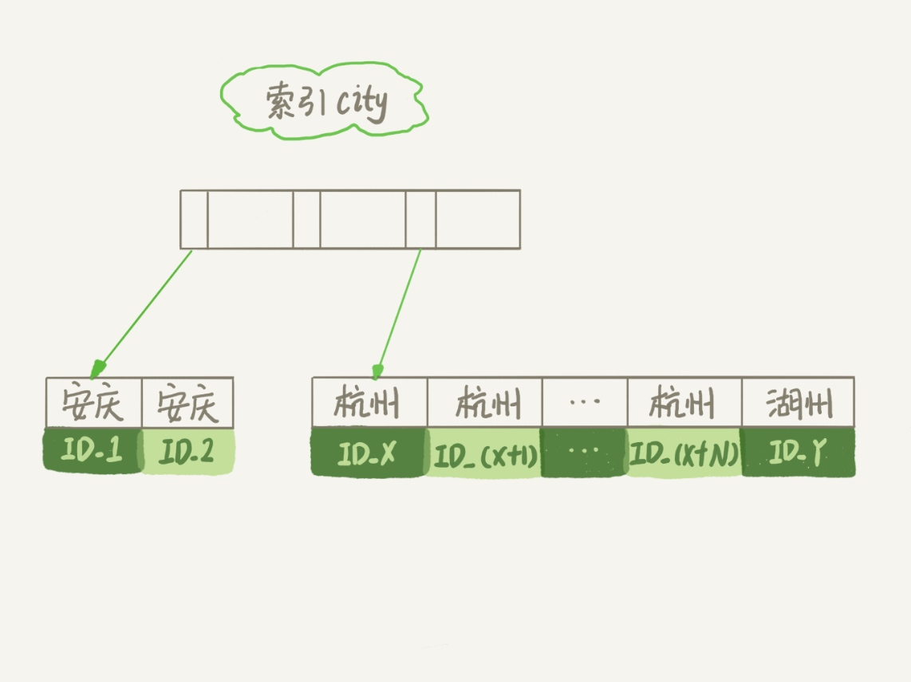
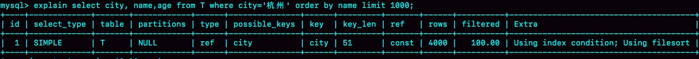

### 《MySQL 实战 45 讲》学习笔记 Day 17

16 | “order by”是怎么工作的？

下面这个语句是怎么执行的，以及有什么参数会影响执行的行为？

```
select city,name,age from t where city='杭州' order by name limit 1000;
```

```
CREATE TABLE `t` (
  `id` int(11) NOT NULL,
  `city` varchar(16) NOT NULL,
  `name` varchar(16) NOT NULL,
  `age` int(11) NOT NULL,
  `addr` varchar(128) DEFAULT NULL,
  PRIMARY KEY (`id`),
  KEY `city` (`city`)
) ENGINE=InnoDB;
```

#### 全字段排序

**索引结构**

满足 city='杭州’条件的行，是从 ID_X 到 ID_(X+N) 的这些记录。



**排序过程**


**sort_buffer**



explain Extra 字段中的“Using filesort”表示的就是需要排序，MySQL 会给每个线程分配一块内存用于排序。

**重要参数**

* sort_buffer_size：如果要排序的数据量小于该值，排序就在内存中完成
* number_of_tmp_files：如果内存放不下，则利用数量为该值的磁盘临时文件进行归并排序
* sort_mode：紧凑处理 packed_additional_fields，即按照实际长度来分配字段空间

#### rowid 排序

**max_length_for_sort_data**

控制用于排序的行数据的长度。如果单行长度超过，则使用 rowid 排序。


> 感悟：如果内存够，就要多利用内存，尽量减少磁盘访问！

学习来源： 极客时间 https://time.geekbang.org/column/intro/100020801


