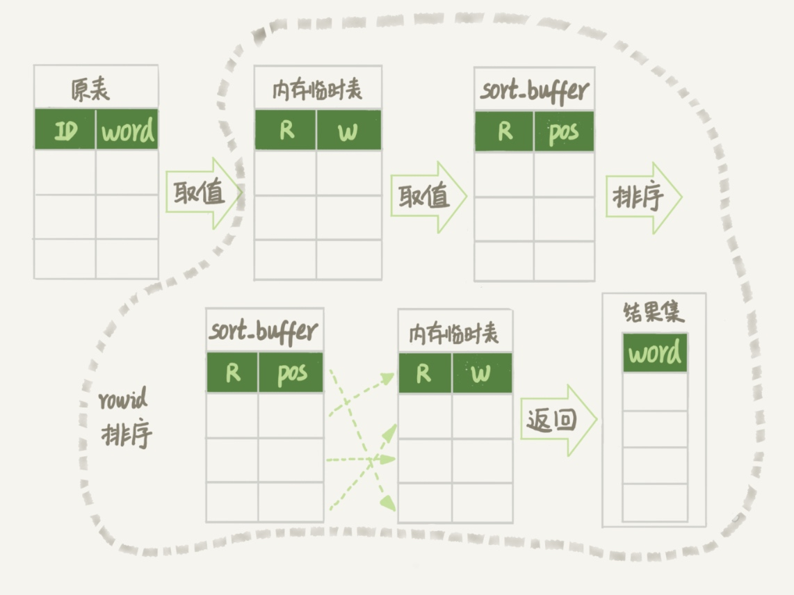
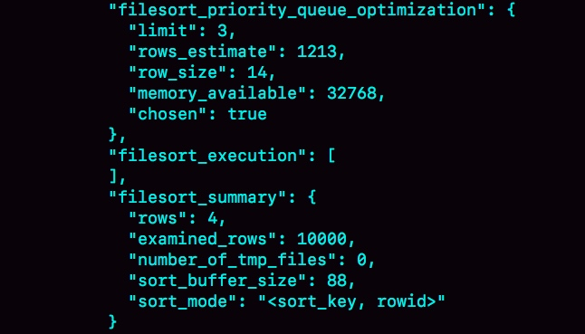
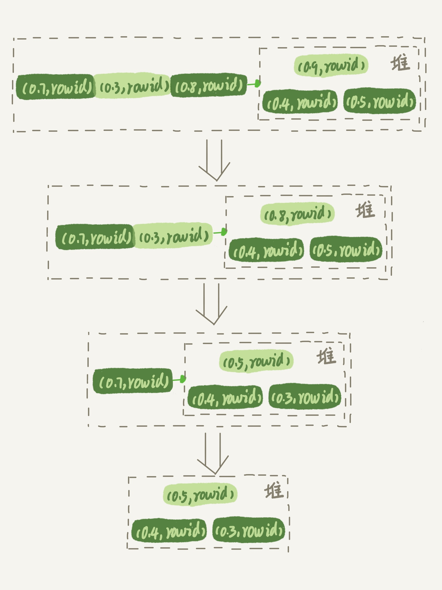

### 《MySQL 实战 45 讲》学习笔记 Day 18

17 | 如何正确地显示随机消息？

从一个 10000 行记录的单词表中随机选出三个单词，有什么方法实现，存在什么问题以及如何改进？

```
mysql> CREATE TABLE `words` (
  `id` int(11) NOT NULL AUTO_INCREMENT,
  `word` varchar(64) DEFAULT NULL,
  PRIMARY KEY (`id`)
) ENGINE=InnoDB;

delimiter ;;
create procedure idata()
begin
  declare i int;
  set i=0;
  while i<10000 do
    insert into words(word) values(concat(char(97+(i div 1000)), char(97+(i % 1000 div 100)), char(97+(i % 100 div 10)), char(97+(i % 10))));
    set i=i+1;
  end while;
end;;
delimiter ;

call idata();
```

#### 内存临时表

**order by rand()**

缺点：需要 Using temporary 和 Using filesort，执行代价较大。

```
mysql> select word from words order by rand() limit 3;
```

**slow log**

```
# Query_time: 0.900376  Lock_time: 0.000347 Rows_sent: 3 Rows_examined: 20003
SET timestamp=1541402277;
select word from words order by rand() limit 3;
```



**rowid**

每个引擎用来唯一标识数据行的信息。

* 对于有主键的 InnoDB 表，就是主键 ID
* 对于没有主键的 InnoDB 表，就是由系统生成的
* MEMORY 引擎不是索引组织表，就是数组下标

#### 磁盘临时表

**OPTIMIZER_TRACE**

```
set tmp_table_size=1024;
set sort_buffer_size=32768;
set max_length_for_sort_data=16;
/* 打开 optimizer_trace，只对本线程有效 */
SET optimizer_trace='enabled=on'; 

/* 执行语句 */
select word from words order by rand() limit 3;

/* 查看 OPTIMIZER_TRACE 输出 */
SELECT * FROM `information_schema`.`OPTIMIZER_TRACE`\G
```



**优先队列排序**

最大堆排序。



#### 随机排序方法

**随机算法1**

缺点：概率不均匀

1. 取得这个表的主键 id 的最大值 M 和最小值 N
2. 用随机函数生成一个最大值到最小值之间的数 X = (M-N)*rand() + N
3. 取不小于 X 的第一个 ID 的行

**随机算法2**

1. 取得整个表的行数，并记为 C
2. 取得 Y = floor(C * rand())。 floor 即取整数部分
3. 再用 limit Y,1 取得一行

**随机算法3**

1. 取得整个表的行数，记为 C
2. 根据相同的随机方法得到 Y1、Y2、Y3
3. 再执行三个 limit Y, 1 语句得到三行数据

> 感悟：不去搞明白底层原理，就很容易写出性能低下的代码！

学习来源： 极客时间 https://time.geekbang.org/column/intro/100020801


