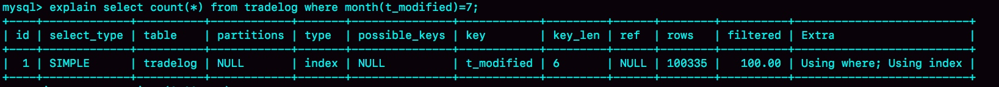
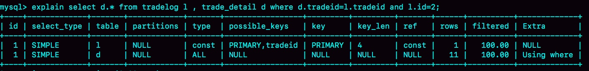
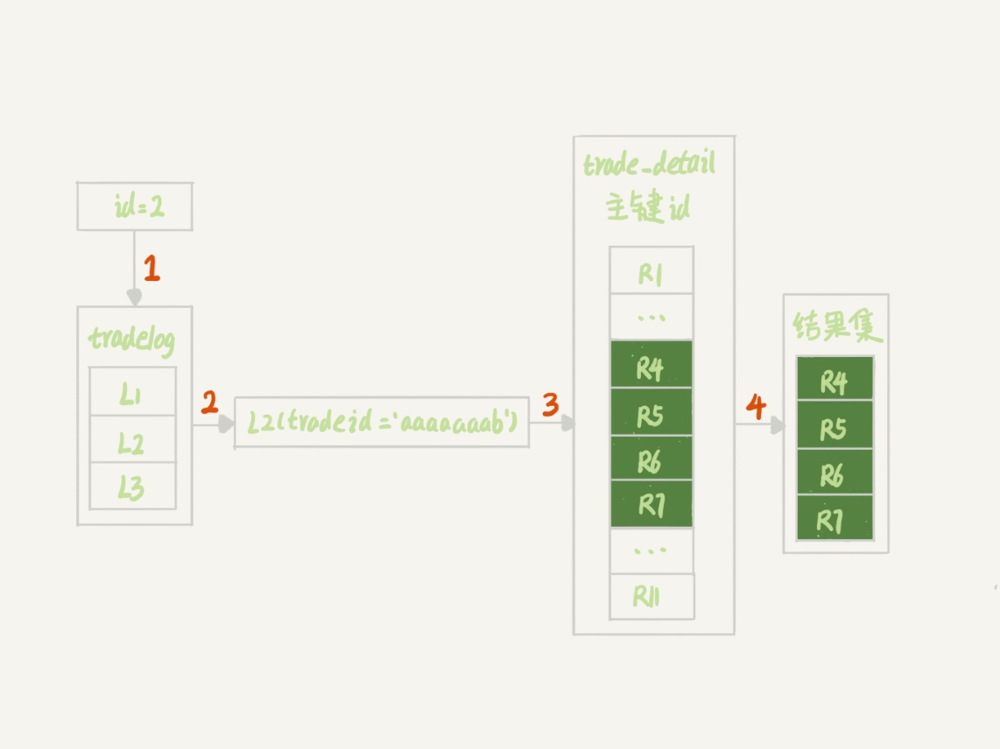
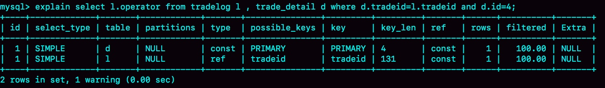

### 《MySQL 实战 45 讲》学习笔记 Day 19

18 | 为什么这些SQL语句逻辑相同，性能却差异巨大？

SQL 语句使用不当，就会不经意间导致整个数据库的压力变大，一起看三个案例。

```
mysql> CREATE TABLE `tradelog` (
  `id` int(11) NOT NULL,
  `tradeid` varchar(32) DEFAULT NULL,
  `operator` int(11) DEFAULT NULL,
  `t_modified` datetime DEFAULT NULL,
  PRIMARY KEY (`id`),
  KEY `tradeid` (`tradeid`),
  KEY `t_modified` (`t_modified`)
) ENGINE=InnoDB DEFAULT CHARSET=utf8mb4;
```

#### 案例一：条件字段函数操作

统计发生在所有年份中 7 月份的交易记录总数：

```
mysql> select count(*) from tradelog where month(t_modified)=7;
```

对索引字段做函数操作，可能会破坏索引值的有序性，因此优化器就决定放弃走树搜索功能，这个案例它会选择遍历索引 t_modified，也就是全索引扫描。



正确的做法（基于字段本身的范围查询）：

```
mysql> select count(*) from tradelog where
    -> (t_modified >= '2016-7-1' and t_modified<'2016-8-1') or
    -> (t_modified >= '2017-7-1' and t_modified<'2017-8-1') or 
    -> (t_modified >= '2018-7-1' and t_modified<'2018-8-1');
```

#### 案例二：隐式类型转换

```
mysql> select * from tradelog where tradeid=110717;
```

从 select “10” > 9 返回的是 1，可以确认 MySQL 里的转换规则：字符串和数字做比较的话，是将字符串转换成数字。

即上面的 SQL 语句等价于：

```
mysql> select * from tradelog where  CAST(tradid AS signed int) = 110717;
```

**同案例一：对索引字段做函数操作。**

#### 案例三：隐式字符编码转换

```
mysql> CREATE TABLE `trade_detail` (
  `id` int(11) NOT NULL,
  `tradeid` varchar(32) DEFAULT NULL,
  `trade_step` int(11) DEFAULT NULL, /*操作步骤*/
  `step_info` varchar(32) DEFAULT NULL, /*步骤信息*/
  PRIMARY KEY (`id`),
  KEY `tradeid` (`tradeid`)
) ENGINE=InnoDB DEFAULT CHARSET=utf8;

insert into tradelog values(1, 'aaaaaaaa', 1000, now());
insert into tradelog values(2, 'aaaaaaab', 1000, now());
insert into tradelog values(3, 'aaaaaaac', 1000, now());

insert into trade_detail values(1, 'aaaaaaaa', 1, 'add');
insert into trade_detail values(2, 'aaaaaaaa', 2, 'update');
insert into trade_detail values(3, 'aaaaaaaa', 3, 'commit');
insert into trade_detail values(4, 'aaaaaaab', 1, 'add');
insert into trade_detail values(5, 'aaaaaaab', 2, 'update');
insert into trade_detail values(6, 'aaaaaaab', 3, 'update again');
insert into trade_detail values(7, 'aaaaaaab', 4, 'commit');
insert into trade_detail values(8, 'aaaaaaac', 1, 'add');
insert into trade_detail values(9, 'aaaaaaac', 2, 'update');
insert into trade_detail values(10, 'aaaaaaac', 3, 'update again');
insert into trade_detail values(11, 'aaaaaaac', 4, 'commit');
```

**无法命中索引**

查询 id=2 的交易的所有操作步骤信息：

```
mysql> select d.* from tradelog l, trade_detail d where d.tradeid=l.tradeid and l.id=2; /*语句Q1*/
```





第 3 步不符合预期。没有用上表 trade_detail 里 tradeid 字段的索引。

这两个表的字符集不同，一个是 utf8，一个是 utf8mb4，所以做表连接查询的时候用不上关联字段的索引。

```
mysql> select * from trade_detail where tradeid=$L2.tradeid.value; 
```

$L2.tradeid.value 的字符集是 utf8mb4。

字符集 utf8mb4 是 utf8 的超集，所以当这两个类型的字符串在做比较的时候，MySQL 内部的操作是，先把 utf8 字符串转成 utf8mb4 字符集，再做比较。

即上面的 SQL 语句等价于：

```
select * from trade_detail  where CONVERT(traideid USING utf8mb4)=$L2.tradeid.value; 
```

**同案例一：对索引字段做函数操作。**

解决办法：

```
mysql> select d.* from tradelog l , trade_detail d where d.tradeid=CONVERT(l.tradeid USING utf8) and l.id=2; 
```

**可以命中索引**

mysql>select l.operator from tradelog l , trade_detail d where d.tradeid=l.tradeid and d.id=4;



上面的 SQL 语句等价于：

```
select operator from tradelog  where traideid =CONVERT($R4.tradeid.value USING utf8mb4); 
```

> 感悟：多用 explain！

学习来源： 极客时间 https://time.geekbang.org/column/intro/100020801

