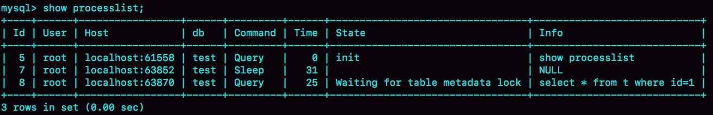
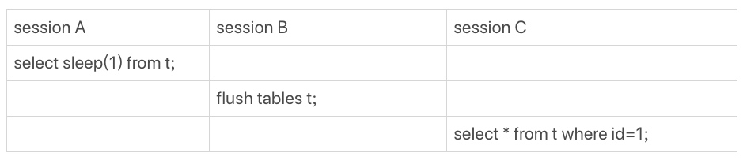
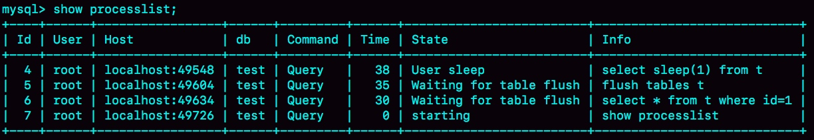
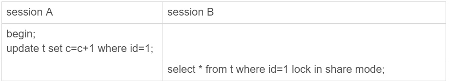
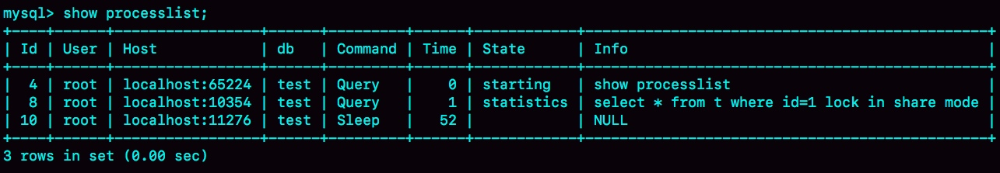
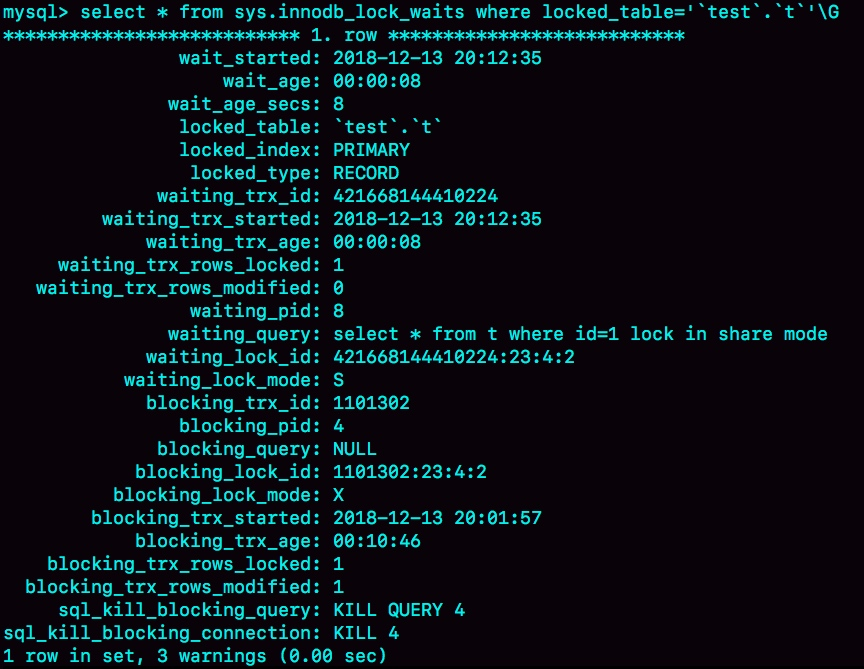
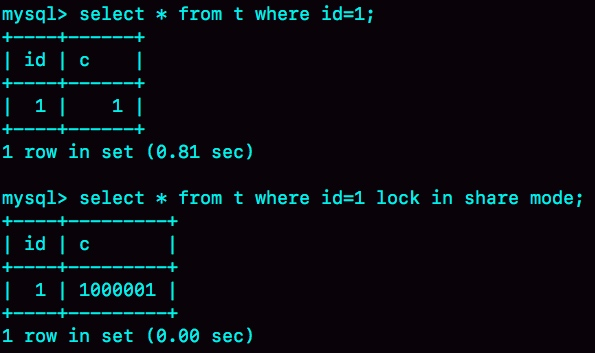
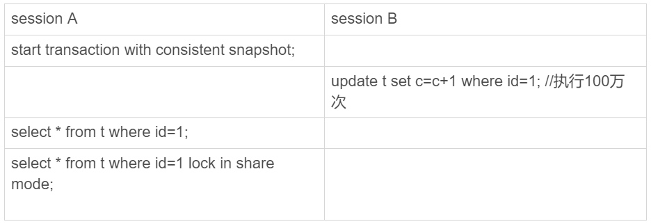
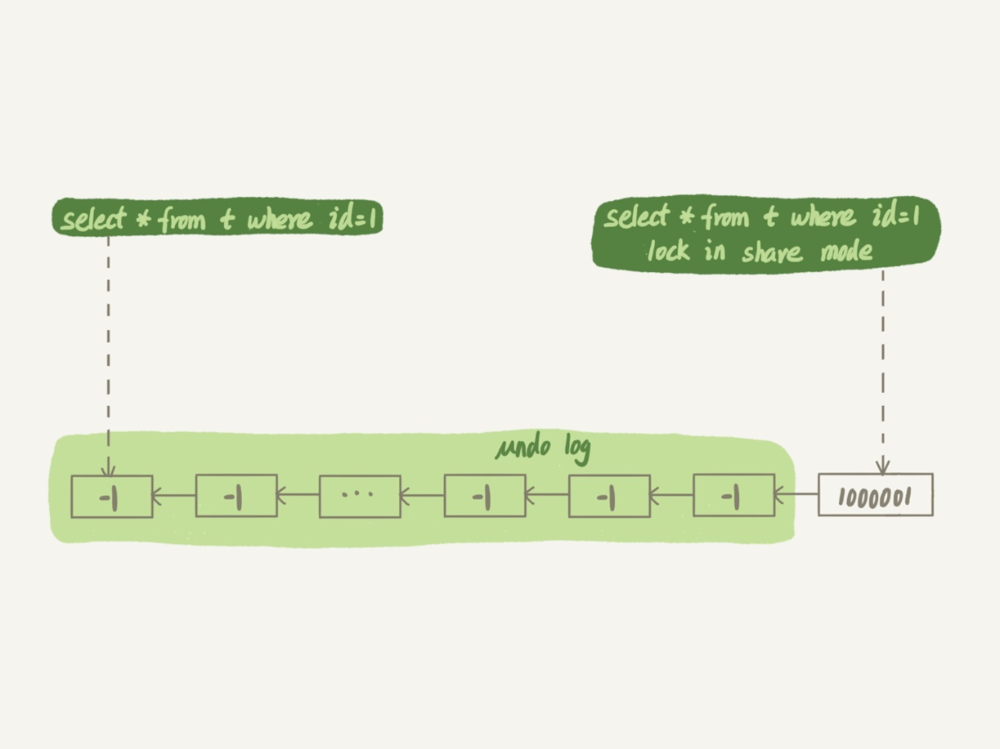

### 《MySQL 实战 45 讲》学习笔记 Day 20

19 | 为什么我只查一行的语句，也执行这么慢？

表 t 有两个字段 id 和 c，10 万行记录。

```
mysql> CREATE TABLE `t` (
  `id` int(11) NOT NULL,
  `c` int(11) DEFAULT NULL,
  PRIMARY KEY (`id`)
) ENGINE=InnoDB;

delimiter ;;
create procedure idata()
begin
  declare i int;
  set i=1;
  while(i<=100000) do
    insert into t values(i,i);
    set i=i+1;
  end while;
end;;
delimiter ;

call idata();
```

#### 第一类：查询长时间不返回

```
mysql> select * from t where id=1;
```

大概率是表 t 被锁住了。

show processlist 看看当前语句处于什么状态。针对每种状态，去分析它们产生的原因、如何复现，以及如何处理。

**等 MDL 锁**



有一个线程正在表 t 上请求或者持有 MDL 写锁，把 select 语句堵住了。


解决：找到谁持有 MDL 写锁，然后把它 kill 掉。

```
select blocking_pid from sys.schema_table_lock_waits;

kill $blocking_pid;
```

**等 flush**





**等行锁**

```
mysql> select * from t where id=1 lock in share mode; 
```





```
mysql> select * from t sys.innodb_lock_waits where locked_table='`test`.`t`'\G
```



解决：

KILL 4 才有效，也就是说直接断开这个连接。隐含逻辑是，连接被断开的时候，会自动回滚这个连接里面正在执行的线程，也就释放了 id=1 上的行锁。

#### 第二类：查询慢

**扫描行数多，执行慢**

```
mysql> select * from t where c=50000 limit 1;
```

字段 c 上没有索引，只能走 id 主键顺序扫描，因此需要扫描 5 万行。


**扫描行数是 1，执行慢**

```
mysql> select * from t where id=1；
```








* 当前读：lock in share mode，直接读到 1000001 这个结果，所以速度很快
* 一致性读：select * from t where id=1 需要从 1000001 开始，依次执行 undo log，执行了 100 万次以后，才将 1 这个结果返回

> 感悟：学会用 sys.schema_table_lock_waits 和 sys.innodb_lock_wait 诊断加锁状态，kill释放锁处理紧急问题。

学习来源： 极客时间 https://time.geekbang.org/column/intro/100020801

