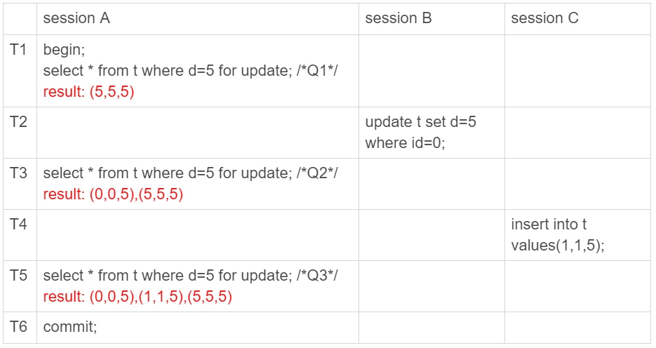
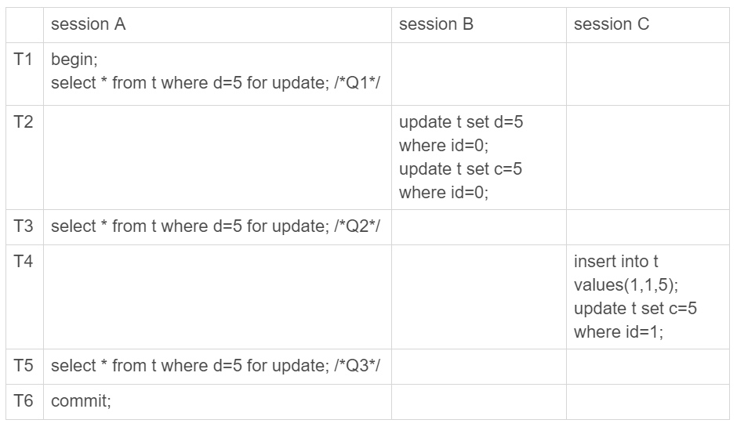
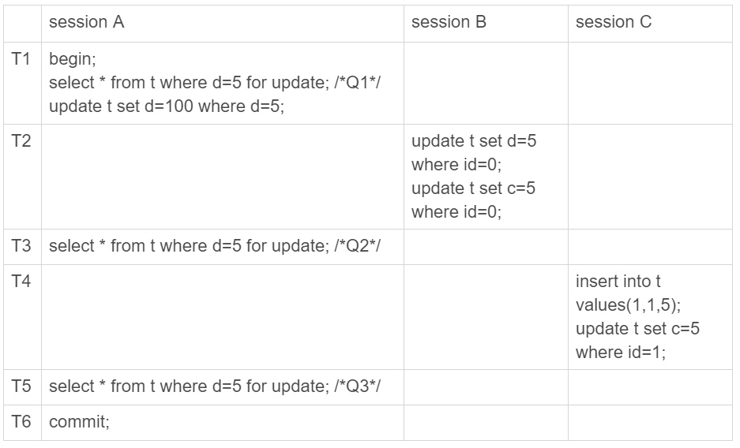
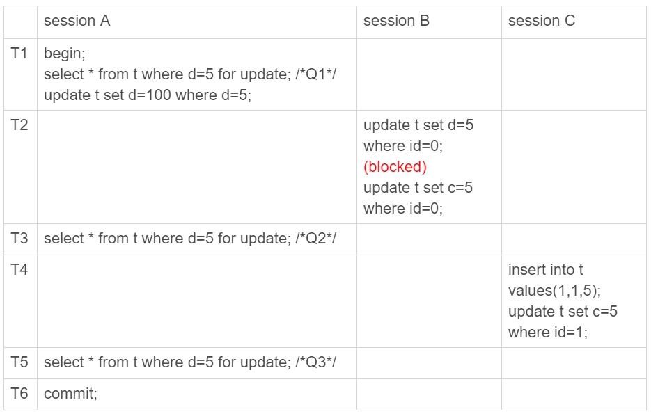
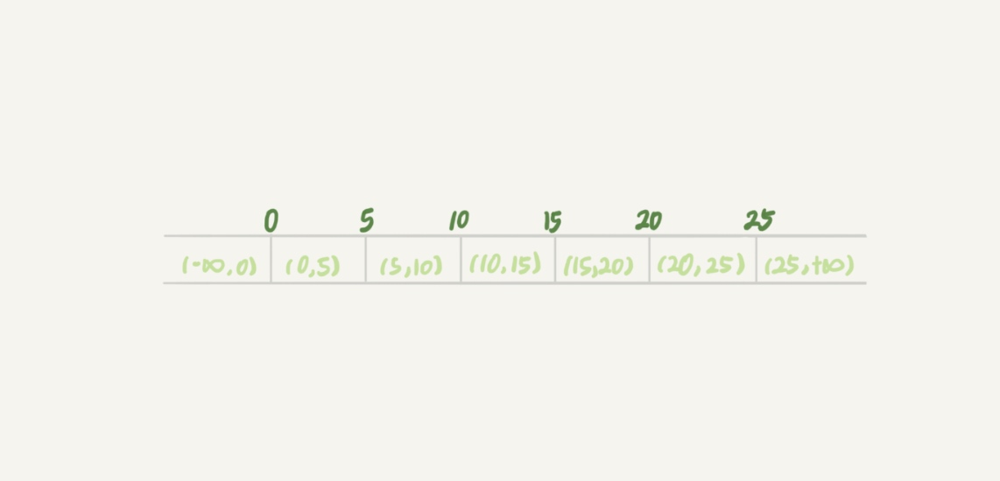
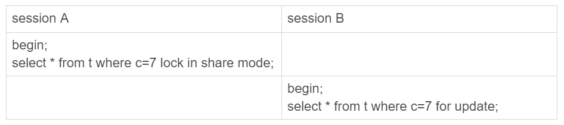
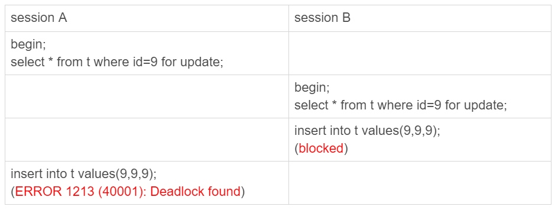

### 《MySQL 实战 45 讲》学习笔记 Day 21

20 | 幻读是什么，幻读有什么问题？

表 t 有 3 个字段， id、c 和 d，6 行记录。

```
CREATE TABLE `t` (
  `id` int(11) NOT NULL,
  `c` int(11) DEFAULT NULL,
  `d` int(11) DEFAULT NULL,
  PRIMARY KEY (`id`),
  KEY `c` (`c`)
) ENGINE=InnoDB;

insert into t values(0,0,0),(5,5,5),
(10,10,10),(15,15,15),(20,20,20),(25,25,25);
```

下面的语句序列，是怎么加锁的，加的锁又是什么时候释放的呢？

```
begin;
select * from t where d=5 for update;
commit;
```

这个语句会命中 d=5 的这一行，对应的主键 id=5，因此在 select 语句执行完成后，id=5 这一行会加一个写锁，由于两阶段锁协议，这个写锁会在执行 commit 语句的时候释放。

由于字段 d 上没有索引，这条查询语句会做全表扫描。那么，其他被扫描到的，但是不满足条件的 5 行记录上，会不会被加锁呢？

#### 幻读是什么？

如果只在 id=5 这一行加锁，而其他行的不加锁的话，会怎么样？



T5 时刻 Q3 读到 id=1 这一行的现象，被称为幻读。

一个事务在前后两次查询同一个范围的时候，后一次查询看到了前一次查询没有看到的行。

1. 幻读在当前读下才会出现。在可重复读隔离级别下，普通的查询是快照读，是不会看到别的事务插入的数据的
2. 幻读仅专指新插入的行。上面 session B 的修改结果，被 session A 之后的 select 语句用“当前读”看到，不能称为幻读

#### 幻读有什么问题？

**语义被破坏**



1. session A：T1 时刻，把所有 d=5 的行锁住，不准别的事务读写操作
2. session B：update t set c=5 where id=0
3. session C：update t set c=5 where id=1

**数据一致性**



1. session A：T1 时刻，把所有 d=5 的行锁住，更新 (5,5,5) => (5,5,100)
2，binlog 出现不一致：出现 (0,5,100)，(1,5,100)，(5,5,100)

```
update t set d=5 where id=0; /*(0,0,5)*/
update t set c=5 where id=0; /*(0,5,5)*/

insert into t values(1,1,5); /*(1,1,5)*/
update t set c=5 where id=1; /*(1,5,5)*/

update t set d=100 where d=5;/*所有d=5的行，d改成100*/
```

**所有行加写锁**



binlog 部分一致：

```
insert into t values(1,1,5); /*(1,1,5)*/
update t set c=5 where id=1; /*(1,5,5)*/

update t set d=100 where d=5;/*所有d=5的行，d改成100*/

update t set d=5 where id=0; /*(0,0,5)*/
update t set c=5 where id=0; /*(0,5,5)*/
```

id=1 这一行不一致：

```
db(1,5,5) => binlog(1,5,100)
```

原因：在 T3 时刻，给所有行加锁的时候，id=1 这一行还不存在，不存在也就加不上锁。

#### 如何解决幻读？

Gap Lock：间隙锁。锁的就是两个值之间的空隙。

本文开头的表 t，初始化插入了 6 个记录，这就产生了 7 个间隙。



当执行 select * from t where d=5 for update 时，不止是给已有的 6 个记录加上了行锁，还同时加了 7 个间隙锁。确保了无法再插入新的记录。

**锁的冲突关系**

* 跟行锁有冲突关系的是另外一个行锁
* 跟间隙锁有冲突关系的，是往这个间隙中插入一个记录这个操作
* 间隙锁之间都不存在冲突关系



session B 并不会被堵住。表 t 里并没有 c=7 这个记录，因此 session A 加的是间隙锁 (5,10)。而 session B 也是在这个间隙加的间隙锁。它们有共同的目标，即：保护这个间隙，不允许插入值。但，它们之间是不冲突的。

**next-key lock**

间隙锁和行锁的合称。

每个 next-key lock 是前开后闭区间。也就是说，表 t 初始化以后，如果用 select * from t for update 要把整个表所有记录锁起来，就形成了 7 个 next-key lock，分别是 (-∞,0]、(0,5]、(5,10]、(10,15]、(15,20]、(20, 25]、(25, +supremum]。

supremum 为 一个不存在的最大值。

**间隙锁死锁**



因为同样的间隙锁 (5,10) 死锁。

间隙锁的引入，可能会导致同样的语句锁住更大的范围，影响了并发度。

**更简单的解决幻读**

1. 读提交隔离级别：没有间隙锁
2. binlog_format=row：解决数据和日志不一致
3. 配置是否合理，跟业务场景有关，需要具体问题具体分析

> 感悟：Gap Lock 间隙锁的设计很牛逼！

学习来源： 极客时间 https://time.geekbang.org/column/intro/100020801


