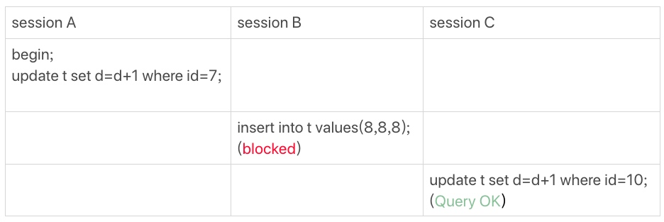
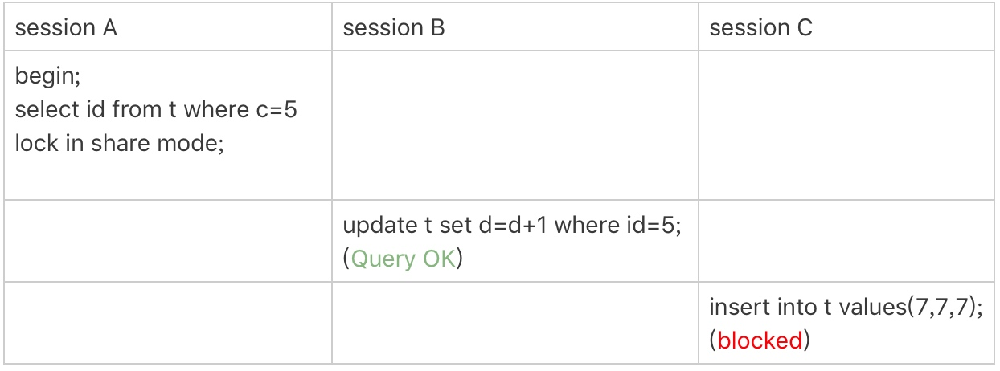
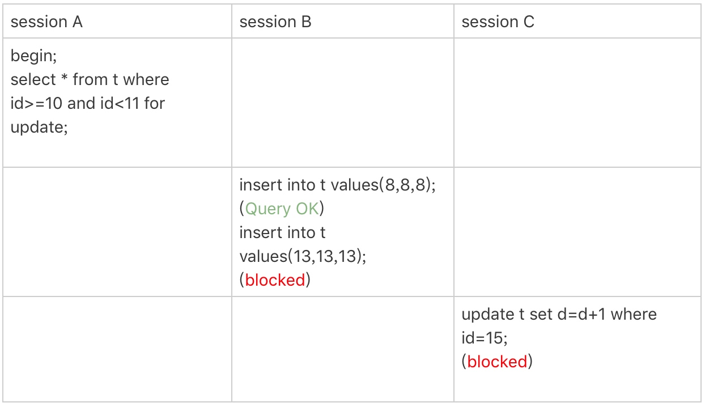
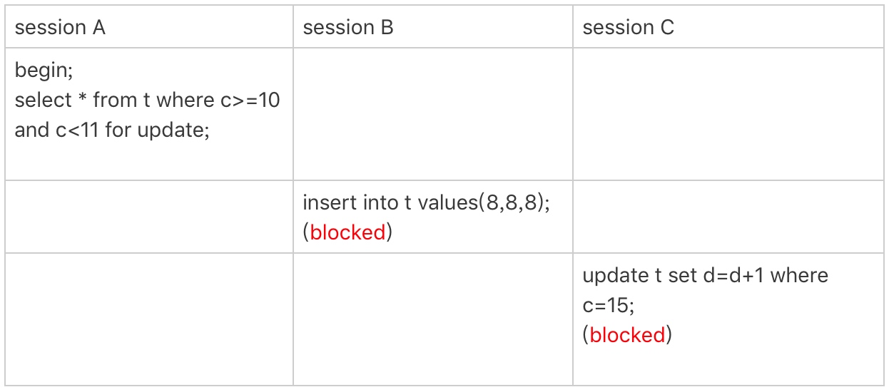
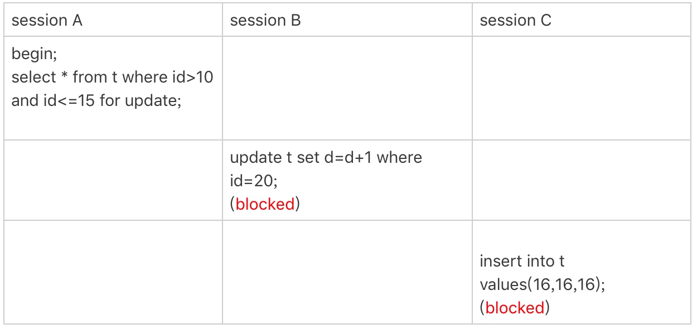
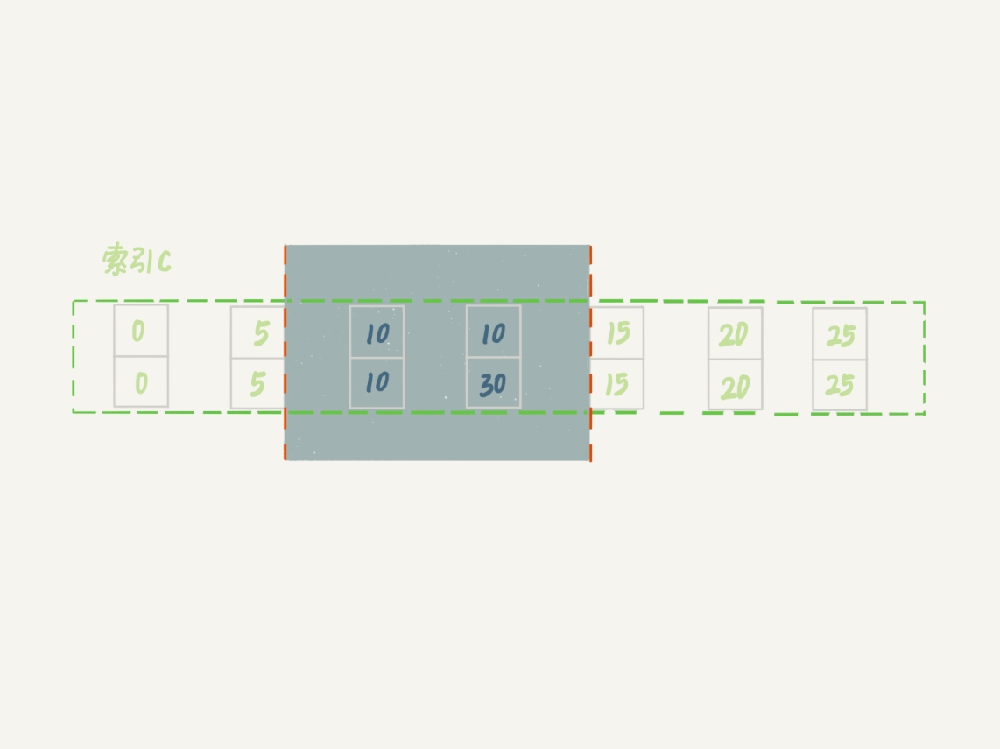
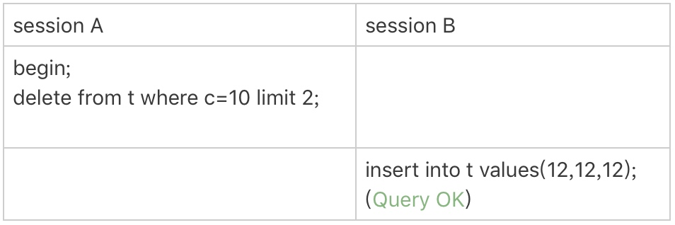
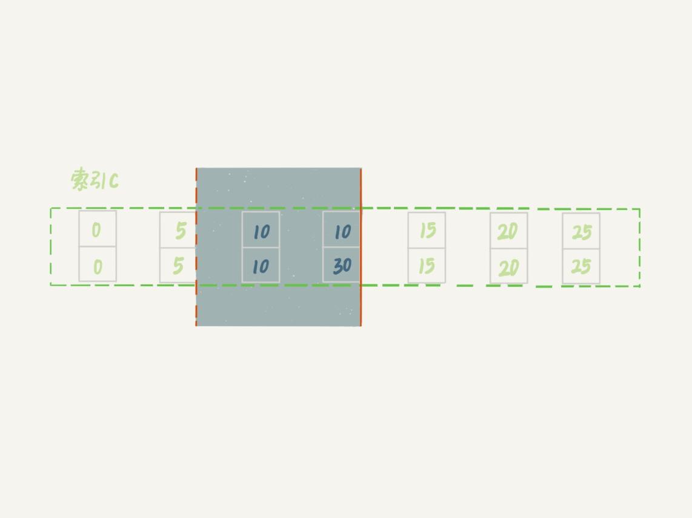
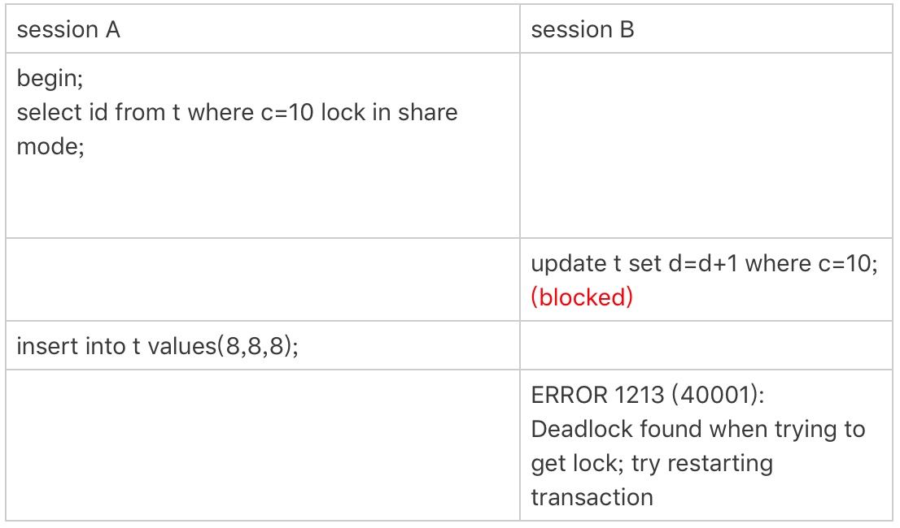

### 《MySQL 实战 45 讲》学习笔记 Day 22

21 | 为什么我只改一行的语句，锁这么多？

表 t 有 3 个字段， id、c 和 d，6 行记录。

```
CREATE TABLE `t` (
  `id` int(11) NOT NULL,
  `c` int(11) DEFAULT NULL,
  `d` int(11) DEFAULT NULL,
  PRIMARY KEY (`id`),
  KEY `c` (`c`)
) ENGINE=InnoDB;

insert into t values(0,0,0),(5,5,5),(10,10,10),(15,15,15),(20,20,20),(25,25,25);
```

#### 加锁规则

1. 原则 1：加锁的基本单位是 next-key lock，前开后闭区间
2. 原则 2：查找过程中访问到的对象才会加锁
3. 优化 1：索引上的等值查询，给唯一索引加锁的时候，next-key lock 退化为行锁
4. 优化 2：索引上的等值查询，向右遍历时且最后一个值不满足等值条件的时候，next-key lock 退化为间隙锁
5. 一个 bug：唯一索引上的范围查询会访问到不满足条件的第一个值为止

#### 案例一：等值查询间隙锁

session A 加锁范围：间隙锁(5,10)



#### 案例二：非唯一索引等值锁

session A 加锁范围：覆盖索引，间隙锁(5,10)



#### 案例三：主键索引范围锁

session A 加锁范围：主键索引，行锁 id=10 和 next-key lock(10,15]



#### 案例四：非唯一索引范围锁

session A 加锁范围：索引 c，next-key lock(5,10] 和 (10,15]



#### 案例五：唯一索引范围锁 bug

session A 加锁范围：主键索引，next-key lock(10,15] 和 (15,20]



#### 案例六：非唯一索引上存在"等值"的例子

session A 加锁范围：间隙锁(c=5,id=5) 到 (c=15,id=15) 开区间

```
mysql> insert into t values(30,10,30);
```




#### 案例七：limit 语句加锁

session A 加锁范围：间隙锁(c=5,id=5) 到 (c=10,id=30)，前开后闭

删除数据的时候尽量加 limit。这样不仅可以控制删除数据的条数，让操作更安全，还可以减小加锁的范围。




 
#### 案例八：一个死锁的例子

session A 加锁范围：索引 c，next-key lock(5,10] 和间隙锁 (10,15)

session B 的加 next-key lock(5,10] 操作，分两步：

1. 先加间隙锁 (5,10) 成功
2. 再加行锁 c=10，被锁住



> 感悟：这几篇锁的案例相当精彩！

学习来源： 极客时间 https://time.geekbang.org/column/intro/100020801


