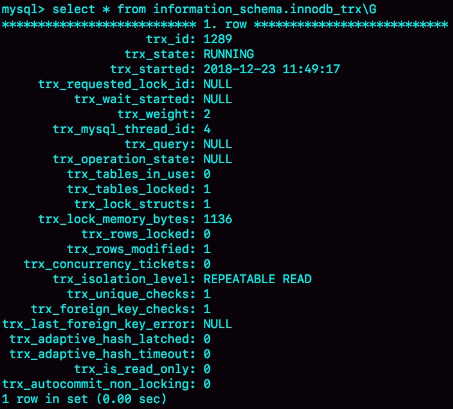
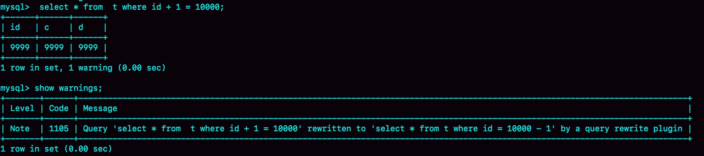

### 《MySQL 实战 45 讲》学习笔记 Day 23

22 | MySQL有哪些“饮鸩止渴”提高性能的方法？

业务高峰期，生产环境的 MySQL 压力太大，没法正常响应，需要短期内、临时性地提升一些性能。不管你用什么方案，让业务先跑起来再说。

#### 短连接风暴

MySQL 建立连接的过程，成本是很高的。除了正常的网络连接三次握手外，还需要做登录权限判断和获得这个连接的数据读写权限。

**max_connections**

用来控制一个 MySQL 实例同时存在的连接数的上限，超过这个值，系统就会拒绝接下来的连接请求，并报错提示Too many connections。

该值改得太大，更多的连接进来，系统的负载会进一步加大，大量资源耗费在权限验证等逻辑上，结果可能适得其反，已经连接的线程反而拿不到 CPU 资源去执行业务的 SQL 请求。

有损处理方法：

**Kill 空闲线程**

1. show processlist 找到 Sleep 状态的会话
2. information_schema.innodb_trx 排除还处在事务中的会话 trx_mysql_thread_id
3. kill $id 断开连接




**减少连接过程的消耗**

--skip-grant-tables 重启数据库，使得客户端连接和执行 SQL 时跳过权限验证。

谨慎使用！！！外网可访问禁用！！！

#### 慢查询性能问题

**索引没有设计好**

解决：紧急创建索引。假设一主一备，主库 A，备库 B。

1. 在备库 B 上执行 set sql_log_bin=off 不写 binlog，然后执行 alter table 加索引
2. 执行主备切换。此时主库变为 B，备库是 A
3. 在 备库 A 上执行 set sql_log_bin=off，然后执行 alter table 加索引

**语句没写好**

解决：查询重写

```
mysql> insert into query_rewrite.rewrite_rules(pattern, replacement, pattern_database) values ("select * from t where id + 1 = ?", "select * from t where id = ? - 1", "db1");

call query_rewrite.flush_rewrite_rules();
```

确认改写规则生效：



**MySQL 选错了索引**

解决：force index

#### QPS 突增问题

业务突然出现高峰，或者应用程序 bug，导致某个语句的 QPS 突然暴涨，都可能导致 MySQL 压力过大，影响服务。

规范的运维体系：

1. 虚拟化。上线前测试表插入模拟线上数据，回归测试
2. 白名单机制。新业务功能可从数据库端直接下掉
3. 业务账号分离。新业务工使用单独的用户，可从数据库端删掉

> 感悟：更多的准备，往往意味着更稳定的系统！着急忙慌的上线，意味着更多的线上突发事件处理！

学习来源： 极客时间 https://time.geekbang.org/column/intro/100020801


