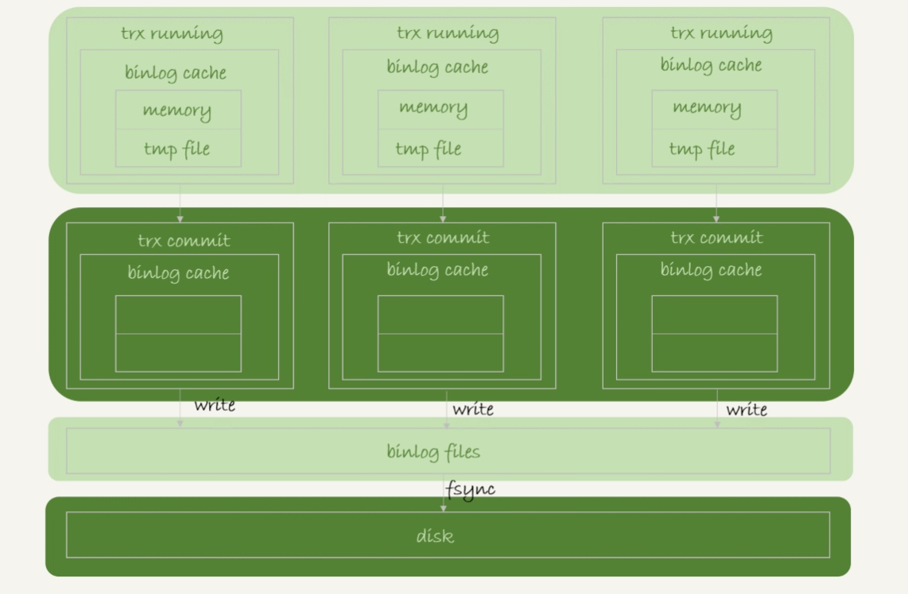
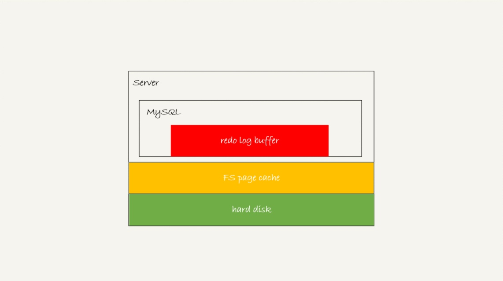
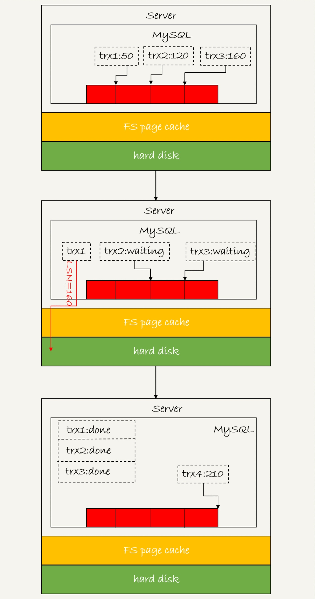
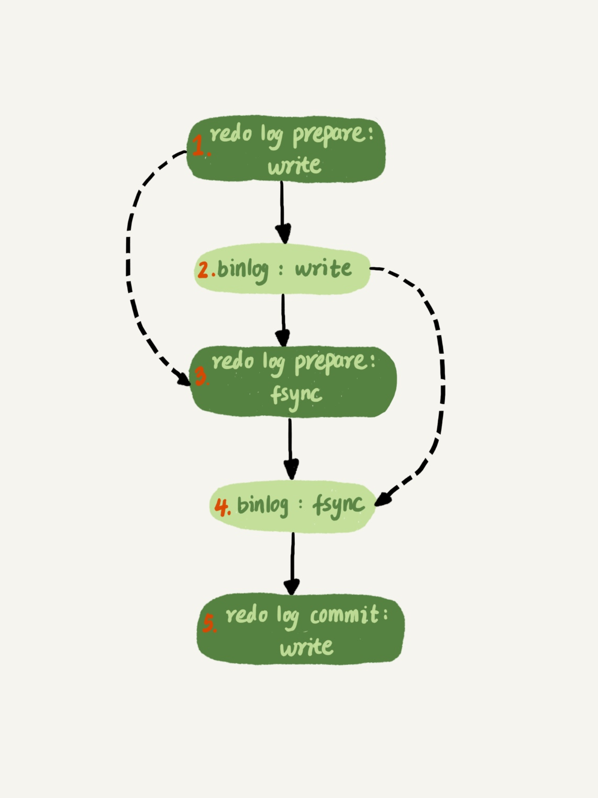

### 《MySQL 实战 45 讲》学习笔记 Day 24

23 | MySQL是怎么保证数据不丢的？

只要 redo log 和 binlog 保证持久化到磁盘，就能确保 MySQL 异常重启后，数据可以恢复。一起看看 MySQL 写入 binlog 和 redo log 的流程。

#### binlog 的写入机制

**事务执行过程**

先把日志写到 binlog cache，事务提交的时候，再把 binlog cache 写到 binlog 文件中。

每个线程有自己 binlog cache，共用同一份 binlog 文件。

* write：把日志写入到文件系统的 page cache，并没有持久化到磁盘，所以速度比较快
* fsync：将数据持久化到磁盘的操作，占磁盘的 IOPS

**sync_binlog 参数**

* 0：每次提交事务都只 write，不 fsync
* 1：，每次提交事务都会执行 fsync
* N(N>1)：每次提交事务都 write，但累积 N 个事务后才 fsync

#### redo log 的写入机制

**redo log 存储状态**

**innodb_flush_log_at_trx_commit 参数**

* 0 ：每次事务提交时都只是把 redo log 留在 redo log buffer 中
* 1 ：每次事务提交时都将 redo log 直接持久化到磁盘
* 2 ：每次事务提交时都只是把 redo log 写到 page cache

后台线程每隔 1 秒，就会把 redo log buffer 中的日志，调用 write 写到文件系统的 page cache，然后调用 fsync 持久化到磁盘。

**group commit 机制**

日志逻辑序列号 LSN：Log Sequence Number。单调递增，对应 redo log 的每个写入点。

三个并发事务 (trx1, trx2, trx3) 在 prepare 阶段，都写完 redo log buffer，持久化到磁盘的过程，对应的 LSN 分别是 50、120 和 160。

1. trx1 第一个到达，会被选为这组的 leader
2. 等 trx1 开始写盘时，组里已经有了三个事务，LSN 变成了 160
3. trx1 去写盘时，带的就是 LSN=160，因此等 trx1 返回时，所有 LSN 小于等于 160 的 redo log，都已经被持久化到磁盘
4. trx2 和 trx3 直接返回

组员越多，节约磁盘 IOPS 的效果越好。

#### IO 性能瓶颈

1. 设置 binlog_group_commit_sync_delay 和 binlog_group_commit_sync_no_delay_count 参数，减少 binlog 的写盘次数。可能会增加语句的响应时间，但没有丢失数据的风险
2. 将 sync_binlog 设置为大于 1 的值（比较常见是 100~1000）。风险：主机掉电时会丢 binlog 日志
3. 将 innodb_flush_log_at_trx_commit 设置为 2。风险：主机掉电时会丢数据

#### crash-safe 保证

1. 如果客户端收到事务成功的消息，事务就一定持久化了
2. 如果客户端收到事务失败（比如主键冲突、回滚等）的消息，事务就一定失败了
3. 如果客户端收到执行异常的消息，应用需要重连后通过查询当前状态来继续后续的逻辑。此时数据库只需要保证内部（数据和日志之间，主库和备库之间）一致就可以了

> 感悟：两阶段提交保证数据一致性的设计值得借鉴！

学习来源： 极客时间 https://time.geekbang.org/column/intro/100020801

