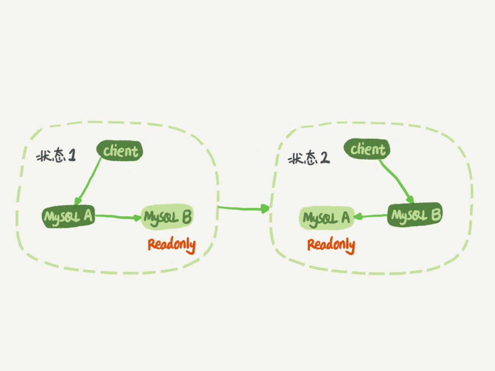
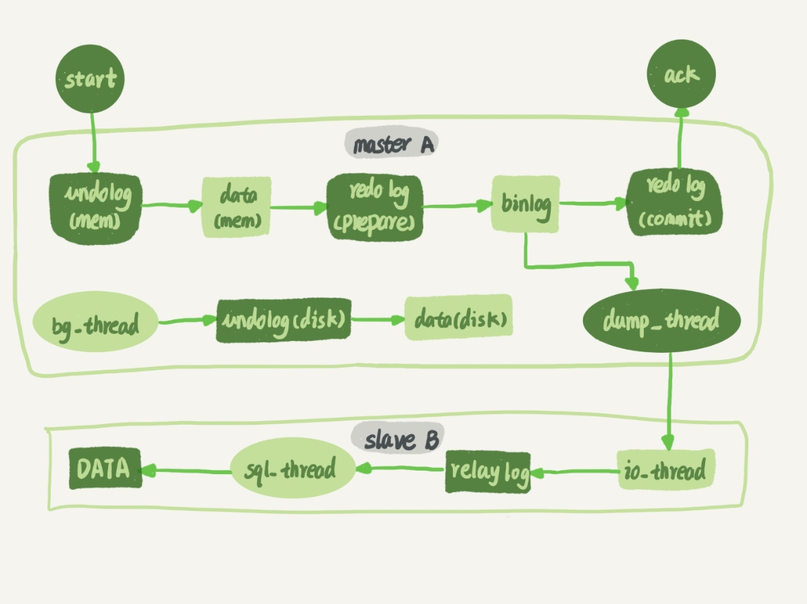
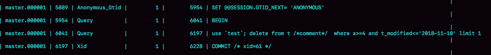
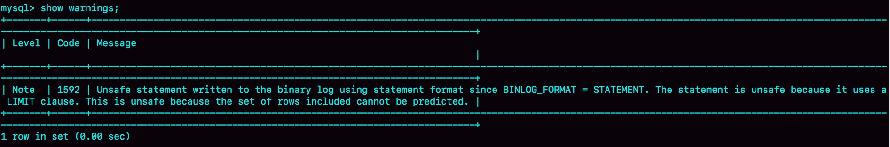
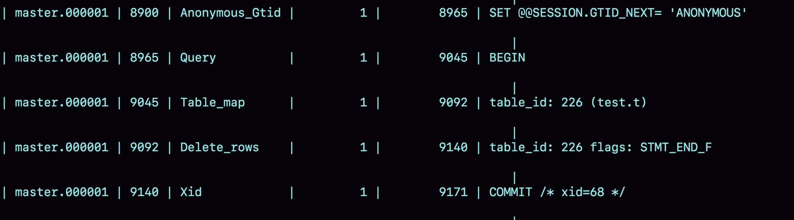
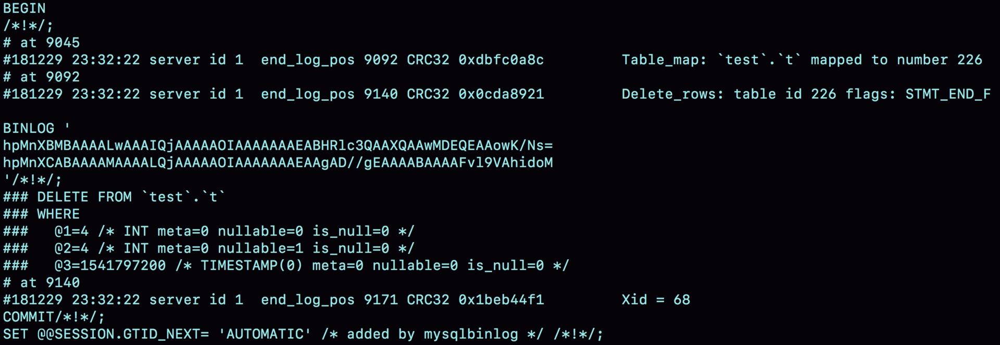
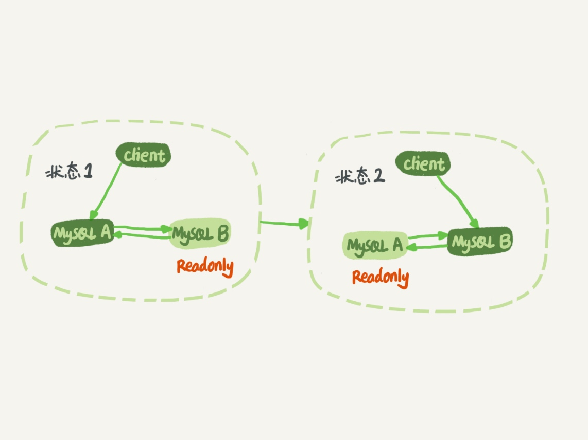

### 《MySQL 实战 45 讲》学习笔记 Day 25

24 | MySQL是怎么保证主备一致的？

binlog 可以用来归档，也可以用来做主备同步，但它的内容是什么样的呢？为什么备库执行了 binlog 就可以跟主库保持一致了呢？

#### MySQL 主备的基本原理

**主备切换流程**




**主备流程**

一个 update 语句在节点 A 执行，然后同步到节点 B 的完整流程图：



主库接收到客户端的更新请求后，执行内部事务的更新逻辑，同时写 binlog。

备库 B 跟主库 A 之间维持了一个长连接。主库 A 内部有一个线程，专门用于服务备库 B 的这个长连接。一个事务日志同步的完整过程是这样的：

1. 备库 B change master：设置主库 A 的 IP、端口、用户名、密码，以及开始请求 binlog 的位置（文件名&日志偏移量）
2. 备库 B start slave：启动两个线程 io_thread（负责与主库建立连接）/sql_thread
3. 主库 A 发送 binglog：校验完用户名、密码后，开始按照备库 B 传过来的位置，从本地读取 binlog，发给 B
4. 备库 B 写中转日志 relay log：拿到 binlog 后，写到本地文件
5. 备库 B 执行 sql：sql_thread 读取中转日志，解析并执行日志里的命令

#### binlog 的三种格式对比

```
mysql> CREATE TABLE `t` (
  `id` int(11) NOT NULL,
  `a` int(11) DEFAULT NULL,
  `t_modified` timestamp NOT NULL DEFAULT CURRENT_TIMESTAMP,
  PRIMARY KEY (`id`),
  KEY `a` (`a`),
  KEY `t_modified`(`t_modified`)
) ENGINE=InnoDB;

insert into t values(1,1,'2018-11-13');
insert into t values(2,2,'2018-11-12');
insert into t values(3,3,'2018-11-11');
insert into t values(4,4,'2018-11-10');
insert into t values(5,5,'2018-11-09');
```

```
mysql> delete from t /*comment*/  where a>=4 and t_modified<='2018-11-10' limit 1;
```

```
mysql> show binlog events in 'master.000001';
```

**binlog_format=statement**

SQL 原文记录





delete 带 limit，很可能会出现主备数据不一致的情况：

1. 如果 delete 语句使用的是索引 a，那么会根据索引 a 找到第一个满足条件的行，也就是说删除的是 a=4 这一行
2. 如果使用的是索引 t_modified，那么删除的就是 t_modified='2018-11-09’ 也就是 a=5 这一行

**binlog_format=row**



```
mysqlbinlog  -vv data/master.000001 --start-position=8900;
```



binlog 里面记录了真实删除行的主键 id，传到备库时，就肯定会删除 id=4 的行，不会有主备删除不同行的问题。

**binlog_format=mixed**

MySQL 自己判断这条 SQL 语句是否可能引起主备不一致，如果有可能，就用 row 格式，否则就用 statement 格式。

**恢复数据**

标准做法是，用 mysqlbinlog 工具解析出来，然后把解析结果整个发给 MySQL 执行：

```
mysqlbinlog master.000001  --start-position=2738 --stop-position=2973 | mysql -h127.0.0.1 -P13000 -u$user -p$pwd;
```

#### 循环复制问题

节点 A 和 B 互为主备关系，在切换的时候就不用再修改主备关系。



1. 节点 A 更新的事务，binlog 里面记的都是 A 的 server id
2. 传到节点 B 执行一次以后，节点 B 生成的 binlog 的 server id 也是 A 的 server id
3. 再传回给节点 A，判断到这个 server id 与自己的相同，丢弃不处理，死循环在这里就断掉了

> 感悟：对主备数据复制流程以及binlog格式有了更深入的了解！

学习来源： 极客时间 https://time.geekbang.org/column/intro/100020801


