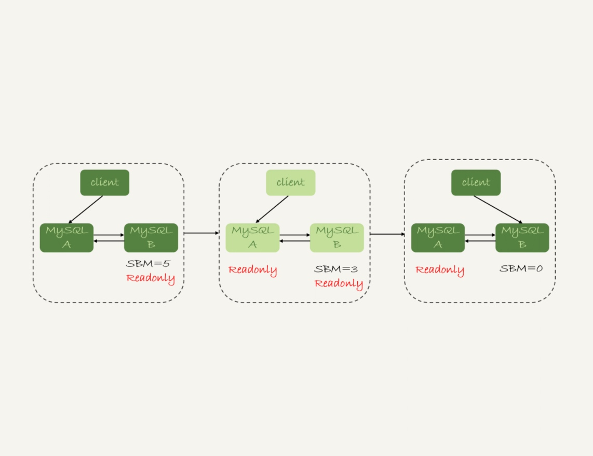
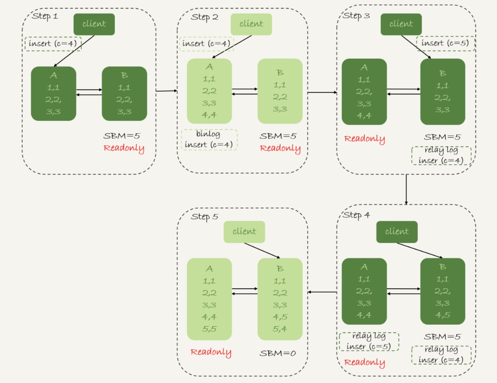

### 《MySQL 实战 45 讲》学习笔记 Day 26

25 | MySQL是怎么保证高可用的？

MySQL 要提供高可用能力，只有最终一致性是不够的。

#### 主备延迟

**最终一致性**

只要主库执行更新生成的所有 binlog，都可以传到备库并被正确地执行，备库就能达到跟主库一致的状态。

与数据同步有关的时间点：

1. T1：主库 A 执行完成一个事务，写入 binlog
2. T2：之后传给备库 B，备库 B 接收完这个 binlog 的时刻
3. T3：备库 B 执行完成这个事务
4. T3-T1：主备延迟

**seconds_behind_master**

备库执行 show slave status 查看，单位（秒数）

#### 主备延迟的来源

**备库机器的性能比主库差**

备库用差一点儿的机器。或者把 20 个主库放在 4 台机器上，而把备库集中在一台机器上。

解决：

1. 主备选用同规格机器
2. 做对称部署

**备库的压力大**

主库直接影响业务，使用起来比较克制，反而忽视了备库的压力控制。结果就是，备库上的查询耗费了大量的 CPU 资源，影响了同步速度，造成主备延迟。

解决：

1. 一主多从。分担读的压力
2. 通过 binlog 输出到外部系统如 Hadoop，提供统计类查询能力

**大事务**

主库上必须等事务执行完成才会写入 binlog，再传给备库。所以，如果一个主库上的语句执行 10 分钟，那这个事务很可能就会导致从库延迟 10 分钟。比如：

1. 一次性地用 delete 语句删除太多数据
2. 大表 DDL

解决：

1. 计划内的 DDL，建议使用 [gh-ost](https://github.com/github/gh-ost) 方案

**备库的并行复制能力**

#### 可靠性优先策略

1. 判断备库 B 的 seconds_behind_master，如果小于某个值（比如 5 秒）继续，否则重试
2. 把主库 A 改成只读状态，即把 readonly 设置为 true
3. 判断备库 B 的 seconds_behind_master 的值，直到变成 0
4. 把备库 B 改成可读写状态，也就是把 readonly 设置为 false
5. 把业务请求切到备库 B




#### 可用性优先策略

如果不等主备数据同步，直接把连接切到备库 B，并且让备库 B 可以读写，那么系统几乎就没有不可用时间了。

这个切换流程的代价，就是可能出现数据不一致的情况。

```
mysql> CREATE TABLE `t` (
  `id` int(11) unsigned NOT NULL AUTO_INCREMENT,
  `c` int(11) unsigned DEFAULT NULL,
  PRIMARY KEY (`id`)
) ENGINE=InnoDB;

insert into t(c) values(1),(2),(3);
```

```
insert into t(c) values(4);
insert into t(c) values(5);
```

**binlog_format=mixed**



**binlog_format=row**


> 感悟：对于数据库来说，数据可靠性优先！

学习来源： 极客时间 https://time.geekbang.org/column/intro/100020801


