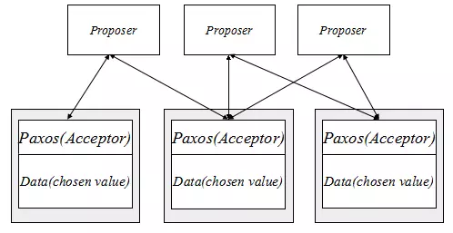
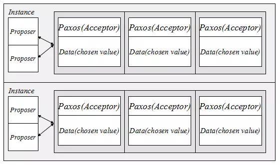
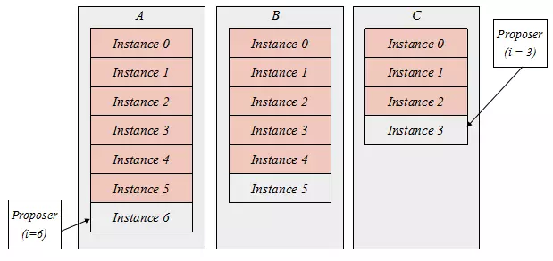
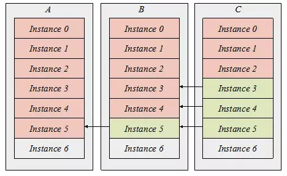
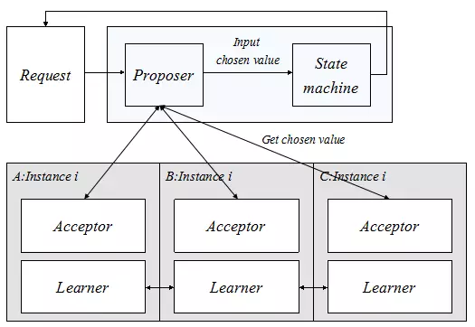
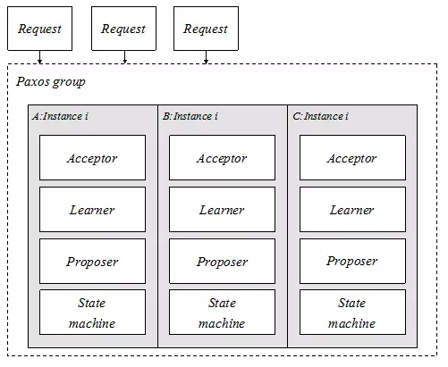
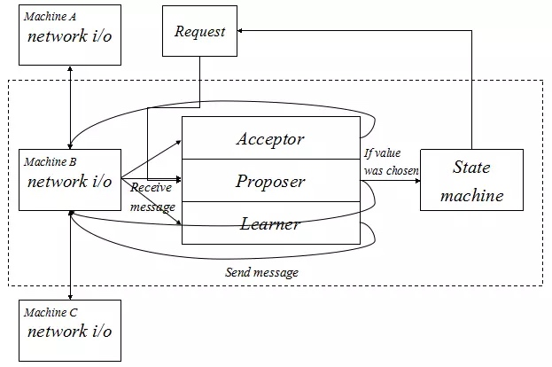
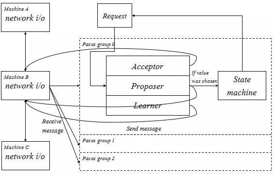
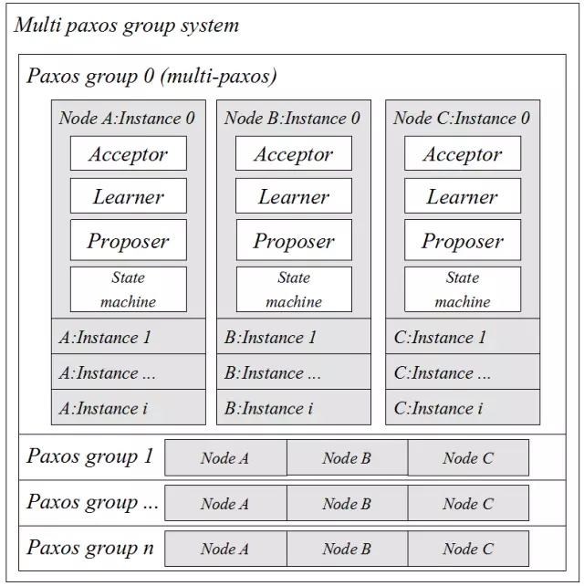

# 原文

> https://mp.weixin.qq.com/s?__biz=MjM5MDE0Mjc4MA==&mid=2650993105&idx=1&sn=d1566927744480b3b47f06bc9ee86f79&scene=23&srcid=0628VXkIMJUe0yeXfkgwO3uv#rd

以下为摘要或归纳：

# Paxos简介
## 定义
Paxos就是一个在异步通信环境，并容忍在只有多数派机器存活的情况下，仍然能完成一个一致性写入的协议。

## 一致性协议
多个副本确定同一个值，大家记录下来同一个值，那么就达到了一致性。

## 分布式环境
异步通信环境指的是消息在网络传输过程中，可能发生丢失、延迟、乱序现象。

## 两阶段提交缺点
机器的当机，甚至永久失联情况下，两阶段提交将无法完成一个一致性的写入。

## 角色
Proposer 提议者：发起写入请求，通过与各个Acceptor的协同工作，去完成一个值的写入。
Acceptor 接受者：严格遵守paxos协议去处理消息。

# Paxos用途
## 确定一个值
Proposer只需要与多数派的Acceptor交互，即可完成一个值的确定，但一旦这个值被确定下来后，无论Proposer再发起任何值的写入，Data数据都不会再被修改。Chosen value即是被确定的值，永远不会被修改。 

## 确定多个值
Paxos实例：Proposer，各个Acceptor，所服务的Data共同构成的一个大的集合。一个实例确定一个值，多个实例确定多个值，但各个实例独立，互不干涉。

## 有序确定多个值
首先给实例一个编号，定义为i，i从0开始，只增不减，由本机器生成，不依赖网络。
其次，我们保证一台机器任一时刻只能有一个实例在工作，这时候Proposer往该机器的写请求都会被当前工作的实例受理。
最后，当编号为i的实例获知已经确定好一个值之后，这个实例将会被销毁，进而产生一个编号为i+1的实例。
基于这三个约束，每台机器的多个实例都是一个连续递增编号的有序系列，而基于Paxos的保证，同一个编号的实例，确定的值都是一致的，那么三台机都获得了一个有序的多个值。

# Paxos新的角色
## 实例对齐
Learner学习者：询问别的机器相同编号的实例，如果这个实例已经被销毁了，那说明值已经确定好了，直接把这个值拉回来写到当前实例里面，然后编号增长跳到下一个实例再继续询问，如此反复，直到当前实例编号增长到与其他机器一致。

## 状态机State machine
一个状态机必然涉及到一个状态转移，而Paxos的每个实例，就是状态转移的输入，由于每台机器的实例编号都是连续有序增长的，而每个实例确定的值是一样的，那么可以保证的是，各台机器的状态机输入是完全一致的。根据状态机的理论，只要初始状态一致，输入一致，那么引出的最终状态也是一致的。

## Proposer，Acceptor，Learner，State machine如何协同工作
一个请求发给Proposer，Proposer与相同实例编号为x的Acceptor协同工作，共同完成一值的确定，之后将这个值作为状态机的输入，产生状态转移，最终返回状态转移结果给发起请求者

# Paxos工程化
## Paxos group
这里三台机器，每台机器运行着相同的实例i，实例里整合了Acceptor，Proposer，Learner，State machine四个角色，三台机器的相同编号实例共同构成了一个Paxos group的概念。
一个请求只需要灌进Paxos group里面就可以了，根据Paxos的特点，Paxos group可以将这个请求可以随意写往任意一个Proposer，由Proposer来进行提交。

## 四个角色如何协同工作
首先，由于Acceptor和Proposer在同一个进程里面，那么保证它们处于同一个实例是很简单的事情。
其次，当一个值被确认之后，也可以很方便传送给State machine去进行状态的转移。
最后当出现异常状态，实例落后或者收不到其他机器的回应，剩下的事情就交给Learner去解决，就这样一整合，事情就变得简单了。 

## 严格的落盘
一般的磁盘写入是有缓冲区的，当机器当机，这些缓冲区仍然未刷到磁盘，那么就会丢失部分数据，导致保证失效。

严格的意思是当操作系统告诉我写盘成功，那么无论任何情况都不会丢失。这个我们一般使用fsync来解决问题，也就是每次进行写盘都要附加一个fsync进行保证。

Fsync是一个非常重的操作，也因为这个，Paxos最大的瓶颈也是在写盘上，在工程上，我们需要尽量通过各种手段，去减少Paxos算法所需要的写盘次数。

万一磁盘fsync之后，仍然丢失或者数据错乱怎么办？这个称之为拜占庭问题，工程上需要一系列的措施检测出这些拜占庭错误，然后选择性的进行数据回滚或者直接丢弃。 

## 一个Leader
Paxos一个实例，支持任意多个Proposer同时进行写入，但是最终确定出来一个相同的值，里面是运用了一些类似锁的方法来解决冲突的，而越多的Proposer进行同时写入，冲突的剧烈程度会更高，虽然完全不妨碍最终会确定一个值，但是性能上是比较差的。

希望有一个Proposer的领导者，优先由他来进行写入。Leader的引入，不是为了解决一致性问题，而是为了解决性能问题。

Leader出错也不会妨碍正确性，不用去保证绝对的不允许出现两个Proposer或以上同时工作。通过心跳以及租约就可以做到。

## 状态机记录最大实例编号
当机器重启或者进程重启之后，状态机的数据可能会由于自身实现问题，或者磁盘数据丢失而导致回滚，这个我们没办法像上文提到的fsync一样进行这么强的约束，所以提出了一种方法，状态机必须严格记得自己输入过的最大实例编号。

启动重放：在每次启动的时候，状态机告诉Paxos最大的实例编号x，而Paxos发现自己最大的已确定值的实例编号是y，而x < y. 那这时候怎么办，只要有(x, y]的Chosen value，我们重新把这些value一个一个输入到状态机，那么状态机的状态就会更新到y了。

## 异步消息处理模型
分布式环境是一个异步通信环境，而Paxos解决了基于这种环境下的一致性问题，那么一个显而易见的特点就是，我们不知道也不确定消息何时到达，是否有序到达，是否到达，我们只需要去遵守Paxos协议，严格的处理每一条到达的消息即可，这跟RPC模型比较不一样，Paxos的特点是有去无回。

工作流程如下：

1. 收到Request，由Proposer处理，如需要发送Paxos消息，则通过network i/o发送。

2. Net work i/o收到Paxos消息，根据消息类型选择Acceptor，Proposer，或Leaner处理，如处理后需要发送Paxos消息，则通过network i/o发送。

3. Proposer通过paxos消息获知Chosen value，则输入value到State machine完成状态转移，最终通知Request转移结果，完成一个请求的处理。

4. 当Paxos完成一个值的确认之后，所有当前实例相关角色状态进行清空并初始化进行下一个编号的实例。 

# 生产级Paxos库
## RTT与写盘次数的优化
朴素的Paxos算法，确定一个值，在无冲突的情况下，需要两个RTT，以及每台机器的三次写盘。

## 同时运行多个Paxos group
基于一个network i/o搭配多组Paxos group的结构:

一个多个Paxos group的系统，完整结构如下：

## 更快对齐数据
1. 提前获取差距，批量打包进行学习。
2. 流式传输，实现Learner的边发边学。

## 删除Paxos数据
Paxos数据，即通过Paxos确认下来的有序的多个值，即Paxos log。

Paxos是允许少于多数派的机器挂掉，替代的新机器要从0开始重放Paxos log。

需要的是一个状态机的镜像数据Checkpoint，拷贝数据时停止写入。

## Checkpoint
用两个状态转移完全一致的状态机，分别管理不同的状态数据，通过灌入相同的Paxos log，最终出来的状态数据是完全一致的。

首先程序会根据磁盘使用情况自动删除Paxos log；
其次，程序自动的通过镜像状态机生成Checkpoint；
最后，当一个新机器启动的时候，可以自动的获取到Checkpoint，然后通过Learner自动的对齐剩下的数据，从而自动的完成无人工介入的机器更换。 

# 正确性保证
## 模拟异步通信环境
使用了内存队列来模拟网络通信，支持出队的延迟，丢失，以及乱序。
通过钩子将进程频繁杀掉重启，以及写盘方面的控制，模拟机器当机重启。

## 运行时对账
采用crc32算法，对有序的多个值进行累加校验。

## 防止拜占庭问题
对于所有磁盘写入的数据，都需要进行二次校验。校验不通过，及时回滚，产生报警。

# Paxos怎么确定一个值？

