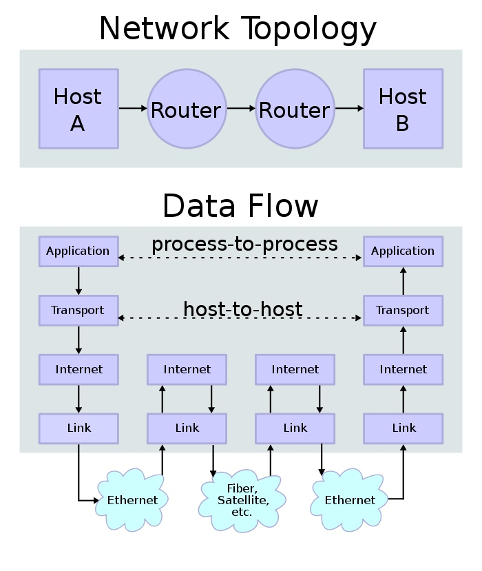
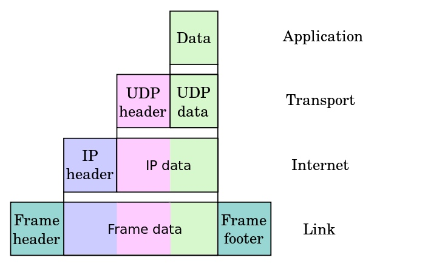

# tcp/ip协议栈

## 原文

> https://zh.wikipedia.org/wiki/TCP/IP%E5%8D%8F%E8%AE%AE%E6%97%8F

## osi model

Open Systems Interconnection model

一种概念模型，由国际标准化组织提出，一个试图使各种计算机在世界范围内互连为网络的标准框架。

根据建议X.200，OSI将计算机网络体系结构划分为以下七层，标有1～7，第1层在底部。 现“OSI/RM”是英文“Open Systems Interconnection Reference Model”的缩写。

### 第7层 应用层
应用层（Application Layer）提供为应用软件而设的接口，以设置与另一应用软件之间的通信。例如: HTTP，HTTPS，FTP，TELNET，SSH，SMTP，POP3等。

### 第6层 表示层
表示层（Presentation Layer）把数据转换为能与接收者的系统格式兼容并适合传输的格式。

### 第5层 会话层
会话层（Session Layer）负责在数据传输中设置和维护电脑网络中两台电脑之间的通信连接。

### 第4层 传输层
传输层（Transport Layer）把传输表头（TH）加至数据以形成数据包。传输表头包含了所使用的协议等发送信息。例如:传输控制协议（TCP）等。

### 第3层 网络层
网络层（Network Layer）决定数据的路径选择和转寄，将网络表头（NH）加至数据包，以形成分组。网络表头包含了网络数据。例如:互联网协议（IP）等。

### 第2层 数据链路层
数据链路层（Data Link Layer）负责网络寻址、错误侦测和改错。当表头和表尾被加至数据包时，会形成帧。数据链表头（DLH）是包含了物理地址和错误侦测及改错的方法。数据链表尾（DLT）是一串指示数据包末端的字符串。例如以太网、无线局域网（Wi-Fi）和通用分组无线服务（GPRS）等。

分为两个子层：逻辑链路控制（logic link control，LLC）子层和介质访问控制（media access control，MAC）子层。

### 第1层 物理层
物理层（Physical Layer）在局部局域网上传送数据帧（data frame），它负责管理电脑通信设备和网络媒体之间的互通。包括了针脚、电压、线缆规范、集线器、中继器、网卡、主机适配器等。

## tcp/ip model

### 第4层 应用层
应用层（application layer）该层包括所有和应用程序协同工作，利用基础网络交换应用程序专用的数据的协议。

### 第3层 传输层
传输层（transport layer）解决诸如端到端可靠性（数据是否已经到达目的地）和保证数据按照正确的顺序到达这样的问题。包括面向连接的`TCP传输控制协议`和无连接的包传输的`UDP用户数据报文协议`

### 第2层 网络互连层
网络互连层（internet layer）解决在一个单一网络上传输数据包的问题。

### 第1层 网络接口层
网络接口层（link layer）是数据包从一个设备的网络层传输到另外一个设备的网络层的方法。

## 数据传输示意图

两个因特网主机通过两个路由器和对应的层连接。各主机上的应用通过一些数据信道相互执行读取操作。

RFC 1122中描述的沿着不同的层应用数据的封装递减：

